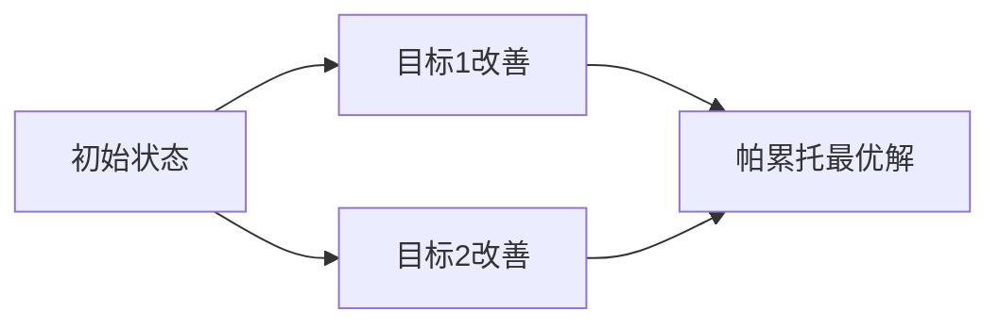

# PRISM 多目标逻辑

## 引言

在概率模型检测中，**多目标逻辑**（Multi-Objective Logic）允许我们同时分析系统的多个概率性质。例如，我们可能希望验证一个系统在满足某个性能指标的同时，还能保证另一个安全属性的概率约束。PRISM工具通过扩展其时序逻辑语法支持此类分析，为复杂系统的验证提供了强大工具。

:::note 关键概念
多目标逻辑通过组合多个概率或期望目标，支持对系统行为的**综合权衡分析**，例如：
- "系统在能耗低于阈值的同时，完成任务的成功率高于90%"
- "网络延迟不超过5ms的概率达到99%，且带宽利用率保持在80%以下"
:::

---

## 基础语法

PRISM的多目标逻辑基于**PCTL**（概率计算树逻辑）扩展，支持以下操作符组合：

```prism
multi(P1, P2, ..., Pk)
```
其中每个`Pi`可以是：
- 概率查询：`P bound [ path_property ]`
- 期望查询：`R bound [ reward_property ]`

### 示例1：双目标查询
```prism
// 同时满足两个概率约束
multi(P>=0.9 [ F "任务完成" ], P<=0.1 [ F "错误发生" ])
```

### 示例2：混合目标
```prism
// 组合概率和期望目标
multi(R{"能耗"}<=100 [ C ], P>=0.95 [ F<=10 "响应成功" ])
```

---

## 语义解释

多目标查询的求解通常涉及**帕累托前沿**（Pareto Frontier）分析，即寻找所有不可被其他解支配的最优解集。



:::tip 理解帕累托最优
当无法在不损害其他目标的情况下改进任一目标时，即达到帕累托最优。例如：
- 解X：成功率92%，能耗95
- 解Y：成功率90%，能耗90
若不存在同时优于X和Y的解，则它们都属于帕累托前沿。
:::

---

## 实际案例

### 案例1：网络协议优化
验证一个路由协议同时满足：
1. 数据包传递成功率 ≥98%
2. 平均延迟 ≤50ms
3. 能耗 ≤200单位

```prism
multi(
    P>=0.98 [ F "delivered" ],
    R{"delay"}<=50 [ S ],
    R{"energy"}<=200 [ C ]
)
```

### 案例2：机器人路径规划
确保清洁机器人：
1. 覆盖所有区域的概率 ≥95%
2. 碰撞概率 ≤5%
3. 电池消耗 ≤85%

```prism
multi(
    P>=0.95 [ F "complete" ],
    P<=0.05 [ F "collision" ],
    R{"battery"}<=85 [ C ]
)
```

---

## 求解技术

PRISM采用以下方法处理多目标查询：

1. **数值迭代**：通过策略迭代逼近帕累托前沿
2. **线性规划**：将问题转化为多目标线性规划
3. **近似算法**：对大规模模型采用抽样方法

:::caution 复杂度警告
多目标分析的复杂度随目标数量**指数增长**，建议：
- 优先处理关键目标
- 使用PRISM的`-pareto`参数控制精度
:::

---

## 总结

- 多目标逻辑允许**联合分析**多个系统属性
- 通过`multi()`操作符组合PCTL/Reward查询
- 求解结果表现为**帕累托前沿**而非单一值
- 适用于需要权衡多种指标的复杂系统验证

---

## 延伸学习

### 推荐练习
1. 修改案例1的网络协议，添加吞吐量目标`R{"throughput"}>=100`
2. 尝试用`-pareto 0.1`参数观察精度对结果的影响

### 进阶资源
- PRISM手册第10章"Multi-Objective Model Checking"
- 《Principles of Model Checking》第28章（MIT Press）