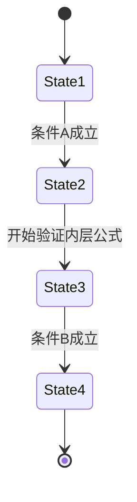

# PRISM 嵌套路径公式

## 介绍

在PRISM概率模型检测器中，**嵌套路径公式（Nested Path Formulas）**是时序逻辑表达式的一种高级形式，允许在路径公式内部嵌套其他路径公式。这种结构能够表达更复杂的系统行为属性，特别是涉及多阶段条件或递归验证的场景。

嵌套路径公式的核心思想是：在验证某个路径属性时，可以动态引入新的验证条件。例如："系统在满足条件A后，必须进入一个状态，使得从该状态开始，条件B最终会成立"。

## 基本语法

PRISM中嵌套路径公式使用以下语法结构：

```text
P∼p [ path_formula ]
```

其中：
- `∼` 是关系运算符（如 `<`, `>`, `<=`, `>=`, `=`）
- `p` 是概率阈值
- `path_formula` 可以包含其他嵌套的 `P` 运算符

### 简单示例

```prism
P>=0.9 [ F "success" ]
```

这个公式表示："系统以至少90%的概率最终会到达'success'状态"。

## 嵌套结构详解

真正的嵌套发生在路径公式内部引用另一个概率表达式时：

```prism
P>=0.8 [ F (x>5 & P>=0.9 [ G y<10 ]) ]
```

这个公式解读为：
"系统以至少`80%`的概率最终会到达一个状态，其中`x>5`且从该状态开始，系统以至少`90%`的概率会永远保持`y<10`"

### 嵌套层级

PRISM支持多级嵌套，但需要注意：
1. 每一层都需要用方括号`[]`明确界定范围
2. 内层公式可以引用外层公式的变量
3. 计算复杂度会随嵌套深度增加

```prism
P>=0.7 [ X P>0.5 [ F P<0.1 [ G "error" ] ] ]
```

## 实际案例

### 案例1：系统恢复保证

考虑一个具有恢复机制的服务器系统：

```prism
// 当服务器宕机后，它应该以高概率恢复
// 并且在恢复后保持稳定运行
P>=0.95 [ F ("down" & P>=0.99 [ F "up" ]) ]
```

### 案例2：资源分配系统

```prism
// 系统应以高概率在分配资源后
// 确保资源最终被释放的概率很低
P>=0.9 [ ("allocate" & P<0.05 [ F "leak" ]) ]
```

## 状态图示例

以下Mermaid状态图展示了嵌套路径公式的验证过程：



## 常见错误与提示

:::caution 注意嵌套深度
虽然PRISM支持多层嵌套，但超过3层的嵌套会导致:
1. 模型检测时间指数增长
2. 结果难以解释
建议将复杂嵌套拆分为多个属性验证
:::

:::tip 调试技巧
1. 从内层公式开始单独验证
2. 逐步添加外层约束
3. 使用PRISM的模拟功能观察路径
:::

## 总结

嵌套路径公式为PRISM提供了表达复杂系统属性的能力：
- 允许在路径验证中引入新的概率条件
- 支持多阶段属性验证
- 能够建模递归或条件依赖的行为

## 练习与扩展

1. 为交通信号灯系统编写一个嵌套公式，要求：
   - 红灯后至少有95%概率会变绿
   - 变绿后至少有90%概率在10秒内不变红

2. 尝试将以下自然语言描述转换为嵌套公式：
   "系统在发生错误后，应该以高概率进入恢复模式，且在恢复模式中最终正常工作的概率要很高"

3. 分析以下公式的计算复杂度：
   ```prism
   P>0.8 [ F (P>0.7 [ X P>0.6 [ G "safe" ] ]) ]
   ```

## 进一步学习

推荐阅读PRISM官方文档中关于:
- 概率计算树逻辑(PCTL)
- 线性时序逻辑(LTL)
- 奖励结构(reward structures)与嵌套公式的结合使用