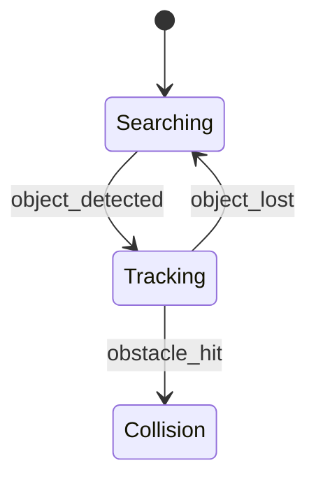

# PRISM 时序性质表达

## 引言

时序逻辑是模型检测中用于描述系统随时间演变的数学语言。在PRISM中，我们通过**概率计算树逻辑(PCTL)**和**线性时序逻辑(LTL)**的变体来形式化系统的概率性质。本节将详细介绍如何用PRISM语法表达这些性质。

## 基础概念

PRISM中的时序性质由两类公式构成：

1. **状态公式(State Formulas)**：在特定系统状态下为真/假
2. **路径公式(Path Formulas)**：在系统执行的路径上为真/假

### 状态公式语法

```prism
// 基本布尔表达式
"label"      // 状态标签
x=1          // 变量比较
a & b        // 逻辑与
P=? [ F "goal" ]  // 概率查询
```

### 路径公式运算符

| 运算符 | 含义          | 示例             |
|--------|---------------|------------------|
| `X`    | Next          | `X x=1`          |
| `F`    | Finally       | `F "complete"`   |
| `G`    | Globally      | `G !"failed"`    |
| `U`    | Until         | `"req" U "resp"` |
| `W`    | Weak Until    | `a W b`          |

## 概率性质表达

### 基本概率查询

```prism
P=? [ path_formula ]  // 计算路径公式成立的概率
P>=0.9 [ F x=5 ]      // x最终等于5的概率是否≥90%
```

### 时间界限性质

```prism
// 在100个时间单位内达到目标状态的概率
P=? [ F<=100 "goal" ]

// 前50步中始终保持安全的概率
P=? [ G<=50 !"failed" ]
```

## 实际案例

### 案例1：通信协议

```prism
// 消息在10次重传内成功传递的概率
P=? [ F<=10 "message_delivered" ]

// 系统永不发生死锁的概率
P=? [ G !"deadlock" ]
```

### 案例2：机器人导航



```prism
// 在碰撞前找到目标的概率
P=? [ !"Collision" U "TargetFound" ]

// 平均需要多少步才能找到目标
R{"steps"}=? [ F "TargetFound" ]
```

## 高级模式

### 嵌套公式

```prism
// 在达到状态A后，最终会到达状态B的概率
P=? [ F (A & F B) ]
```

### 奖励性质

```prism
// 在达到目标前累积的期望能量消耗
R{"energy"}=? [ F "target" ]
```

## 常见错误

:::caution 易犯错误
1. 混淆状态公式和路径公式：
   - 错误：`P=? [ x=1 U y=2 ]` (x=1应为状态公式)
   - 正确：`P=? [ "x_eq_1" U "y_eq_2" ]`

2. 错误的时间界限语法：
   - 错误：`P=? [ F<10 "goal" ]`
   - 正确：`P=? [ F<=10 "goal" ]`
:::

## 总结

PRISM的时序性质表达提供了强大的工具来描述和验证概率系统的行为特性。关键要点包括：

- 区分状态公式和路径公式
- 熟练使用`P`和`R`操作符进行概率/奖励查询
- 合理使用时序运算符(`F`,`G`,`U`等)组合复杂性质

## 练习建议

1. 为简单的马尔可夫链编写3种不同的时序性质
2. 尝试将自然语言描述的系统需求转化为PRISM公式
3. 实验时间界限参数对验证结果的影响

## 延伸阅读

- PRISM手册第10章"Property Specification"
- 《Principles of Model Checking》第19章
- 时序逻辑标准CTL/LTL对比文档