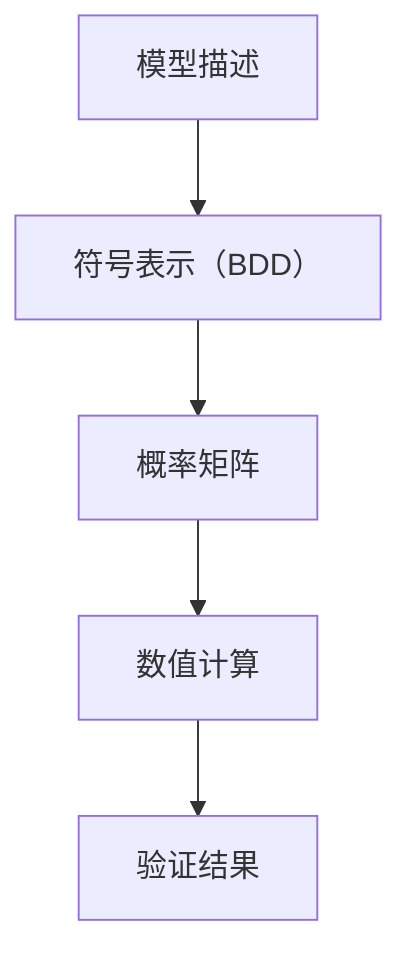

## 引言

PRISM（Probabilistic Symbolic Model Checker）是一个用于分析概率系统的模型检测工具。它支持多种概率模型，如离散时间马尔可夫链（DTMC）、连续时间马尔可夫链（CTMC）和马尔可夫决策过程（MDP）。PRISM的核心功能是通过验证算法计算系统满足特定属性的概率。本章将介绍PRISM的验证算法，帮助初学者理解其工作原理和应用场景。

## PRISM 验证算法基础

PRISM的验证算法基于**概率模型检查**，其核心思想是通过状态空间探索和概率计算，验证系统是否满足给定的概率属性。以下是PRISM验证算法的关键步骤：

1. **模型构建**：将系统描述为概率模型（如DTMC、CTMC或MDP）。
2. **属性规约**：使用概率时序逻辑（如PCTL或CSL）定义待验证的属性。
3. **状态空间分析**：通过图算法或数值方法计算属性满足的概率。

### 示例：DTMC模型验证

以下是一个简单的DTMC模型示例，描述了一个硬币投掷系统：

```prism
// PRISM模型：公平硬币投掷
dtmc

module Coin
  s : [0..2] init 0; // 状态：0=初始, 1=正面, 2=反面

  [] s=0 -> 0.5 : (s'=1) + 0.5 : (s'=2); // 投掷硬币
  [] s=1 -> true; // 吸收状态（正面）
  [] s=2 -> true; // 吸收状态（反面）
endmodule
```

**验证属性**：计算最终状态为正面（s=1）的概率：
```prism
P=? [ F s=1 ]
```

**输出结果**：
```plaintext
Result: 0.5
```

## 核心算法详解

### 1. 概率模型检查
PRISM通过以下步骤实现概率模型检查：
- **模型解析**：将PRISM语言描述的模型转换为内部表示（如矩阵）。
- **属性解析**：将逻辑公式转换为计算任务（如概率、期望值）。
- **数值计算**：使用迭代方法（如Jacobi、Gauss-Seidel）求解线性方程。

### 2. 状态空间缩减
PRISM利用以下技术优化计算：
- **符号表示**：使用二元决策图（BDD）压缩状态空间。
- **抽象精化**：通过近似方法减少计算复杂度。



### 3. 实际案例：网络协议可靠性
假设我们需要验证一个网络协议在丢包环境下的可靠性，可以建模为DTMC：

```prism
dtmc

module Protocol
  s : [0..2] init 0; // 0=空闲, 1=发送, 2=成功
  [] s=0 -> 0.9 : (s'=1) + 0.1 : (s'=0);
  [] s=1 -> 0.8 : (s'=2) + 0.2 : (s'=0);
endmodule
```

验证属性：计算最终成功传输的概率：
```prism
P=? [ F s=2 ]
```

:::tip
对于大型模型，PRISM会自动选择高效的数值计算策略（如稀疏矩阵存储）。
:::

## 总结

PRISM的验证算法通过概率模型检查和状态空间优化，为复杂系统提供可靠的定量分析。关键点包括：
1. 支持多种概率模型（DTMC、CTMC、MDP）。
2. 使用符号表示和数值计算提高效率。
3. 适用于通信协议、生物系统等场景。

## 附加资源
- **练习**：修改硬币投掷模型，验证三次投掷后至少两次为正面的概率。
- **进阶阅读**：PRISM官方文档中的“Advanced Model Checking”章节。