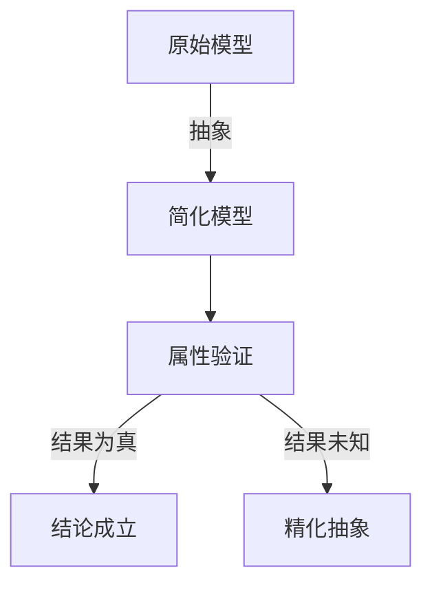

# PRISM 模型优化

## 介绍

PRISM（Probabilistic Symbolic Model Checker）是一个用于建模和分析概率系统的工具。在实际应用中，模型可能变得非常庞大，导致计算资源不足或分析时间过长。**模型优化**技术可以帮助减少状态空间、提高分析效率，同时保持模型的语义准确性。本章将介绍PRISM中常用的优化方法及其实现。

## 状态空间缩减

### 概念
状态空间缩减是通过消除冗余状态或合并等效状态来减小模型规模的技术。PRISM提供了多种内置优化策略：

1. **常量传播**：在模型编译阶段替换常量表达式
2. **表达式简化**：简化布尔/算术表达式
3. **死代码消除**：移除不可达的代码路径

### 示例
考虑以下简单的DTMC模型：

```prism
dtmc

const int N = 3;

module main
  s : [0..N] init 0;
  
  [] s=0 -> 0.5:(s'=1) + 0.5:(s'=2);
  [] s=1 -> 1:(s'=3);
  [] s=2 -> 1:(s'=3);
  [] s=3 -> 1:(s'=3);
endmodule
```

启用优化后，PRISM会自动：
- 用实际值替换所有`N`的出现
- 合并状态1和状态2的相同转移行为

## 对称性检测

### 原理
对称性检测识别模型中行为相同的组件，通过对称性减少分析的状态空间。

:::tip 适用场景
当模型包含多个行为相同的并行进程时（如协议中的多个节点），对称性检测特别有效。
:::

### 案例
考虑一个包含3个相同进程的模型：

```prism
mdp

module process1
  x1 : [0..1];
  [] x1=0 -> (x1'=1);
endmodule

module process2 = process1 [ x1=x2 ] endmodule
module process3 = process1 [ x1=x3 ] endmodule
```

启用对称性检测后，PRISM会将`(x1=0,x2=1,x3=0)`和`(x1=0,x2=0,x3=1)`视为等效状态。

## 模型抽象

### 方法
抽象技术通过创建模型的简化版本来进行分析：

1. **区间抽象**：将连续值分组为区间
2. **谓词抽象**：使用布尔变量表示复杂条件



## 实际应用案例

### 网络协议分析
分析一个具有N个节点的容错协议时：
1. 使用对称性减少节点排列组合
2. 应用常量传播优化参数化模型
3. 通过区间抽象处理消息计数器

```prism
// 优化前的模型可能难以分析
const int MAX = 100;
formula connected = (count >= N/2+1);
// 优化后可替换为具体值并简化条件
```

## 优化技术对比

| 技术 | 适用场景 | 效果 |
|------|----------|------|
| 常量传播 | 含大量常量的模型 | 减少表达式复杂度 |
| 对称性检测 | 对称组件系统 | 指数级状态缩减 |
| 区间抽象 | 连续/大范围变量 | 线性状态缩减 |

## 总结与练习

### 关键点总结
- PRISM提供自动和手动的模型优化技术
- 状态空间缩减是提高分析效率的关键
- 对称性检测特别适合多组件系统
- 抽象技术可以处理复杂或无限状态系统

### 练习建议
1. 在PRISM GUI中尝试启用/禁用不同优化选项，观察状态空间变化
2. 对一个简单的投票协议模型应用对称性检测
3. 使用区间抽象分析一个资源分配系统

### 附加资源
- PRISM手册中的"Model Optimization"章节
- 《Principles of Model Checking》第10章
- 尝试PRISM示例库中的`leader`案例，观察优化效果