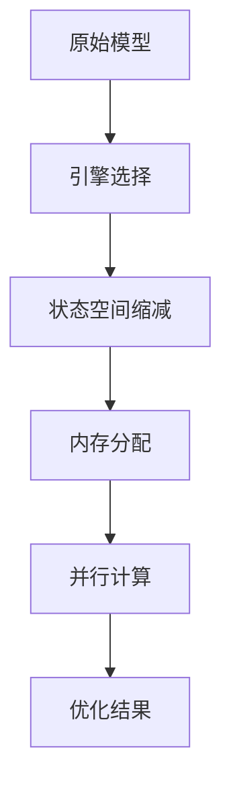

# PRISM 验证性能调优

## 引言
PRISM作为概率符号模型检测器，在处理复杂系统时可能面临性能瓶颈。本节将介绍如何通过参数调整、模型优化和硬件利用来显著提升验证效率。

:::note 为什么需要性能调优？
大型概率模型的状态空间可能达到10^6以上，未经优化的验证可能需要数小时甚至无法完成。
:::

## 核心优化技术

### 1. 引擎选择
PRISM提供三种计算引擎：
```prism
// 命令行选择引擎示例
prism model.pm props.pctl -engine hybrid
```
- `explicit`：适用于小型离散模型
- `mtbdd`：符号化处理（默认）
- `hybrid`：混合模式（推荐大多数场景）

### 2. 内存管理
关键JVM参数调整：
```bash
# 启动PRISM时分配更多内存
java -Xmx4g -jar prism.jar model.pm
```
建议值：
- 小型模型：`-Xmx2g`
- 中型模型：`-Xmx8g`
- 大型模型：`-Xmx16g`（需64位系统）

### 3. 模型预处理
简化模型结构示例：
```prism
// 优化前
module M1
    x : [0..100] init 0;
    [] x<100 -> 0.5:(x'=x+1) + 0.5:(x'=x+2);
endmodule

// 优化后（减少状态空间）
module M1_opt
    x : [0..50] init 0;
    [] x<50 -> 0.5:(x'=x+1) + 0.5:(x'=x+2);
endmodule
```

### 4. 并行计算
启用多线程处理（需模型支持）：
```prism
// 在属性文件中设置
const int THREADS = 4;
```

## 实际案例研究

### 案例：网络协议验证
原始模型验证耗时：42分钟  
优化步骤：
1. 切换至`hybrid`引擎
2. 限制重传次数从无限改为MAX=5
3. 使用`-Xmx6g`内存分配
4. 启用4线程并行

优化后结果：6分23秒



## 高级技巧

:::tip 属性分解
将复杂属性拆解为多个简单属性验证：
```prism
// 替代 P>=0.7[ F (a&b&c) ]
P>=0.7[ F a ] && P>=0.7[ F b ] && P>=0.7[ F c ]
```
:::

:::caution 注意对称性
利用模型对称性可大幅减少计算量：
```prism
// 声明对称变量
symm 1: x,y;
```

## 性能监控

使用PRISM内置统计功能：
```bash
prism model.pm --statistics --timings
```
输出示例：
```
States:     1,048,576
Transitions: 3,145,728
Time:       126.4s
```

## 总结与练习

### 关键要点
1. 根据模型规模选择合适的计算引擎
2. 合理分配JVM内存资源
3. 通过模型简化减少状态空间
4. 利用并行计算加速验证

### 练习题目
1. 对提供的"leader_election.prism"模型进行优化：
   - 将进程数从5减至3
   - 尝试不同引擎比较耗时
2. 编写一个脚本自动测试不同内存配置下的性能

### 扩展阅读
- PRISM官方手册"Performance Considerations"章节
- 论文《Efficient Probabilistic Model Checking of Symmetric Systems》