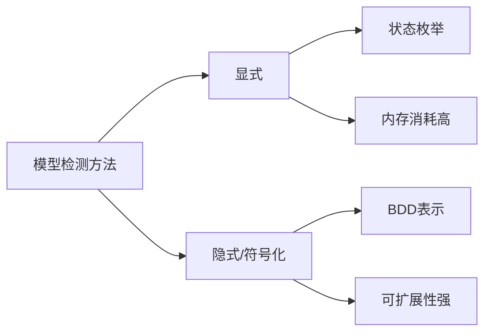

# PRISM 显式模型检测

## 简介

显式模型检测（Explicit Model Checking）是PRISM工具中用于分析概率系统的一种基础技术。与符号化方法不同，显式方法直接枚举系统的所有可能状态，逐状态验证性质是否满足。这种方法虽然可能受"状态空间爆炸"问题限制，但对于中小规模模型或需要直观调试的场景非常有效。

:::tip 何时使用显式检测？
- 模型状态空间较小（通常`<10⁶`状态）
- 需要生成完整的可达状态图
- 调试时需观察具体状态转移
- 教学演示需要直观展示
:::

## 核心概念

### 1. 显式与隐式对比



### 2. PRISM中的显式引擎

PRISM通过以下步骤执行显式检测：
1. 解析模型描述文件（`.prism`或`.pm`）
2. 构建显式状态空间
3. 计算稳态/瞬态概率
4. 验证属性（PCTL/CSL公式）

## 模型示例

### 简单DTMC模型

考虑一个三状态天气模型（晴/阴/雨）：

```prism
// weather.prism
dtmc

module Weather
    s : [0..2] init 0; // 0=晴, 1=阴, 2=雨
    
    [] s=0 -> 0.7 : s'=0 + 0.3 : s'=1;
    [] s=1 -> 0.5 : s'=1 + 0.3 : s'=0 + 0.2 : s'=2;
    [] s=2 -> 0.8 : s'=2 + 0.2 : s'=0;
endmodule
```

### 显式检测命令

在PRISM命令行中显式验证"最终下雨概率"：

```bash
prism weather.prism -explicit -pf "P=? [ F s=2 ]"
```

输出示例：
```
Result: 0.555555... (5/9)
```

## 关键参数解析

PRISM显式检测支持以下重要参数：

| 参数             | 说明       | 示例                         |
|----------------|----------|----------------------------|
| `-explicit`    | 启用显式引擎   | 必需                         |
| `-m`           | 最大内存(MB) | `-m 2048`                  |
| `-cuddmaxmem`  | CUDD内存限制 | `-cuddmaxmem 2g`           |
| `-exporttrans` | 导出转移矩阵   | `-exporttrans weather.tra` |

## 实际案例：网络协议分析

分析一个简单的ARQ重传协议：

```prism
// arq.prism
mdp

module Sender
    s : [0..2]; // 0=空闲, 1=发送, 2=等待ACK
    [send] s=0 -> 0.9 : s'=1 + 0.1 : s'=0;
    [timeout] s=2 -> 0.8 : s'=1 + 0.2 : s'=0;
endmodule

module Channel
    [send] true -> 0.95 : true + 0.05 : true; // 5%丢包率
    [recv] true -> true;
endmodule
```

验证"最大成功传输概率"：

```bash
prism arq.prism -explicit -pf "Pmax=? [ F s=0 & packets_sent=3 ]"
```

## 常见问题解决

:::caution 内存不足处理
当遇到`OutOfMemoryError`时：
1. 增加JVM内存：`-javamaxmem 4g`
2. 使用`-compact`减少状态存储
3. 考虑状态聚合或抽象
:::

## 总结与练习

### 关键要点
- 显式检测适合中小规模模型
- 可直接观察状态转移关系
- 需要合理配置内存参数
- 调试时可导出状态图辅助分析

### 扩展练习
1. 修改天气模型，增加"雪"状态并验证新属性
2. 对ARQ协议添加窗口限制参数
3. 尝试导出状态图并用可视化工具查看

### 学习资源
- PRISM官方手册：Explicit Engine章节
- 《Principles of Model Checking》第10章
- PRISM案例库中的`examples/explicit`目录