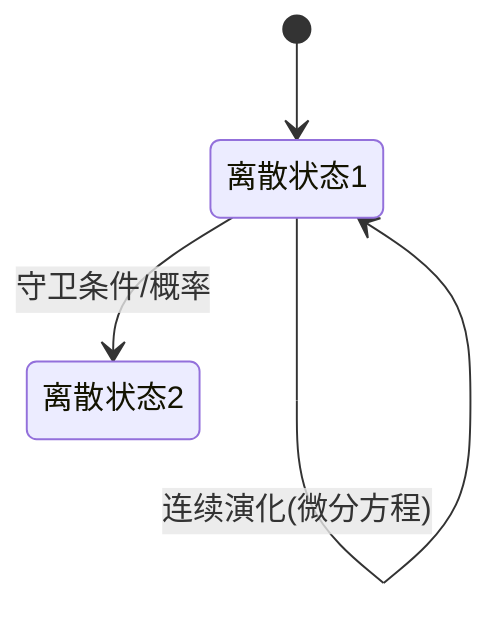

# PRISM 混合模型检测

## 简介

PRISM混合模型检测（Hybrid Model Checking）是PRISM工具中处理同时包含**离散**和**连续**行为的系统的重要技术。这类系统常见于：

- 嵌入式控制系统（如机器人导航）
- 生化反应网络
- 电力系统动态分析

混合模型通过结合：
1. **离散状态转换**（如开关模式切换）
2. **连续变量演化**（如温度/速度变化）

实现更贴近现实世界的建模。

## 核心概念

### 混合自动机模型
PRISM使用扩展的**概率混合自动机**表示系统：



### 关键组件
| 组件类型       | 描述                          | PRISM语法示例            |
|----------------|-----------------------------|--------------------------|
| 离散变量       | 有限取值范围的状态变量         | `x : [0..2] init 0;`     |
| 连续变量       | 实数域变化的动态变量           | `y : real init 0.0;`     |
| 微分方程       | 控制连续变量演化的规则          | `[mode1] y' = -y + 2;`   |
| 守卫条件       | 触发离散转移的约束             | `guard y >= 1.5;`        |

## 建模实例

### 温度控制系统
考虑一个具有两种工作模式的恒温器：

```prism
// 离散状态变量
mode : [0..1] init 0;  // 0=加热, 1=冷却

// 连续变量
temp : real init 20.0;  // 当前温度(℃)

// 微分方程
[mode=0] temp' = 0.5;   // 加热模式温度变化率
[mode=1] temp' = -0.3;  // 冷却模式温度变化率

// 状态转移
[mode=0] temp >= 22 -> 0.9:(mode'=1) + 0.1:(mode'=0);
[mode=1] temp <= 18 -> (mode'=0);
```

:::note 参数说明
- `temp' = 0.5` 表示温度每秒上升0.5℃
- 概率 `0.9` 表示到达阈值时有90%概率切换模式
:::

## 分析方法

### 1. 概率可达性
验证系统以特定概率到达目标状态：

```prism
P>=0.95 [ F temp > 25 ]
// 温度超过25℃的概率是否≥95%
```

### 2. 稳态分析
计算长期运行下的温度分布：

```prism
S=? [ temp < 18 ]
// 稳态时温度低于18℃的概率
```

### 3. 时间相关属性
使用**时钟变量**分析时间约束：

```prism
// 添加时钟变量
clock : real init 0.0;
[mode=0] clock' = 1;

// 验证5秒内达到目标的概率
P=? [ F<=5 temp >= 21 ]
```

## 实际应用案例

### 无人机电池管理
混合模型可描述：
- 离散状态：飞行模式（悬停/巡航/着陆）
- 连续变量：电池电量、高度、速度

```prism
// 电池放电模型
[mode=悬停] 电量' = -0.02 * 负载;
[mode=巡航] 电量' = -0.05 * 风速因子;

// 紧急着陆条件
[mode=巡航] 电量 <= 0.15 -> (mode'=着陆);
```

可验证属性示例：
```prism
// 电量耗尽前安全着陆的概率
P>=0.99 [ !(电量<=0) U mode=着陆 ]
```

## 常见挑战与解决方案

:::caution 数值精度问题
连续变量计算可能产生累积误差：
- **解决方案**：调整PRISM引擎参数
  ```prism
  engine { hybrid { precision = 1e-6; } }
  ```
:::

:::tip 状态空间爆炸缓解
混合模型易产生大规模状态空间：
1. 使用**抽象化**技术
2. 定义**变量界限**：
   ```prism
   temp : real init 20.0 min 15.0 max 30.0;
   ```
:::

## 总结

PRISM混合模型检测的核心优势在于：
- 统一处理离散事件和连续动态
- 支持概率与实时约束的组合验证
- 提供丰富的分析属性语法

## 扩展学习

推荐练习：
1. 建模一个混合动力汽车的充放电系统
2. 验证房间恒温控制器在24小时内的能耗概率分布
3. 分析具有故障恢复机制的液压系统

进阶资源：
- PRISM官方手册《Hybrid Systems Modeling》
- 学术论文《Probabilistic Verification of Hybrid Systems》
- Coursera课程《Cyber-Physical Systems Verification》