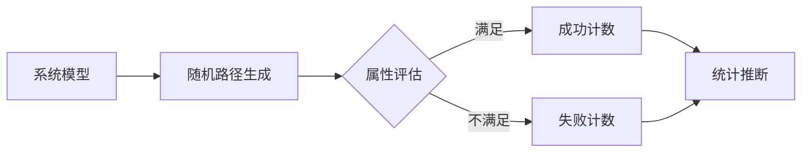

## 引言

统计模型检测（Statistical Model Checking, SMC）是PRISM工具中一种基于模拟的验证技术，适用于难以通过精确计算分析的复杂概率系统。它通过随机采样路径并统计评估属性概率，以可控制的误差范围给出近似结果。

:::tip 适用场景
当系统规模过大或包含非马尔可夫行为时，传统数值方法可能失效，此时SMC成为首选方案。
:::

## 核心原理

1. **蒙特卡洛采样**：通过重复模拟系统运行轨迹生成样本
2. **假设检验**：使用统计方法（如序贯概率比检验）判断属性是否满足
3. **置信区间**：结果附带概率误差界限（如95%置信度）



## PRISM 语法示例

验证"系统在100步内达到目标状态的概率≥0.9"：

```prism
// 模型定义（离散时间马尔可夫链）
dtmc

module System
    s : [0..2] init 0;
    [] s=0 -> 0.6:(s'=1) + 0.4:(s'=2);
    [] s=1 -> 0.7:(s'=0) + 0.3:(s'=2);
    [] s=2 -> 1.0:(s'=2);
endmodule

// 统计模型检测命令
smc << P>=0.9 [ F<=100 s=2 ] >>;
```

输出示例：
```
Statistical verification: P>=0.9 [ F<=100 s=2 ]
Result: true (estimated probability 0.927, 95% CI [0.915,0.939])
Samples used: 10000
Simulation time: 2.34s
```

## 参数配置方法

PRISM提供多种SMC调节参数：

```prism
// 设置采样次数和置信水平
smc_samples = 1e5;
smc_confidence = 0.99;

// 设置绝对/相对误差
smc_absolute_error = 0.01;
smc_relative_error = 0.1;
```

:::caution 精度与效率权衡
更多样本带来更高精度，但会增加计算时间。典型实践中：
- 初步验证：1,000-10,000样本
- 最终报告：100,000+样本
:::

## 实际案例：网络协议验证

验证"TCP重传成功率在10次尝试内达到99%"：

```prism
ctmc

const double lambda = 0.1; // 丢包率
const double mu = 1.0;    // 重传速率

module TCP
    attempts : [0..10] init 0;
    success : bool init false;
    
    // 正常传输
    [send] !success & attempts<10 -> mu : (attempts'=attempts+1);
    
    // 成功接收（无丢包）
    [recv] !success & attempts<10 -> mu*(1-lambda) : (success'=true);
endmodule

// 统计验证
smc << P>=0.99 [ F attempts=10 | success ] >>;
```

## 高级技术

### 1. 序贯抽样
自动调整样本量直至达到所需置信度：
```prism
smc_method = "sequential";
smc_epsilon = 0.02; // 允许误差
```

### 2. 罕见事件处理
使用重要性采样加速低概率事件检测：
```prism
smc_rare_event = true;
smc_importance_sampling = "cross_entropy";
```

## 总结

| 方法          | 优点                      | 限制                     |
|---------------|--------------------------|-------------------------|
| 统计模型检测   | 适用于大规模系统          | 结果具有概率性          |
| 数值模型检测   | 精确结果                  | 受状态空间爆炸限制      |

## 延伸学习

1. **练习建议**：
   - 修改TCP案例中的lambda值，观察所需样本量变化
   - 比较smc_method="batch"与"sequential"的效率差异

2. **扩展阅读**：
   - PRISM官方文档"SMC Tutorial"章节
   - 《Handbook of Statistical Model Checking》Springer出版

:::warning 注意事项
统计模型检测不适用于：
- 必须获得绝对确证的情况
- 概率极低（`<1e-6`）的属性验证
:::