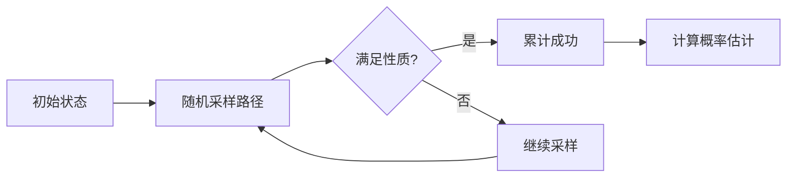

# PRISM 近似模型检测

## 简介

PRISM（Probabilistic Symbolic Model Checker）是一个用于分析概率系统的形式化验证工具。**近似模型检测**是PRISM中的一项关键技术，用于在系统状态空间过大时，通过统计采样或近似计算来高效地验证概率性质。本教程将介绍其核心概念、算法实现及实际应用。

## 基本原理

近似模型检测的核心思想是**用有限采样代替穷举计算**，适用于以下场景：
1. **状态空间爆炸**：精确计算不可行时
2. **实时性要求**：需要快速获得近似结果
3. **概率边界验证**：如验证"性质成立的概率≥0.95"

PRISM提供两种主要方法：
- **蒙特卡洛模拟**：通过随机采样估计概率
- **统计模型检测**：结合统计方法与概率边界验证

## 代码示例

### 蒙特卡洛模拟示例
```prism
// 定义简单的DTMC模型
dtmc

module CoinToss
  state : [0..1] init 0;
  [] state=0 -> 0.5 : (state'=1) + 0.5 : (state'=0);
  [] state=1 -> 1 : (state'=0);
endmodule

// 验证"连续出现两次正面"的概率
P=? [ F state=1 & X state=1 ]
```

使用近似验证命令：
```bash
prism coin_toss.prism -sim -simsamples 10000
```

输出示例：
```
Approximate result: 0.2483 (95% confidence interval: [0.2395, 0.2571])
```

## 关键技术

### 1. 统计模型检测算法


### 2. 置信区间计算
PRISM使用Hoeffding不等式或Chernoff边界计算置信区间：
```
P(|p̂ - p| ≥ ε) ≤ 2e^(-2nε²)
```
其中`p̂`为估计值，`p`为真实值，`n`为采样次数。

## 实际案例

### 网络协议验证
验证"数据包在3跳内成功传输的概率≥0.99"：
```prism
// 定义每跳丢失率为10%
const double loss = 0.1;

module Network
  hops : [0..3] init 0;
  [] hops<3 -> (1-loss) : (hops'=hops+1) + loss : (hops'=0);
  [] hops=3 -> true;
endmodule

// 近似验证
P>=0.99 [ F hops=3 ]
```

使用统计验证命令：
```bash
prism network.prism -conf 0.99 -epsilon 0.01
```

:::tip 参数选择建议
- 更高置信度 → 增加采样次数
- 更精确结果 → 减小ε值
:::

## 总结

| 方法          | 优点                  | 局限性               |
|---------------|-----------------------|----------------------|
| 精确验证      | 结果确定              | 状态空间受限        |
| 近似验证      | 处理大规模系统        | 概率结果有误差范围  |

## 延伸学习

1. **练习**：修改硬币抛掷模型，验证"连续3次正面"的概率
2. **进阶阅读**：
   - PRISM手册中"Statistical Model Checking"章节
   - 《概率模型检测》第6章近似方法

:::caution 注意事项
近似结果可能因随机性波动，重要场景建议结合精确验证
:::