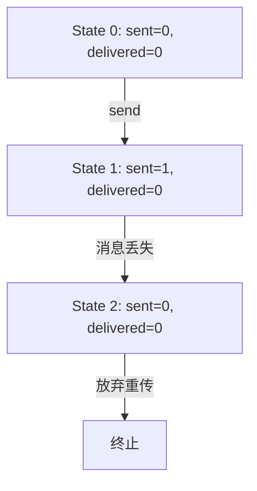

# PRISM 反例生成

## 介绍

在模型检测中，**反例（Counterexample）** 是验证属性失败时系统行为的具体路径。PRISM工具能够自动生成反例，帮助开发者定位问题。本章将介绍PRISM反例生成的原理、操作方法和实际应用。

:::note 为什么需要反例？
当PRISM验证某个属性不成立时，反例会展示导致该属性失败的**具体状态序列**，是调试模型的重要依据。
:::

---

## 反例生成基础

### 1. 启用反例生成
在PRISM中，需通过命令行或GUI显式启用反例生成功能：
```bash
prism model.pm properties.pctl -exportcounterexample example.txt
```

### 2. 反例类型
PRISM支持两种反例：
- **路径反例（Path Counterexample）**：单个违反属性的执行路径。
- **策略反例（Strategy Counterexample）**：展示所有可能的违反路径（适用于概率模型）。

---

## 实际案例：简单通信协议

### 模型描述
假设有一个重传协议，消息可能丢失（概率=0.1）。我们验证属性：
```prism
P>=0.9 [ F delivered=1 ]
```
（“消息最终被交付的概率至少为90%”）

### 生成反例
当模型存在错误（如重传次数不足）时，PRISM会生成类似以下的反例：
```text
Counterexample for P>=0.9 [F delivered=1]:
Path 1 (probability=0.1):
  State 0: sent=0, delivered=0
  State 1: sent=1, delivered=0 (消息丢失)
  State 2: sent=0, delivered=0 (放弃重传)
```

:::warning 注意
概率型反例的路径可能包含多个分支，需结合概率值分析主要问题来源。
:::

---

## 代码示例

### 输入模型（model.pm）
```prism
dtmc

module Sender
  sent : [0..1] init 0;
  [send] sent=0 -> 0.9:(sent'=1) + 0.1:(sent'=0);
  [retry] sent=1 -> 0.9:(sent'=1) + 0.1:(sent'=0);
endmodule

module Receiver
  delivered : [0..1] init 0;
  [recv] sent=1 -> (delivered'=1);
endmodule
```

### 输出反例分析


---

## 高级技巧

### 1. 最小化反例
使用 `-min` 参数获取最简反例：
```bash
prism model.pm prop.pctl -exportcounterexample min.txt -min
```

### 2. 可视化工具
将反例导出为`.tra`文件后，可用PRISM-GUI可视化路径：
```prism
0: (sent=0,delivered=0)
1: (sent=1,delivered=0)
2: (sent=0,delivered=0)
```

:::tip 调试建议
1. 优先检查反例中概率最低的转移
2. 对比预期与实际状态变量变化
3. 逐步放宽属性条件测试边界情况
:::

---

## 总结

| 关键点                  | 说明                          |
|-------------------------|-----------------------------|
| 反例生成条件            | 属性验证失败时自动触发       |
| 核心价值                | 定位模型设计或属性表述错误   |
| 典型应用场景            | 通信协议、并发系统验证       |

**延伸练习**：
1. 修改上述通信协议模型，使它能通过验证属性
2. 尝试生成一个包含3次重传的反例

---

## 扩展资源
- PRISM官方手册：Counterexample Generation章节
- 《Principles of Model Checking》第10章
``` 

注：实际使用时请移除代码块外的