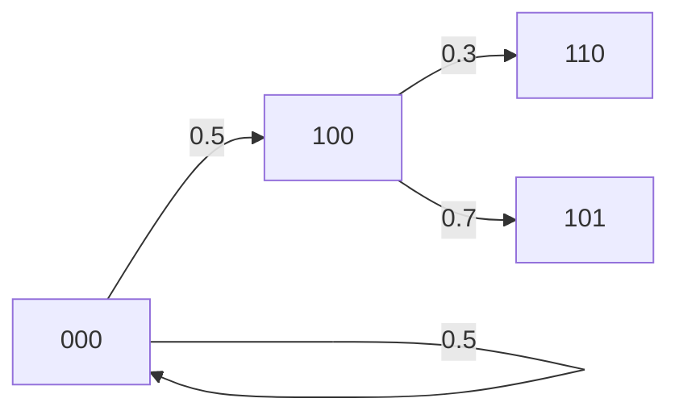

# PRISM 状态空间探索

## 介绍

状态空间探索是模型检测的核心环节，它通过系统地遍历系统所有可能的状态和转移路径，验证系统是否满足给定的规约属性。在PRISM中，状态空间探索针对**离散概率系统**（如DTMC、MDP等）进行，计算状态可达性、路径概率等关键指标。

:::note 关键术语
- **状态空间**：系统所有可能状态的集合
- **转移矩阵**：状态间的概率转移关系
- **可达性**：从初始状态能否到达目标状态
:::

## 基础概念

### 1. 状态表示
PRISM中的每个状态由变量组合定义。例如一个3比特系统：
```prism
// PRISM模型定义
dtmc

module bit_system
    b0 : [0..1] init 0;
    b1 : [0..1] init 0;
    b2 : [0..1] init 0;
    
    [] b0=0 -> 0.5:(b0'=1) + 0.5:(b0'=0);
    // 其他转移规则...
endmodule
```
该系统的状态空间大小为2³=8（每个比特有2种取值）。

### 2. 状态转移图


## 探索算法

PRISM采用混合方法进行状态空间探索：

1. **显式探索**：逐个生成可达状态
2. **符号化表示**（使用MTBDD）：
   - 将转移矩阵编码为二进制决策图
   - 压缩存储状态空间

:::tip 效率优化
对于大型系统（>10⁷状态），建议启用`-sym`参数使用符号化方法：
```bash
prism model.pm props.pctl -sym
```
:::

## 实际案例：网络协议分析

分析一个简单的重传协议，其中：
- 数据包发送成功概率=0.9
- 最多重试3次

```prism
// 重传协议模型
dtmc

module sender
    attempts : [0..3] init 0;
    success : bool init false;
    
    [send] !success & attempts<3 -> 0.9:(success'=true) + 0.1:(attempts'=min(attempts+1,3));
    [done] success -> true;
endmodule
```

使用PRISM验证"最终发送成功"的概率：
```prism
P=? [ F success=true ]
```

输出示例：
```
Result: 0.999 (exact value: 1-0.1^3)
```

## 常见问题处理

:::caution 状态爆炸问题
当变量数量增加时，状态空间呈指数增长：
- 10个布尔变量 → 1,024状态
- 30个布尔变量 → 超过10亿状态

**解决方案**：
1. 使用抽象精化方法
2. 应用对称性约减
3. 分模块验证
:::

## 总结

PRISM的状态空间探索通过：
1. 系统性地枚举或符号化表示所有可达状态
2. 计算状态间的概率转移关系
3. 支持概率可达性等核心验证任务

## 延伸学习

推荐练习：
1. 修改比特系统模型，增加一个比特变量，观察状态空间变化
2. 在重传协议中增加超时机制，验证成功概率变化

附加资源：
- PRISM手册第5章：Model Construction
- 《Principles of Model Checking》第10章
