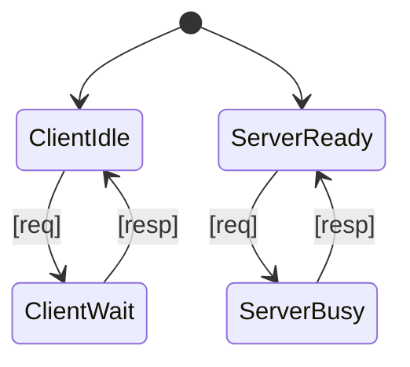

# PRISM 模块通信

## 引言

在PRISM概率模型检测器中，复杂系统通常被分解为多个交互模块。模块通信是描述这些组件如何协同工作的核心机制，主要通过**同步动作**和**共享变量**实现。本教程将详细介绍这两种通信方式，并通过案例演示如何建模分布式系统中的交互行为。

## 模块通信基础

PRISM模型由多个模块组成，每个模块包含：
- 局部变量（仅当前模块可修改）
- 命令（形式为 `[action] guard -> rate : update;`）
- 同步标签（用于跨模块协调）

### 1. 同步动作（Synchronisation）

当多个模块的相同动作标签同时触发时，发生**同步**。例如：

```prism
// 模块1
module Module1
    x : [0..1] init 0;
    [send] x=0 -> 1.0 : (x'=1);
endmodule

// 模块2
module Module2
    y : [0..1] init 0;
    [send] y=0 -> 1.0 : (y'=1);
endmodule
```

当 `send` 动作触发时：
1. 两个模块的守卫条件（`x=0` 和 `y=0`）必须同时满足
2. 两个更新语句（`x'=1` 和 `y'=1`）原子性执行

:::tip 同步规则
- 同步动作的所有参与模块必须满足各自的守卫条件
- 更新操作是瞬时完成的（无时间延迟）
:::

### 2. 共享变量（Shared Variables）

全局变量可被所有模块读取，但通常只允许一个模块写入：

```prism
global z : [0..2] init 0;  // 全局变量

module ModA
    [act] z<2 -> 0.5 : (z'=z+1);
endmodule

module ModB
    [act] z>0 -> 0.5 : (z'=z-1);
endmodule
```

## 实际案例：客户端-服务器模型



对应的PRISM模型：

```prism
// 客户端-服务器通信模型
const int N = 3;  // 最大请求数

module Client
    state : [0..2] init 0;  // 0=idle, 1=waiting, 2=done
    count : [0..N] init 0;
    
    [request] state=0 & count<N -> (state'=1) & (count'=count+1);
    [response] state=1 -> (state'=0);
    [timeout] state=1 -> 0.1 : (state'=0);
endmodule

module Server
    busy : bool init false;
    
    [request] !busy -> (busy'=true);
    [response] busy -> (busy'=false);
endmodule
```

**行为分析**：
1. `request` 同步时：
   - 客户端从 idle 进入 waiting 状态
   - 服务器标记为 busy
2. `response` 同步时：
   - 客户端返回 idle
   - 服务器恢复 ready 状态

## 高级通信模式

### 广播通信
使用 `broadcast` 关键字实现一对多同步：

```prism
module Broadcaster
    [broadcast send] true -> (msg'=1);
endmodule

module Receiver1
    received1 : bool init false;
    [send] true -> (received1'=true);
endmodule

module Receiver2
    received2 : bool init false;
    [send] true -> (received2'=true);
endmodule
```

### 优先级控制
通过动作标签命名约定实现优先级：

```prism
module HighPriority
    [urgent_act] true -> ...;
endmodule

module LowPriority
    [normal_act] true -> ...;
endmodule
```

## 常见问题解决

:::caution 死锁场景
当同步动作的守卫条件无法同时满足时：
```prism
module A
    [sync] x>0 -> ...;
endmodule

module B
    [sync] y<0 -> ...;
endmodule
```
解决方案：检查守卫条件的逻辑兼容性
:::

## 总结与练习

### 关键点回顾
- 同步动作实现跨模块原子操作
- 共享变量用于状态共享（需谨慎设计）
- 广播机制简化一对多通信

### 巩固练习
1. 修改客户端-服务器模型，添加2个客户端竞争服务器资源
2. 创建一个包含3个模块的投票系统，需要多数模块同意才能执行动作

### 扩展阅读
- PRISM手册《Advanced Modelling Techniques》章节
- 《Principles of Model Checking》第7章（进程代数）