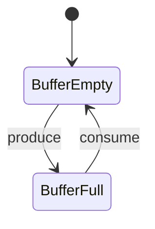

## 引言

在PRISM中，**同步构造机制**是描述多个模块间同步行为的关键特性。当多个模块需要在同一时间点执行特定动作时（例如并发系统中的通信或共享资源访问），同步机制能够准确表达这种协作关系。本节将通过基础概念、语法示例和实际案例，帮助初学者掌握这一核心功能。

---

## 同步机制基础

PRISM通过**同步标签**（synchronisation labels）实现模块间的同步。当一个动作被多个模块标记为相同的同步标签时，这些动作会**原子性**地同时执行。语法结构如下：

```prism
[action] guard -> updates;
```

- `action`：同步标签（可选），若多个模块使用相同标签，则同步触发
- `guard`：执行条件（布尔表达式）
- `updates`：状态更新（概率性/确定性）

:::note
同步机制常用于建模：
- 分布式协议的消息传递
- 多线程程序的锁竞争
- 物理系统的并行事件
:::

---

## 代码示例：简单的双模块同步

以下模型展示两个模块通过同步标签 `sync` 实现交互：

```prism
// 模块1
module Module1
    x : [0..1] init 0;
    [sync] x=0 -> (x'=1);
endmodule

// 模块2
module Module2
    y : [0..1] init 0;
    [sync] y=0 -> (y'=1);
endmodule
```

**执行逻辑**：
1. 初始状态：`x=0, y=0`
2. 当 `sync` 动作触发时，两个模块的更新同时发生
3. 结果状态：`x=1, y=1`

:::tip
在PRISM GUI中，同步动作会显示为**共享的过渡边**，直观体现模块间的耦合关系。
:::

---

## 实际案例：生产者-消费者问题

通过同步机制建模生产者-消费者工作流：

```prism
// 缓冲区（容量1）
module Buffer
    item : bool init false;
    [produce] !item -> (item'=true);
    [consume] item -> (item'=false);
endmodule

// 生产者
module Producer
    [produce] true -> ; // 无条件触发生产
endmodule

// 消费者
module Consumer
    [consume] true -> ; // 无条件触发消费
endmodule
```

**行为解释**：
- `produce` 和 `consume` 是同步标签
- 生产者仅当缓冲区为空时能执行 `produce`
- 消费者仅当缓冲区非空时能执行 `consume`



---

## 高级特性：带权同步

PRISM允许为同步动作分配**速率/概率权重**，常用于连续时间模型（CTMC）：

```prism
module Server
    [request] rate=0.5 -> ; // 速率权重
endmodule

module Client
    [request] true -> ; // 参与同步但不影响速率
endmodule
```

**效果**：同步动作的总速率由 `Server` 模块决定（此处为0.5）。

---

## 总结与练习

### 关键点回顾
1. 同步标签实现多模块原子性交互
2. 同步动作需满足所有参与模块的守卫条件
3. 权值同步用于CTMC/DPMC模型

### 练习题目
1. 修改生产者-消费者模型，使其缓冲区容量变为2。
2. 创建一个三模块同步示例，要求其中一个模块控制同步速率。

### 扩展阅读
- PRISM官方文档：[Synchronisation](https://www.prismmodelchecker.org/manual/ThePRISMLanguage/Synchronisation)
- 《Principles of Model Checking》第10章（并发系统建模）