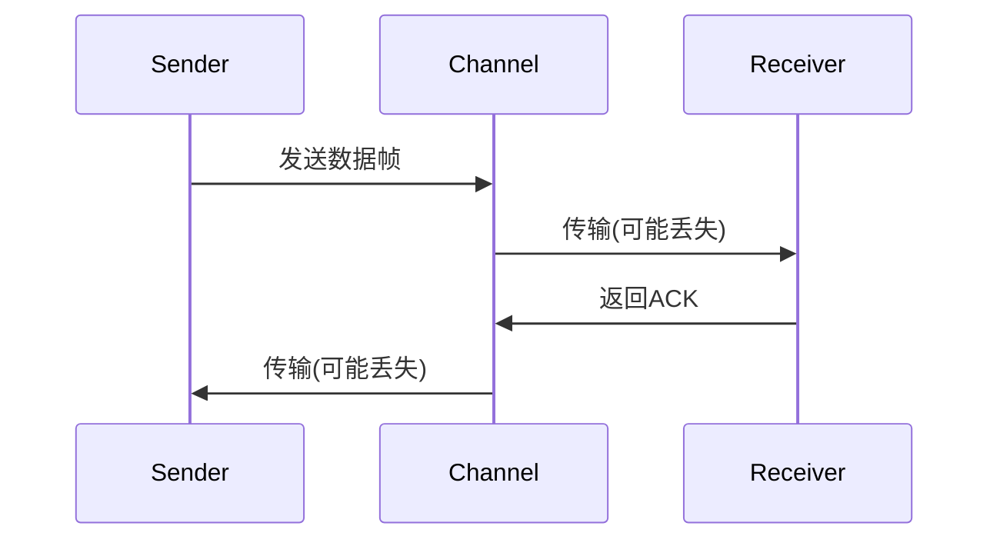

# PRISM 并发系统建模

## 简介
并发系统是由多个独立执行的进程或组件组成的系统，这些进程可能通过共享变量、消息传递或其他机制进行交互。PRISM作为一种**概率符号模型检测器**，能够对并发系统的行为进行形式化建模和验证，尤其适用于分析随机性、不确定性和概率行为。

在本章节中，你将学习：
- 并发系统的基本建模原理
- PRISM中多进程的同步与通信机制
- 实际案例的建模与分析方法

---

## 1. 并发系统基础
并发系统中的进程通常以**并行**或**交错**方式执行。在PRISM中，每个进程被建模为一个独立的模块（`module`），模块间通过以下方式交互：
- **共享变量**：多个模块读写同一变量
- **同步标签**：通过`[action]`语法实现动作同步

### 示例：两个进程的简单并发
```prism
// 定义共享变量
global x : [0..1] init 0;

module Process1
    [act] x=0 -> 0.8: (x'=1) + 0.2: (x'=0);
endmodule

module Process2
    [act] x=0 -> (x'=1);
endmodule
```
当两个进程都执行`[act]`动作时，PRISM会计算它们的**同步组合概率**（此处为0.8和1.0的乘积）。

---

## 2. 同步机制详解
PRISM支持多种同步方式：

### 2.1 完全同步
所有参与模块必须同时执行相同动作：
```prism
[update] x < 10 -> (x'=x+1);  // 模块1
[update] true -> (y'=y-1);    // 模块2
```

### 2.2 部分同步
只有部分模块参与同步：
```prism
module M1
    [send] true -> (msg'=1);
    [local] true -> (state'=2);
endmodule

module M2
    [send] msg=1 -> (received'=true);
endmodule
```

---

## 3. 实际案例：通信协议建模
让我们建模一个简单的**停止等待协议**（Stop-and-Wait）：



对应的PRISM模型：
```prism
// 信道丢包率
const double p_loss = 0.1;

module Sender
    state : [0..2]; // 0=准备, 1=等待ACK, 2=完成
    [send] state=0 -> (state'=1);
    [recv_ack] state=1 -> 0.9: (state'=2) + 0.1: (state'=1);
endmodule

module Receiver
    [recv_data] true -> 0.9: [send_ack] true;
                   // 10%概率丢失数据帧
endmodule

module Channel
    [send] true -> p_loss : true + (1-p_loss): [recv_data] true;
    [send_ack] true -> p_loss : true + (1-p_loss): [recv_ack] true;
endmodule
```

:::tip 同步分析
使用PRISM的`filter`命令可以计算协议成功率：
```prism
filter(prob, F state=2, state=0)
```
:::

---

## 4. 高级模式：进程复制
对于同构进程，PRISM支持`...`语法进行紧凑建模：

```prism
module Node[i=1..N]
    [ping] state[i]=0 -> (state[i]'=1);
    [pong] state[i]=1 -> (state[i]'=0);
endmodule
```

---

## 总结
- PRISM通过`module`和同步标签实现并发建模
- 同步概率是各模块转移概率的乘积
- 实际协议建模需要考虑信道特性

## 练习
1. 修改停止等待协议模型，增加超时重传机制
2. 构建一个3进程的互斥访问模型，验证死锁概率

## 扩展阅读
- PRISM手册第7章 "Parallel Composition"
- 《Principles of Model Checking》第10章
