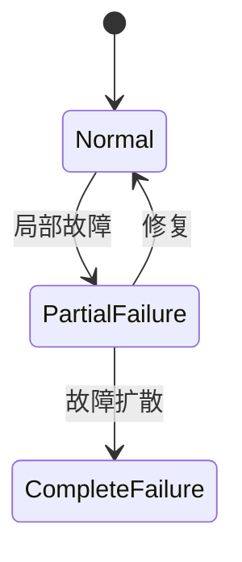

# PRISM 故障容忍建模

## 引言

故障容忍（Fault Tolerance）是分布式系统、嵌入式系统等领域的关键特性，指系统在部分组件发生故障时仍能继续正常运行的能力。PRISM作为概率模型检测工具，能够通过**概率自动机**和**马尔可夫模型**对故障容忍系统进行形式化建模，并验证其可靠性指标（如存活概率、平均故障时间等）。

本节将介绍如何用PRISM建模典型故障场景（如节点崩溃、网络丢包），分析系统的恢复策略，并通过案例演示完整工作流程。

---

## 核心概念

### 1. 故障模式建模
在PRISM中，故障通常被建模为**概率性事件**。例如：
- 节点故障：以概率 `p_fail` 从正常工作状态转移到故障状态
- 网络丢包：以概率 `p_loss` 丢失数据包

```prism
// 示例：单个节点故障模型
module Node
    state: [0..1] init 0; // 0=正常, 1=故障
    [operational] state=0 -> p_fail : (state'=1) + (1-p_fail) : (state'=0);
    [recovery] state=1 -> p_recover : (state'=0);
endmodule
```

### 2. 冗余与恢复机制
常见容错策略的PRISM实现：
- **N模冗余**：系统需要至少k个正常节点才能运行
- **检查点恢复**：定期保存状态，故障后回滚

```prism
// 三模冗余系统（至少2个节点正常）
formula operational = (node1_state=0 + node2_state=0 + node3_state=0) >= 2;
```

---

## 实战案例：分布式存储系统

### 系统描述
- 3个存储节点，每个节点有10%的每日故障概率
- 系统需要至少2个节点正常才能维持服务
- 故障节点每周有50%概率被修复

### PRISM 模型
```prism
// 节点模块（复制3份）
module Node1
    state1: [0..1] init 0; // 0=正常, 1=故障
    [daily] state1=0 -> 0.1 : (state1'=1) + 0.9 : (state1'=0);
    [weekly] state1=1 -> 0.5 : (state1'=0);
endmodule

// 系统可用性判断
formula system_operational = 
    (state1=0 + state2=0 + state3=0) >= 2;
```

### 分析查询
验证系统在1年（365步）内的可靠性：
```prism
P>=0.95 [ F<=365 system_operational ]
```

---

## 高级技巧

### 1. 级联故障建模


对应的PRISM代码：
```prism
module Cascade
    state: [0..2] init 0; // 0=正常, 1=局部故障, 2=完全故障
    [fail] state=0 -> 0.1 : (state'=1);
    [spread] state=1 -> 0.3 : (state'=2) + 0.7 : (state'=1);
    [repair] state!=2 -> 0.2 : (state'=0);
endmodule
```

### 2. 动态修复概率
:::tip
使用PRISM的`公式`功能让修复概率随故障节点数变化：
```prism
formula dynamic_repair = 0.5 / (num_failed_nodes + 1);
```
:::

---

## 总结与练习

### 关键要点
1. 故障事件应建模为概率转移
2. 系统级容错通过组合模块实现
3. 使用PRISM验证概率性指标（如`P>=? [ F[T] φ ]`）

### 拓展练习
1. 修改三模冗余案例，增加节点间故障的相关性
2. 为存储系统添加一个备用节点，分析其对可靠性的影响
3. 使用`reward`结构计算平均年故障次数

### 学习资源
- PRISM手册：[故障容忍案例库](https://www.prismmodelchecker.org/casestudies/)
- 《Principles of Model Checking》第10章
- 斯坦福大学EE384课程讲义（分布式系统验证）