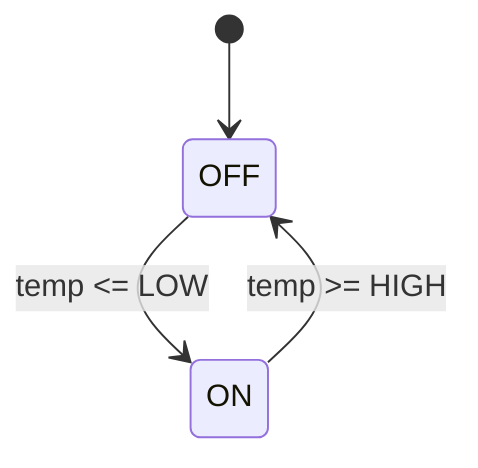

# PRISM 混合系统建模

## 简介

混合系统（Hybrid Systems）是同时包含**离散状态**和**连续动态**的复杂系统，常见于嵌入式控制、物理过程建模等领域。PRISM通过扩展其建模语言支持混合系统分析，允许在概率模型中集成连续变量（如微分方程）与离散逻辑。

:::note 关键概念
- **离散部分**：用有限状态机描述逻辑行为（如模式切换）
- **连续部分**：用常微分方程(ODE)描述物理动态（如温度变化）
:::

---

## 基础语法

PRISM中混合系统通过以下语法扩展实现：

### 1. 连续变量声明
使用 `continuous` 关键字定义连续变量及其微分方程：
```prism
continuous x deriv x' = -x + 1;
```

### 2. 混合命令
在离散转换中更新连续变量：
```prism
[action] guard -> rate : (x'=reset_value);
```

---

## 完整示例：温度控制系统

### 系统描述
- **离散状态**：加热器 `ON/OFF`
- **连续动态**：室温变化遵循牛顿冷却定律

```prism
// 混合系统模型：恒温器
hybrid thermostat

// 离散状态变量
module Heater
    state : [0..1] init 0; // 0=OFF, 1=ON
    [toggle] state=0 -> 1.0 : (state'=1);
    [toggle] state=1 -> 1.0 : (state'=0);
endmodule

// 连续温度变量
continuous temp deriv 
    state=0 : temp' = -0.1*(temp - 20) | // 冷却
    state=1 : temp' = 5 - 0.1*(temp - 20); // 加热

// 目标：保持20-22℃
const double LOW = 20;
const double HIGH = 22;
```



---

## 高级特性

### 1. 守卫条件中的连续变量
```prism
[activate] temp <= 18 -> (state'=1);
```

### 2. 随机切换
```prism
[fail] state=1 -> 0.01 : (state'=0);
```

### 3. 多变量耦合
```prism
continuous speed deriv 
    acceleration - friction*speed;
```

---

## 实际应用案例

### 案例：无人机电池管理
```prism
hybrid drone

module Battery
    continuous charge deriv -0.05; // 5%放电率/分钟
    [recharge] charge <= 0.1 -> (charge'=1.0);
endmodule

module Motor
    [land] charge < 0.15 -> true;
endmodule
```

:::tip 工程实践
1. 使用 `const` 定义关键阈值
2. 通过 `label` 标记关键状态（如 `"low_battery"`）
3. 用 `//` 注释说明物理单位
:::

---

## 总结

| 关键点                  | 说明                          |
|-------------------------|-----------------------------|
| 连续变量声明            | `continuous x deriv ...`     |
| 混合状态更新            | 在离散命令中修改连续变量      |
| ODE分段定义             | 使用守卫条件分隔不同动态      |

**延伸练习**：
1. 扩展恒温器模型，增加故障概率
2. 为无人机模型添加风速干扰项

**学习资源**：
- PRISM手册第7章 "Hybrid Systems"
- 《混合系统建模与验证》第3章