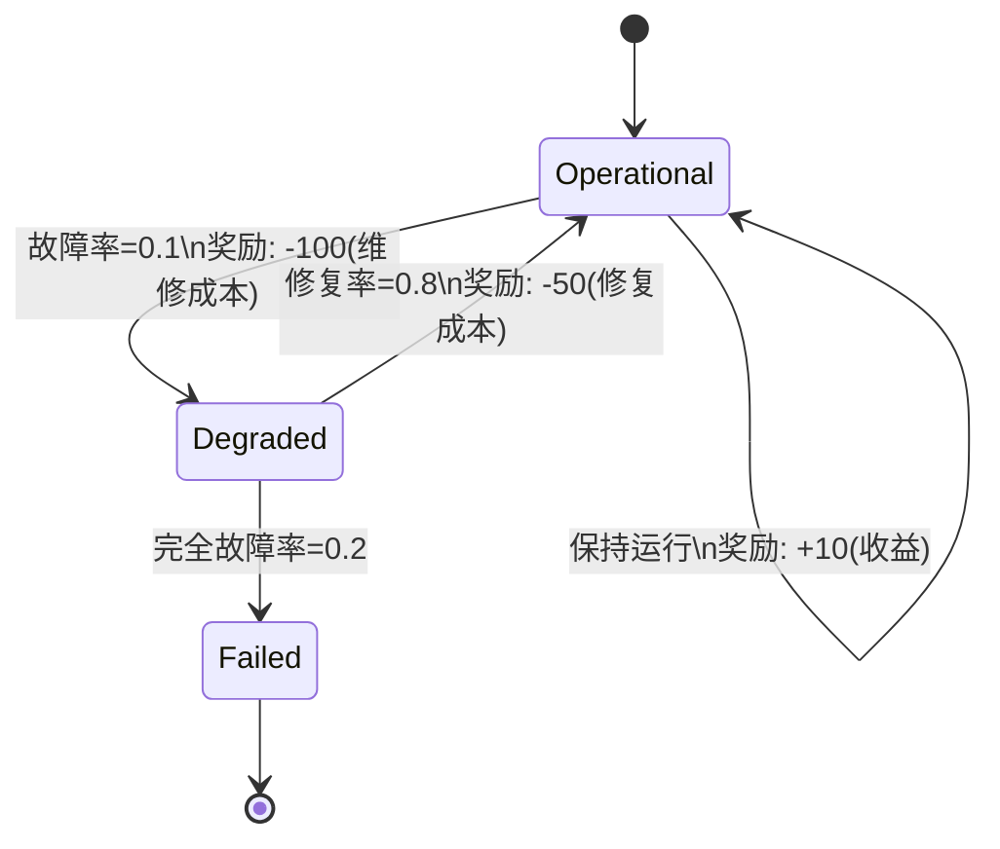

# PRISM 马尔可夫奖励过程

## 介绍

马尔可夫奖励过程(Markov Reward Process, MRP)是马尔可夫链的扩展，它为每个状态或状态转移附加了**奖励值**。在PRISM中，MRP允许我们量化系统的行为，例如计算"在系统崩溃前平均能运行多少小时"或"完成任务的平均能耗"。

:::note 核心概念
- **状态奖励**：进入某个状态时获得的即时奖励
- **转移奖励**：在状态之间转移时获得的奖励
- **累积奖励**：沿着路径获得的总奖励
:::

## 基础语法

在PRISM中，奖励通过`rewards`和`endrewards`块定义：

```prism
rewards
    [action] guard : reward;
endrewards
```

### 状态奖励示例

```prism
rewards "time_elapsed"
    // 每在"s1"状态停留一步获得+1奖励
    state = 1 : 1;
endrewards
```

### 转移奖励示例

```prism
rewards "energy_consumption"
    // 从状态2转移到状态3消耗5单位能量
    [move] state=2 -> state'=3 : 5;
endrewards
```

## 实际案例：服务器集群

考虑一个具有三种状态的服务器集群模型：



对应的PRISM模型：

```prism
dtmc

module Server
    state : [0..2] init 0; // 0=Operational, 1=Degraded, 2=Failed
    
    [] state=0 -> 0.9 : (state'=0) + 0.1 : (state'=1);
    [] state=1 -> 0.8 : (state'=0) + 0.2 : (state'=2);
    [] state=2 -> 1 : (state'=2);
endmodule

rewards "profit"
    state=0 : 10;
endrewards

rewards "cost"
    [ ] state=0 -> state'=1 : -100;
    [ ] state=1 -> state'=0 : -50;
endrewards
```

## 奖励属性验证

PRISM可以分析多种奖励相关属性：

1. **瞬时奖励**（当前状态的奖励）：
   ```prism
   R={"time_elapsed"}=? [F state=2]
   ```

2. **累积奖励**（直到满足条件的总奖励）：
   ```prism
   R{"profit"}=? [F state=2]
   ```

3. **长期平均奖励**：
   ```prism
   R{"profit"}=? [S]
   ```

:::tip 实践建议
- 始终为奖励命名（如`"profit"`），便于区分多个奖励结构
- 结合`label`定义目标状态，使公式更易读：
  ```prism
  label "failed" = state=2;
  R{"cost"}=? [F "failed"]
  ```
:::

## 工业应用案例

**数据中心冷却系统**建模：
- 状态：`{正常, 过热, 紧急冷却}`
- 状态奖励：能耗成本（正常:10W, 过热:20W, 紧急:50W）
- 转移奖励：模式切换的延迟惩罚

```prism
rewards "energy"
    state=0 : 10; // 正常
    state=1 : 20; // 过热
    state=2 : 50; // 紧急
endrewards

rewards "switching"
    [cooling_on] state=1 -> state'=0 : 5; // 启动冷却的延迟
    [override] state=1 -> state'=2 : 15;  // 紧急协议的延迟
endrewards
```

## 总结

马尔可夫奖励过程在PRISM中通过：
1. 定义状态和转移奖励结构
2. 使用`R`操作符查询奖励属性
3. 组合多个奖励结构进行复杂分析

## 延伸学习

1. **推荐练习**：
   - 修改服务器案例，添加预防性维护状态
   - 计算前100步的预期累积利润
   - 比较不同修复策略的长期成本

2. **进阶主题**：
   - 折扣奖励（Discounted Rewards）
   - 多目标奖励优化
   - 连续时间马尔可夫奖励过程

3. **PRISM官方资源**：
   - 奖励结构语法文档
   - 案例库中的Prisoner's Dilemma模型