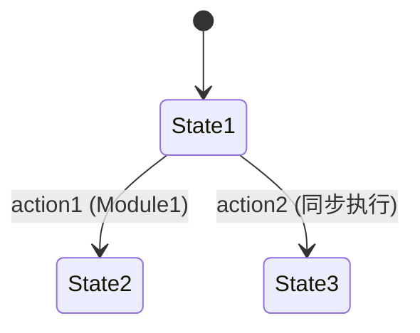

# PRISM 异步系统建模

## 引言

异步系统是指系统中多个组件（如进程或模块）以非同步方式独立运行，通过不确定的时间间隔进行交互。在概率模型检测中，PRISM通过**模块间异步组合**（interleaved concurrency）来建模这类系统。本节将介绍如何用PRISM语言描述异步行为，并通过案例展示其实际应用。

## 基本概念

在PRISM中，异步系统通过以下特性实现：
1. **非确定性选择**：多个模块的命令可在任意顺序下执行
2. **局部变量**：每个模块维护自己的状态变量
3. **同步标签**：显式声明需要同步执行的动作

:::tip 关键区别
同步系统（如DTMC）的步骤是全局锁步的，而异步系统（如MDP）允许步骤间的非确定性交错。
:::

## 建模方法

### 1. 模块定义语法
```prism
module Module1
    x : [0..2] init 0;
    
    [action1] x < 2 -> (x' = x + 1);
    [action2] x > 0 -> (x' = x - 1);
endmodule

module Module2
    y : bool init false;
    
    [action2] !y -> (y' = true);
endmodule
```

### 2. 同步机制
- 相同动作标签（如 `action2`）的命令会**同步执行**
- 未标记的动作默认异步执行



## 实际案例：通信协议

建模一个简单的异步重传协议：
```prism
// 发送方模块
module Sender
    sent : bool init false;
    retry : [0..3] init 0;
    
    [send] !sent & retry < 3 -> 0.9: (sent' = true) 
                              + 0.1: (retry' = retry + 1);
    [timeout] retry >= 3 -> (retry' = 0);
endmodule

// 接收方模块
module Receiver
    received : bool init false;
    
    [send] !received -> (received' = true);
endmodule
```

### 行为分析
1. `send` 动作同步执行（双方状态同时改变）
2. `timeout` 异步执行（仅发送方处理）
3. 概率选择体现在发送方的重传机制

## 高级技巧

### 1. 优先级控制
```prism
// 高优先级动作优先执行
priority "high" [action1];
priority "low" [action2];
```

### 2. 部分同步
```prism
module Task1
    [task_step] true -> (progress' = progress + 1);
endmodule

module Task2
    // 独立于Task1异步执行
    [local_action] true -> (state' = 2);
endmodule
```

## 常见问题

:::caution 状态空间爆炸
异步组合可能导致状态数呈指数增长。可通过以下方式缓解：
- 使用`const`定义常量范围
- 抽象非关键变量
- 分模块验证
:::

## 总结

异步建模是PRISM处理并发系统的核心能力，关键要点包括：
- 模块化定义独立组件
- 通过动作标签控制同步点
- 合理使用概率与非确定性

**延伸练习**：
1. 修改通信协议案例，增加接收方的确认超时机制
2. 尝试用`rewards`结构统计异步任务的完成时间

推荐进一步学习：
- PRISM手册第7章 "Parallel Composition"
- 《Principles of Model Checking》第10章