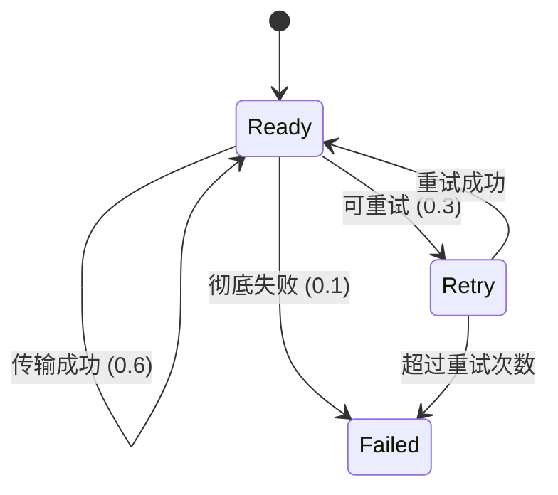

# PRISM 概率选择建模

## 介绍

概率选择建模是PRISM模型检查器的核心功能之一，用于描述系统在多个可能行为中**按概率分布选择下一步动作**的场景。这种建模方式在协议验证、随机算法分析和可靠性评估中非常常见。本节将介绍PRISM中概率选择的基本语法、语义和实际应用方法。

## 基本语法

在PRISM中，概率选择通过`[]`和`->`组合表示，基本结构如下：

```prism
[action] guard -> p1 : update1 + p2 : update2 + ... + pn : updaten;
```

其中：
- `action`：可选的动作标签
- `guard`：触发选择的条件（布尔表达式）
- `p1..pn`：概率值（总和必须为1）
- `update`：状态更新表达式

### 简单示例

```prism
module CoinToss
  face : [0..1] init 0;
  
  [toss] true -> 0.5 : (face'=0)  // 正面
            + 0.5 : (face'=1);    // 反面
endmodule
```

这个模型描述了一个公平硬币投掷：
- 每次`toss`动作有50%概率返回正面(`face=0`)
- 50%概率返回反面(`face=1`)

## 概率分布类型

PRISM支持多种概率分布表达方式：

### 离散分布
```prism
[demo] x=1 -> 0.3:(y'=0) + 0.7:(y'=1);
```

### 均匀分布
```prism
[dice] true -> 1/6:(z'=1) + 1/6:(z'=2) 
               + ... + 1/6:(z'=6);
```

### 状态相关概率
```prism
[retry] fail=true -> p:(attempt'=attempt+1) 
                   + (1-p):(fail'=false);
```

## 实际案例：网络协议重传

考虑一个网络协议的重传机制，每次传输有：
- 60%概率成功
- 30%概率失败但可重试
- 10%概率彻底失败

```prism
module Protocol
  status : [0..2] init 0; // 0=ready, 1=retry, 2=failed
  attempts : [0..3] init 0;
  
  [transmit] status=0 & attempts<3 -> 
    0.6 : (status'=0) & (attempts'=0)  // 成功
    + 0.3 : (status'=1) & (attempts'=attempts+1)  // 可重试
    + 0.1 : (status'=2);  // 彻底失败
endmodule
```

## 状态转换可视化



## 高级技巧

### 概率与非确定性结合
```prism
[timeout] clock>threshold -> 
    // 网络可能处于两种状态
    0.8:(reset'=true) + 0.2:(reset'=false);
```

### 参数化概率
```prism
formula p_success = 1 - 0.1*attempts;
[retry] true -> p_success:(done'=true) 
              + (1-p_success):(attempts'=attempts+1);
```

## 常见错误

:::caution 概率总和检查
确保所有分支概率之和严格等于1.0，否则PRISM会报错：
```prism
// 错误示例（总和=0.9）
[error] true -> 0.5:X + 0.4:Y;
```
:::

:::tip 调试建议
使用PRISM的`-sim`参数进行模拟运行，观察概率路径：
```bash
prism model.pm -sim -simpathlen 100
```
:::

## 总结

概率选择建模使PRISM能够：
1. 描述现实系统中的随机行为
2. 分析概率性协议的正确性
3. 计算复杂系统的可靠性指标

## 延伸练习

1. 修改硬币投掷模型，实现一个有偏硬币（70%正面）
2. 创建一个三状态缓存系统（命中/未命中/失效）
3. 分析WiFi退避算法的平均重传次数

## 附加资源

- PRISM官方文档：概率模型章节
- 《概率模型检验》第3章
- 案例库中的"无线网络MAC协议"示例