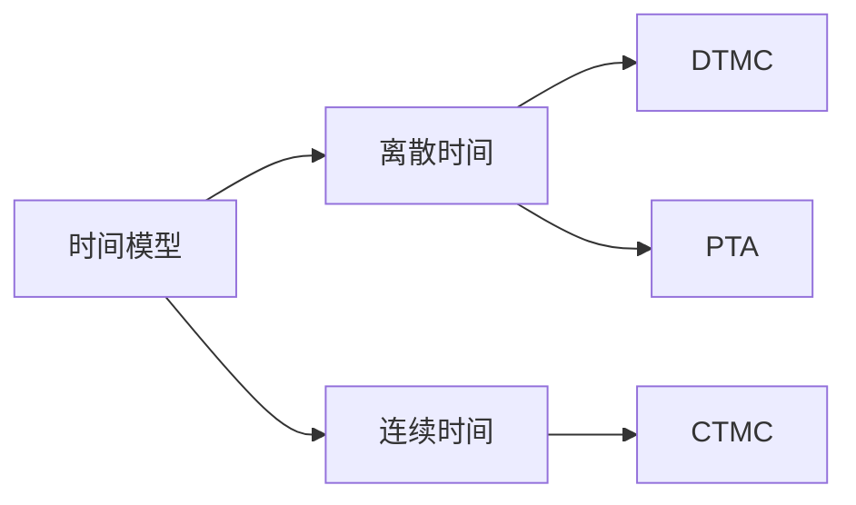

# PRISM 时间概念表达

## 介绍

在概率模型检测中，时间是一个关键维度。PRISM支持对**离散时间**和**连续时间**系统的建模与分析，允许我们表达诸如"在5秒内达到目标状态的概率"或"每秒执行一次操作"等时间相关属性。本章将详细介绍PRISM中时间概念的表示方法及其应用场景。

## 时间模型基础

PRISM支持两种主要的时间模型：

1. **离散时间模型 (DTMC/PTA)**  
   - 时间以离散步骤推进
   - 示例：回合制系统、时钟周期

2. **连续时间模型 (CTMC)**  
   - 时间连续流动
   - 示例：化学反应、网络延迟



## 离散时间表达

### 基本语法

在离散时间模型中，使用`steps`作为时间单位：

```prism
// 3步内完成任务的概率
P=? [ F<=3 "done" ]
```

### 时钟变量示例

```prism
module Timer
    clock : [0..10] init 0;
    
    [tick] clock < 10 -> (clock'=clock+1);
    [timeout] clock = 10 -> true;
endmodule
```

:::note 注意
离散时间模型中，每个状态转换对应一个时间单位
:::

## 连续时间表达

### 速率定义

CTMC中使用`rate`表示状态转换速率：

```prism
module Server
    state : [0..1] init 0;
    
    [] state=0 -> 1.5 : (state'=1); // 速率为1.5的指数分布
    [] state=1 -> 0.8 : (state'=0);
endmodule
```

### 实时属性查询

```prism
// 在5.0时间单位内保持运行的概率
S=? [ state=0 U<=5.0 state=1 ]
```

## 实际案例：网络协议超时

考虑一个简单的重传协议模型：

```prism
ctmc

const double timeout = 2.0;
const double retry_rate = 0.5;

module Sender
    status : [0..2] init 0; // 0=ready, 1=waiting, 2=success
    
    [send] status=0 -> 1.0 : (status'=1);
    [] status=1 -> retry_rate : (status'=0);
    [ack] status=1 -> 1.0/timeout : (status'=2);
endmodule

// 查询：在10秒内传输成功的概率
P=? [ F<=10 status=2 ]
```

## 高级时间特性

### 截止时间约束

```prism
// 使用PTA(概率时间自动机)表达
module Deadline
    x : clock;
    invariant x<=5
    [act] x<=3 -> 0.9 : (x'=0),
                 0.1 : (x'=x);
endmodule
```

### 周期性行为

```prism
module Periodic
    t : [0..10] init 0;
    
    [event] t=10 -> (t'=0);
    [] t<10 -> (t'=t+1);
endmodule
```

## 总结

- 离散时间模型适合步进式系统分析
- 连续时间模型能更精确表达实时行为
- 时钟变量和速率是表达时间概念的核心元素
- PRISM支持丰富的时间相关概率查询

## 扩展练习

1. 修改网络协议案例，添加两次重传后的失败状态
2. 创建一个DTMC模型，计算3步内达到目标状态的概率
3. 设计一个CTMC温度控制器模型，包含加热和冷却速率

## 延伸阅读

- PRISM官方文档"Temporal Properties"章节
- 《Principles of Model Checking》第10章
- UPPAAL工具的时间自动机教程