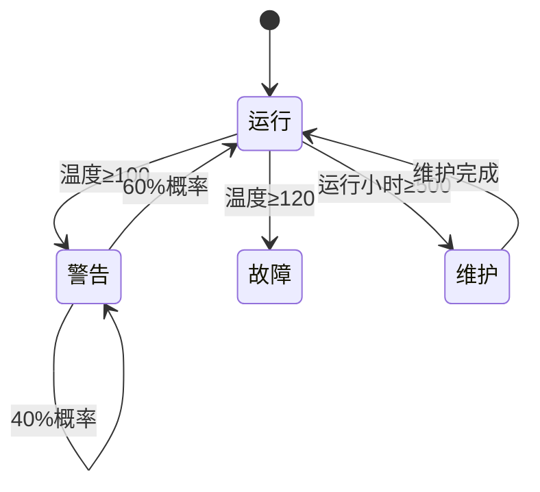

# PRISM 条件转移

## 介绍

条件转移是PRISM建模语言中一个强大的特性，它允许模型根据当前状态的不同条件选择不同的转移路径。这种机制使得我们能够构建更加灵活和表达力强的概率模型，特别适合描述现实世界中复杂的决策过程。

在PRISM中，条件转移通常表现为带有守卫(guard)的命令(commands)，只有当守卫条件为真时，相应的转移才会被激活。这种结构类似于传统编程语言中的`if-then-else`语句，但应用于概率系统的建模。

## 基本语法

PRISM中的条件转移基本语法如下：

```
[action] guard -> p1:(update1) + p2:(update2) + ... + pn:(updaten);
```

其中：
- `action` 是可选的同步标签
- `guard` 是一个布尔表达式，决定转移是否可用
- `p1, p2,..., pn` 是概率值
- `update1, update2,..., updaten` 是状态更新表达式

## 简单示例

让我们从一个简单的天气模型开始：

```
module Weather

  rain : bool init false;
  temp : [0..40] init 25; // 温度范围0-40度，初始25度

  // 温度高于30度时有70%概率下雨
  [daytime] temp > 30 -> 0.7: (rain'=true) + 0.3: (rain'=false);

  // 温度低于等于30度时有20%概率下雨
  [daytime] temp <= 30 -> 0.2: (rain'=true) + 0.8: (rain'=false);

  // 温度变化规则
  [nighttime] true -> 0.5: (temp'=max(temp-5,0)) + 0.5: (temp'=temp);
endmodule
```

在这个例子中，我们根据当前温度的不同条件（`temp > 30`或`temp <= 30`）选择了不同的概率转移。

## 复杂条件转移

PRISM允许更复杂的条件表达式，包括逻辑运算符和数学表达式。下面是一个网络协议模型的例子：

```
module Protocol

  backoff : [0..3] init 0; // 退避计数器
  attempts : [0..5] init 0; // 尝试次数

  // 尝试发送数据包
  [send] attempts < 5 & backoff = 0 -> 
    0.9: (backoff'=0) & (attempts'=0) + // 成功发送
    0.1: (backoff'=min(backoff+1,3)) & (attempts'=attempts+1); // 冲突，增加退避

  // 退避计时器递减
  [tick] backoff > 0 -> (backoff'=backoff-1);

endmodule
```

:::note
注意条件转移中的守卫可以包含多个条件的组合（使用`&`表示AND，`|`表示OR）。这大大增强了模型的表达能力。
:::

## 嵌套条件转移

有时我们需要更复杂的条件逻辑，这时可以使用多个命令来实现嵌套条件的效果：

```
module TrafficLight

  color : [0..2] init 0; // 0=红, 1=黄, 2=绿
  timer : [0..10] init 0;
  emergency : bool init false;

  // 正常情况下交通灯变化
  [step] !emergency & timer=10 & color=0 -> (color'=1) & (timer'=0); // 红→黄
  [step] !emergency & timer=5 & color=1 -> (color'=2) & (timer'=0);  // 黄→绿
  [step] !emergency & timer=10 & color=2 -> (color'=0) & (timer'=0); // 绿→红

  // 紧急情况下立即变红灯
  [emergency] emergency -> (color'=0) & (timer'=0);

  // 计时器递增
  [tick] true -> (timer'=min(timer+1,10));

endmodule
```

## 实际案例：故障恢复系统

让我们看一个更实际的工业控制系统示例，展示条件转移如何建模复杂的故障恢复行为：

```
module Machine

  state : [0..3] init 0; // 0=运行, 1=警告, 2=故障, 3=维护
  temp : [0..150] init 25;
  load : [0..100] init 0;
  hours : [0..1000] init 0;

  // 正常运行
  [operate] state=0 & temp<100 & load<90 -> 
    0.8: (temp'=min(temp+load/10,150)) & (load'=load+1) & (hours'=hours+1) +
    0.2: (temp'=min(temp+load/8,150)) & (load'=load) & (hours'=hours+1);

  // 温度警告
  [operate] state=0 & temp>=100 & temp<120 -> 
    0.7: (state'=1) & (temp'=temp-20) + // 进入警告状态并降温
    0.3: (state'=0) & (temp'=temp-10);  // 继续运行但降温

  // 严重故障
  [operate] state=0 & temp>=120 -> (state'=2); // 立即故障

  // 警告状态下操作
  [operate] state=1 & temp<100 -> 
    0.6: (state'=0) + // 恢复正常
    0.4: (state'=1);  // 保持警告状态

  // 维护需求
  [operate] hours>=500 -> (state'=3); // 计划维护

  // 维护完成
  [maintain] state=3 -> (state'=0) & (hours'=0) & (temp'=25) & (load'=0);

endmodule
```



## 最佳实践

1. **保持守卫条件简单**：复杂的条件表达式可能难以理解和维护。考虑将其分解为多个命令。

2. **明确优先级**：当多个命令的守卫同时为真时，PRISM会非确定性地选择其中一个。确保这是你期望的行为。

3. **使用注释**：为复杂的条件转移添加注释，解释业务逻辑。

4. **模块化设计**：将相关的条件转移分组到同一模块中，提高可读性。

## 常见错误

:::caution
1. **互斥条件不完整**：确保所有可能的情况都被覆盖，否则可能导致模型"卡住"。
   
   错误示例：
   ```
   [act] x=1 -> ... ;
   [act] x=2 -> ... ;
   // 当x=3时没有定义转移
   ```

2. **概率总和不为1**：确保每个命令中的所有概率分支总和为1。
   
   错误示例：
   ```
   [act] true -> 0.6: (x'=1) + 0.3: (x'=2); // 总和0.9≠1
   