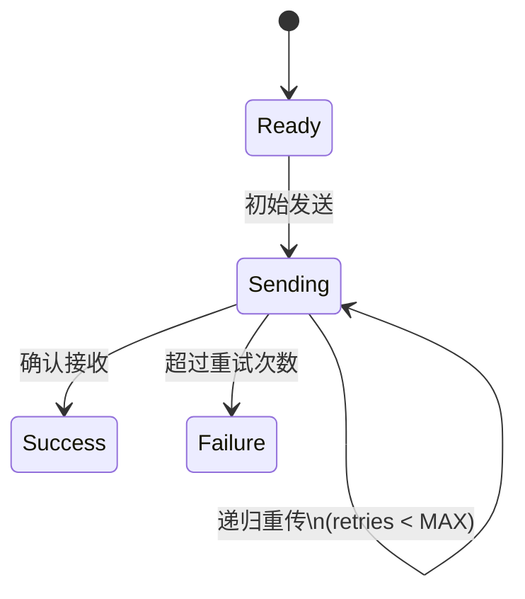

# PRISM 递归结构

## 简介

递归是计算机科学中一种重要的编程范式，它允许函数或模块通过调用自身来解决问题。在PRISM中，递归结构可以用于建模具有重复或分层行为的系统，例如协议栈、网络路由算法或分形几何系统。本节将介绍如何在PRISM模型中实现递归结构，并通过实际案例展示其应用。

:::note 为什么需要递归？
递归能够简洁地描述自相似或无限状态空间的问题，特别适合建模：
- 协议重传机制
- 递归算法（如快速排序）
- 分层系统架构
:::

## 基本语法

PRISM通过`module`和`formula`的递归引用来实现递归结构。以下是基本模式：

```prism
// 递归公式定义
formula recursive_condition = ... | (recursive_case & recursive_condition);

// 递归模块示例
module RecursiveModule
  state : [0..max_depth] init 0;
  
  [] state < max_depth -> lambda : (state' = state + 1);
  [] recursive_condition & state > 0 -> mu : (state' = state - 1);
endmodule
```

## 案例研究：重传协议建模

让我们通过一个数据包重传协议的实际案例来理解递归结构：

```prism
// 最大重试次数常量
const int MAX_RETRIES = 3;

// 递归定义重传条件
formula need_retry = retries < MAX_RETRIES & packet_lost;

module Sender
  retries : [0..MAX_RETRIES] init 0;
  status : [0..2]; // 0:准备 1:发送中 2:成功
  
  // 初始发送
  [] status = 0 -> 0.9 : (status' = 1) + 0.1 : (status' = 0);
  
  // 递归重传逻辑
  [] need_retry & status = 1 -> 0.8 : (retries' = retries + 1) & (status' = 1)
                               + 0.2 : (status' = 2);
  
  // 成功或最终失败
  [] !need_retry & status = 1 -> (status' = 2);
endmodule
```

该模型展示了当数据包丢失时(`packet_lost`)，系统会递归地尝试重传，直到达到最大重试次数。

## 状态空间分析

递归结构会创建状态空间的分层扩展，可以用Mermaid状态图表示：



:::caution 注意事项
1. 必须定义递归的终止条件，否则会导致无限状态空间
2. 递归深度过大会导致状态爆炸问题
3. 验证时可能需要限制递归深度
:::

## 高级技巧：参数化递归

PRISM支持通过参数传递实现更灵活的递归：

```prism
module RecursiveNode(depth)
  [] depth > 0 -> (depth' = depth - 1);
  // 其他行为...
endmodule

// 实例化
module TopLevel = RecursiveNode(5) endmodule
```

## 实际应用场景

1. **网络协议分析**：TCP指数退避重传机制
2. **算法验证**：递归算法的正确性证明
3. **系统恢复**：故障恢复的递归尝试策略
4. **博弈论**：递归博弈树建模

## 总结

PRISM中的递归结构为建模复杂分层系统提供了强大工具。关键要点：
- 使用`formula`定义递归条件
- 确保递归有终止条件
- 参数化模块可增强灵活性
- 注意控制状态空间增长

## 延伸练习

1. 修改重传协议模型，实现指数退避时间
2. 创建一个递归的二叉搜索树模型
3. 分析递归深度对模型验证时间的影响

## 附加资源

- PRISM手册：递归模式章节
- 《概率模型检测》第7章：高级建模技术
- 递归理论在形式化方法中的应用（学术论文）