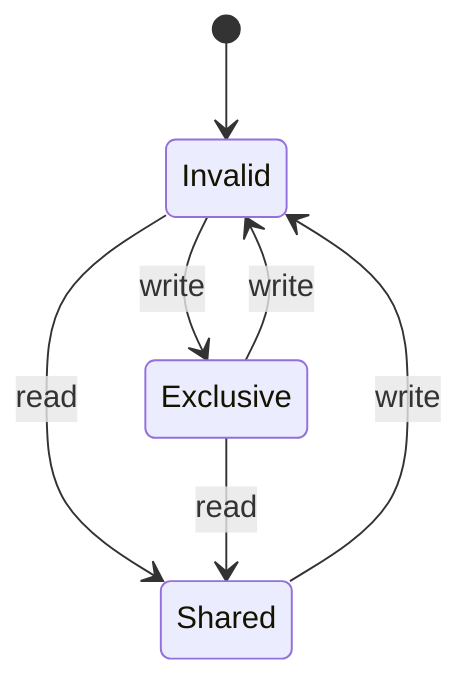

# PRISM 数据结构表达

## 介绍

在PRISM中，数据结构是构建概率模型的基础。本节将详细介绍PRISM支持的变量类型、数组结构、常量定义以及模块化表达方式，帮助您掌握复杂系统的建模方法。

## 基本数据类型

PRISM支持以下基本变量类型：

1. **布尔型 (bool)**: `true`/`false`
2. **整型 (int)**: 有限范围整数
3. **时钟型 (clock)**: 用于时间自动机

```prism
// 变量声明示例
module example
    b : bool init false;  // 布尔变量
    x : [0..5] init 0;    // 范围0-5的整型
    c : clock;            // 时钟变量
endmodule
```

## 常量与公式

使用`const`定义常量，`formula`定义可复用的表达式：

```prism
const int N = 10;  // 常量定义
formula ready = (queue_size > 0);  // 公式定义
```

## 数组结构

PRISM支持一维和多维数组，常用于表示集合或缓冲区：

```prism
module queue
    items : array [0..4] of [0..9];  // 5个元素的数组，每个元素取值0-9
    head : [0..4] init 0;
    
    [enqueue] (head < 4) -> (items'[head]' = value) & (head' = head + 1);
endmodule
```

## 记录类型 (结构体)

通过模块组合实现类似结构体的功能：

```prism
module packet
    source : [0..3];
    destination : [0..3];
    data : [0..255];
endmodule
```

## 状态与转换表达

PRISM使用**守卫-命令**格式定义状态转换：

```prism
[action] guard -> rate : update;
```

示例：简单的计数器模型

```prism
module counter
    count : [0..10] init 0;
    
    [inc] (count < 10) -> 0.5 : (count' = count + 1);
    [reset] true -> 1.0 : (count' = 0);
endmodule
```

## 实际案例：缓存一致性协议



对应的PRISM模型片段：

```prism
module cache
    state : [0..2] init 0;  // 0=Invalid, 1=Shared, 2=Exclusive
    
    [read] (state == 0) -> 0.8 : (state' = 1);
    [write] (state == 0) -> 0.2 : (state' = 2);
    [write] (state == 1) -> 1.0 : (state' = 0);
endmodule
```

## 高级数据结构技巧

1. **参数化模块**：
```prism
module Node(i)
    state : [0..2] init 0;
    [sync] ... -> ...;
endmodule
```

2. **全局变量**：
```prism
global queue_size : [0..10] init 0;
```

3. **自定义函数**：
```prism
formula is_full = (queue_size == 10);
```

## 常见问题与调试技巧

:::caution 变量范围溢出
PRISM会严格检查变量范围，以下代码会导致错误：
```prism
x : [0..5] init 0;
[x_inc] true -> (x' = x + 1);  // 当x=5时会溢出
```
解决方法：
```prism
[x_inc] (x < 5) -> (x' = x + 1);
```
:::

## 总结

PRISM的数据结构表达提供了：
- 基本变量类型和数组支持
- 模块化的组织方式
- 灵活的状态转换定义
- 可复用的公式和常量

## 练习建议

1. 创建一个包含3个节点的环形网络模型
2. 实现一个带有缓冲区的生产者-消费者系统
3. 扩展缓存协议模型，添加"Modified"状态

## 延伸阅读

- PRISM官方手册：变量与模块章节
- 《Principles of Model Checking》第10章
- 进阶主题：PRISM中的PTA(概率时间自动机)建模