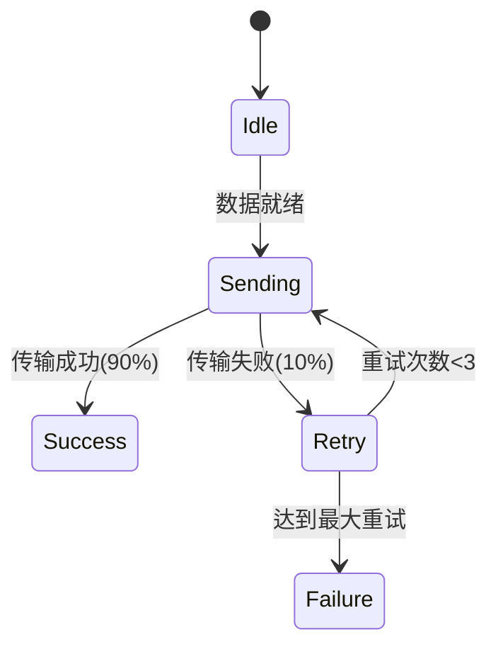

## 引言

PRISM（Probabilistic Symbolic Model Checker）是一个用于分析概率系统的形式化验证工具。在协议分析领域，PRISM可以帮助我们验证通信协议的正确性、计算消息丢失概率、评估吞吐量等关键指标。本章将通过一个**简单重传协议**的案例，展示如何使用PRISM建模并分析协议行为。

## 协议模型基础

我们分析的协议满足以下假设：
1. 发送方在超时后重传消息
2. 每次传输有10%的丢失概率
3. 最多重试3次

用PRISM建模时需要定义：
- **离散时间马尔可夫链（DTMC）**：描述系统的概率转移
- **奖励结构**：计算传输次数等指标

## PRISM 模型代码

```prism
// 重传协议模型
dtmc

const int MAX_RETRIES = 3;
const double LOSS_PROB = 0.1;

module Sender
    retries : [0..MAX_RETRIES] init 0;
    sent : bool init false;

    // 首次发送
    [] !sent -> 0.9 : (sent'=true) + 0.1 : (retries'=min(retries+1, MAX_RETRIES));
    
    // 重传逻辑
    [retry] sent & (retries < MAX_RETRIES) -> 
        0.9 : (sent'=true) + 
        0.1 : (retries'=min(retries+1, MAX_RETRIES));
    
    // 放弃条件
    [giveup] (retries = MAX_RETRIES) -> true;
endmodule
```

## 属性验证示例

验证协议的关键属性：

1. **传输成功率**：
```prism
P=? [ F sent=true ]
```

2. **平均重传次数**（使用奖励结构）：
```prism
rewards "retry_count"
    [retry] true : 1;
endrewards

R{"retry_count"}=? [ F sent=true | retries < MAX_RETRIES ]
```

## 案例：无线传感器网络协议

考虑一个实际场景——无线传感器节点向基站发送数据：



通过PRISM可以验证：
- 在不同丢包率下的端到端可靠性
- 能量消耗（每次传输消耗固定能量）

:::tip 实践建议
修改`MAX_RETRIES`和`LOSS_PROB`参数，观察对以下指标的影响：
1. 系统总能耗（假设每次传输消耗1单位能量）
2. 数据到达率
:::

## 高级分析技巧

### 参数化分析
使用PRISM的参数化功能研究不同网络条件：
```prism
const double p; // 设为参数

// 在命令行中扫描p值
prism model.pm --param p=0.1:0.9:0.1
```

### 时变概率
对随时间变化的网络条件建模：
```prism
formula time_dependent_prob = 0.1 + (t/100)*0.8;
```

## 总结

通过本案例我们学会了：
- 使用DTMC建模重传协议
- 通过概率算子`P=?`验证可靠性
- 利用奖励结构量化性能指标
- 进行参数化敏感性分析

## 扩展练习

1. 修改模型为**滑动窗口协议**，窗口大小=2
2. 添加接收方的ACK机制
3. 研究不对称信道（上行/下行丢包率不同）

## 学习资源

- PRISM官方教程：[协议建模章节](https://www.prismmodelchecker.org/tutorial/protocols.php)
- 《通信协议的形式化验证》第4章
- 标准协议模型库：IEEE 802.11 MAC层模型