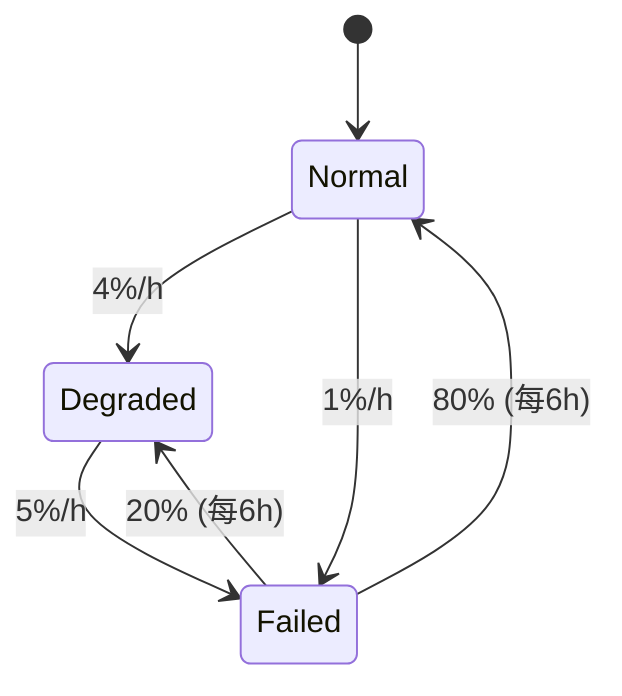

# PRISM 安全系统验证

## 引言

安全关键系统（如航空航天控制、医疗设备或工业自动化）的可靠性验证至关重要。PRISM作为**概率符号模型检测器**，能够通过数学建模分析系统在不确定性下的行为。本章将介绍如何用PRISM验证安全属性（如“系统失效概率低于阈值”），并通过案例演示完整流程。

---

## 核心概念

### 1. 安全属性与概率计算
安全验证通常涉及以下两类属性：
- **概率性质**：例如“系统在100小时内失效的概率≤0.01%”
- **时间性质**：例如“系统在故障后5秒内恢复的概率”

PRISM通过以下步骤验证：
1. 将系统建模为**马尔可夫链（DTMC/CTMC）**或**马尔可夫决策过程（MDP）**
2. 用PCTL（概率计算树逻辑）描述安全属性
3. 自动计算属性满足的概率

:::tip
PCTL示例公式：`P≥0.99 [F≤100 "operational"]`  
表示“系统在100小时内保持运行状态的概率≥99%”
:::

---

## 案例：飞机冗余控制系统

### 系统描述
假设某飞机控制系统有：
- 1个主传感器（故障率0.1%/小时）
- 2个备用传感器（故障率0.2%/小时）
- 系统失效条件：全部传感器故障

### PRISM 模型代码
```prism
// 定义传感器故障率常量
const double lambda_main = 0.001;  // 主传感器
const double lambda_backup = 0.002; // 备用传感器

// 模块定义
module Sensors
    main_ok : bool init true;  // 主传感器初始正常
    backup1_ok : bool init true;
    backup2_ok : bool init true;

    // 主传感器故障
    [main_fail] main_ok -> lambda_main : (main_ok'=false);

    // 备用传感器故障（独立事件）
    [backup1_fail] backup1_ok -> lambda_backup : (backup1_ok'=false);
    [backup2_fail] backup2_ok -> lambda_backup : (backup2_ok'=false);
endmodule

// 系统失效状态定义
label "system_failed" = !main_ok & !backup1_ok & !backup2_ok;
```

### 验证属性
计算24小时内系统失效的概率：
```prism
P=? [ F<=24 "system_failed" ]
```

### 输出结果示例
```
Result: 0.001972 (约0.197%)
```

:::note
此结果表示：即使备用传感器可靠性较低，冗余设计仍能将24小时失效概率控制在0.2%以下。
:::

---

## 进阶案例：带修复的工业机器人

### 系统特性
- 机器人有3种状态：正常、降级（50%功率）、故障
- 每小时故障概率：正常→故障 1%，降级→故障 5%
- 维修团队每6小时检查一次，修复概率80%

### Mermaid状态图


### PRISM 属性验证
```prism
// 验证72小时内累计故障时间不超过1小时的概率
P>=0.95 [ F<=72 (cumulative_failure_time<=1) ]
```

---

## 总结与练习

### 关键点总结
1. PRISM通过概率模型验证**量化安全指标**
2. 建模时需要准确定义故障率和修复机制
3. PCTL公式能灵活表达复杂安全需求

### 推荐练习
1. 修改飞机案例，增加第3个备用传感器，比较失效概率变化
2. 为机器人案例添加“紧急维修”事件（故障后2小时内50%概率修复）

### 扩展资源
- PRISM官方文档：[安全属性验证章节](https://www.prismmodelchecker.org/manual/PropertySpecification/SafetyProperties)
- 《Principles of Model Checking》第10章（概率系统验证）
``` 

注：实际使用时需移除代码块外的