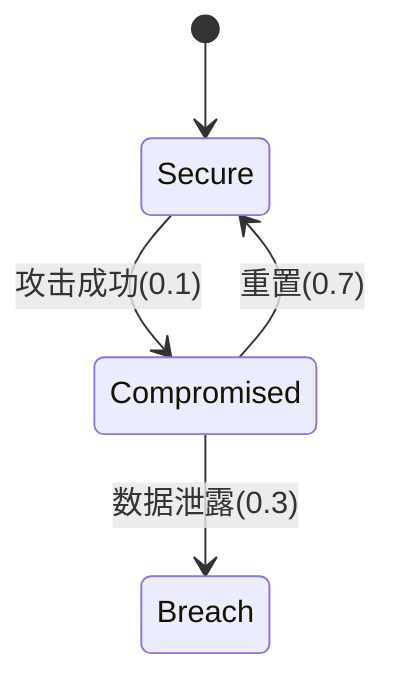

## 引言

风险评估是概率系统分析中的核心任务，它通过量化系统在特定条件下发生故障或满足危险属性的概率，帮助开发者优化设计。PRISM作为概率符号模型检测工具，能够自动化分析马尔可夫模型（如DTMC、CTMC）中的风险指标。本章将介绍PRISM中风险评估的基本方法，并通过实际案例演示分析流程。

---

## 基础概念

在PRISM中，风险评估通常涉及以下步骤：
1. **建模**：将系统抽象为概率模型（如DTMC）。
2. **属性定义**：使用PCTL/CSL公式描述风险场景。
3. **分析**：计算属性满足的概率或期望值。

常用风险评估属性示例：
- `P=? [ F<=T "failure" ]`：在时间T内发生"failure"的概率。
- `R{"cost"}<=0.5 [ F "complete" ]`：到达"complete"状态时代价不超过0.5的概率。

---

## 案例分析：云端存储系统

### 系统描述
考虑一个云端存储系统，每天有：
- 1%概率发生数据损坏（需人工修复）
- 修复成功率为80%，平均耗时2天
- 若连续3天处于损坏状态，系统永久失效

### PRISM 模型
```prism
dtmc

module CloudStorage
  state: [0..3] init 0; // 0:正常, 1-2:损坏天数, 3:失效

  [operational] state=0 -> 0.99: state'=0 
                    + 0.01: state'=1;
  [repair] state=1 -> 0.8: state'=0 
                  + 0.2: state'=2;
  [repair] state=2 -> 0.8: state'=0 
                  + 0.2: state'=3;
  [failed] state=3 -> true;
endmodule
```

### 风险评估问题
1. **7天内系统失效的概率**：
   ```prism
   P=? [ F<=7 state=3 ]
   ```
   输出示例：`Result: 0.00127`

2. **修复操作的平均次数**：
   ```prism
   R{"repairs"}=? [ F state=3|state=0 ]
   ```
   输出示例：`Result: 0.025`

---

## 进阶案例：网络安全协议

### 模型特征


### 多目标风险分析
```prism
// 同时计算被攻击次数和泄露概率
multi(R{"attacks"}<=5, P>=0.9 [ G !"Breach" ])
```

:::tip 实际应用场景
- 金融系统：评估交易失败风险
- 物联网：预测设备集群的故障传播
- 自动驾驶：计算安全关键场景的碰撞概率
:::

---

## 总结

PRISM的风险评估能力使得：
- 概率风险可被精确量化
- 设计缺陷能通过反例路径定位
- 参数敏感度分析可行（如`param P_fail=0.01..0.1`）

---

## 延伸练习
1. 修改云端存储案例，增加定期维护（每5天强制修复）
2. 为网络安全案例添加"临时漏洞"状态
3. 使用`simulate`命令生成风险事件的时间序列数据

## 扩展阅读
- PRISM手册第7章：Reward Structures
- 《Principles of Model Checking》第10章
