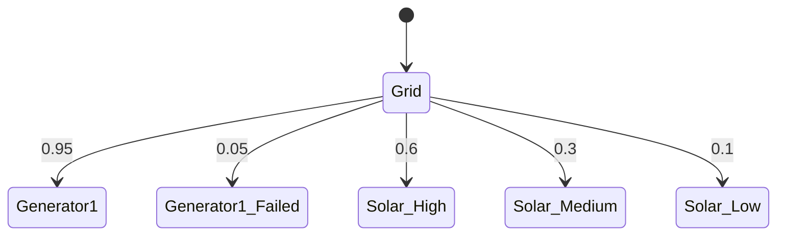

# PRISM 电力系统建模

## 介绍

电力系统是现代社会的重要基础设施，其可靠性和安全性至关重要。PRISM作为一种**概率符号模型检测器**，能够帮助我们对电力系统中的不确定性（如设备故障、可再生能源波动）进行形式化建模和分析。本章将介绍如何用PRISM构建电力系统模型，并通过案例展示实际应用。

## 基础概念

### 1. 电力系统组件建模
电力系统通常包含以下可建模的组件：
- **发电机**：离散或连续概率模型（如故障率）
- **输电线路**：布尔状态（正常/故障）或连续负载概率
- **负载**：随时间变化的概率分布

### 2. 关键属性分析
使用PRISM可以验证：
```prism
P=? [ F<=24h "blackout" ]  // 24小时内发生停电的概率
R{"energy_loss"}=? [ F T ] // 长期预期电能损失
```

## 案例：微型电网可靠性分析

### 系统描述
考虑一个包含以下元素的微型电网：
- 2台柴油发电机（每台故障概率5%/天）
- 1组太阳能电池（输出分"高/中/低"三级）
- 3个关键负载节点



### PRISM 模型代码
```prism
// 发电机模块
module Generator1
    state : [0..1] init 0; // 0=运行, 1=故障
    [operate] state=0 -> 0.95 : (state'=0) + 0.05 : (state'=1);
    [repair] state=1 -> 0.8 : (state'=0);
endmodule

// 太阳能输出模块
module Solar
    output : [0..2] init 0; // 0=高, 1=中, 2=低
    [update] true 
        -> 0.6 : (output'=0) 
        + 0.3 : (output'=1) 
        + 0.1 : (output'=2);
endmodule
```

### 属性验证示例
验证系统在72小时内保持供电的概率：
```prism
P>=0.98 [ F<=72 !(Generator1.state=1 & Generator2.state=1) ]
```

:::note 实际应用场景
某岛屿微电网使用类似模型后：
- 发现单发电机故障导致停电概率达12%
- 通过增加储能电池将风险降至3%
:::

## 进阶：考虑天气影响

扩展模型加入天气状态：
```prism
module Weather
    [sunny] -> 0.7 : (sunny'=true) + 0.3 : (sunny'=false);
    [rainy] -> 0.4 : (sunny'=false) + 0.6 : (sunny'=true);
endmodule

// 更新太阳能模块依赖天气
[update] sunny -> 0.8 : (output'=0) + 0.15 : (output'=1) + 0.05 : (output'=2);
[update] !sunny -> 0.2 : (output'=0) + 0.5 : (output'=1) + 0.3 : (output'=2);
```

## 总结与练习

### 关键要点
1. PRISM可对电力系统组件进行概率建模
2. 能验证可靠性、风险评估等关键指标
3. 可通过模块化逐步构建复杂系统模型

### 推荐练习
1. 为三节点电网添加输电线路故障模型
2. 计算不同储能容量下的系统可靠性
3. 尝试用连续时间模型(CTMC)表示发电机故障

### 扩展资源
- PRISM官方案例库中的`power_control.sm`模型
- IEEE论文《Probabilistic Model Checking of Energy Systems》
- 教材《Formal Methods for Power Systems》第6章