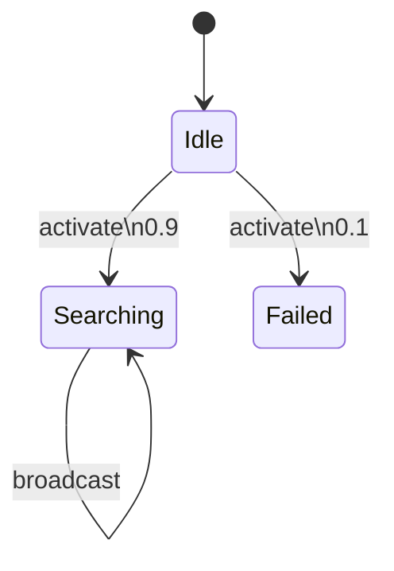

# PRISM 多智能体系统建模

## 介绍
多智能体系统（Multi-Agent Systems, MAS）是由多个自主智能体组成的分布式系统，广泛应用于机器人协作、交通调度和分布式计算等领域。PRISM作为概率符号模型检测器，能够对这类系统进行**概率行为建模**和**性质验证**。本章将教你如何使用PRISM语言描述多智能体交互，并通过案例展示如何分析系统的可靠性、安全性和性能指标。

## 核心概念
### 1. 智能体的PRISM表示
每个智能体可建模为一个**离散时间马尔可夫链（DTMC）**或**马尔可夫决策过程（MDP）**。关键要素包括：
- **状态变量**：描述智能体的内部状态（如 `agent1_state`）
- **动作标签**：同步通信的通道（如 `[send]`）
- **概率转移**：通过 `->` 语法定义行为不确定性

### 2. 系统组合方式
多智能体通过**并行组合**（`||` 运算符）交互，使用同步标签协调动作：

```prism
// 两个智能体通过'sync'动作交互
system = agent1 || agent2
```

## 案例研究：无人机编队
### 场景描述
3架无人机协作执行搜索任务，需满足：
1. 至少2架保持通信连接
2. 单机故障概率0.1
3. 通过 `broadcast` 动作同步位置

### PRISM 模型实现
```prism
// 单个无人机模块
module Drone
    state : [0..2] init 0; // 0=待命, 1=搜索, 2=故障
    [activate] state=0 -> 0.9 : (state'=1) + 0.1 : (state'=2);
    [broadcast] state=1 -> (state'=1);
endmodule

// 系统组合
system = Drone1 || Drone2 || Drone3
```

### 性质验证
验证"始终至少有2架无人机正常工作的概率"：
```prism
P>=0.95 [ G (count(state1!=2 & state2!=2 & state3!=2) >= 2 ) ]
```

## 高级特性
### 1. 部分可观察性建模
通过观察变量实现信息受限的智能体：
```prism
formula obs = (state1=1 | state2=1);
```

### 2. 奖励机制
分析系统平均能耗：
```prism
rewards "energy"
    [broadcast] true : 0.5;
endrewards
```

## 实际应用场景
1. **交通信号协调**：路口信号灯的冲突避免
2. **分布式共识协议**：区块链节点的拜占庭容错
3. **群体机器人**：协同搬运中的避碰策略



## 总结与练习
### 关键要点
- 多智能体系统通过模块化方式建模
- 同步动作实现智能体间通信
- 概率算子可分析系统可靠性

### 推荐练习
1. 扩展无人机案例，增加电池耗尽概率
2. 建模两个智能体的囚徒困境博弈
3. 验证"系统在10步内达成共识的概率"

### 延伸阅读
- PRISM手册第7章：并行组合语法
- 《多智能体系统原理》第3章
- 斯坦福MAS课程讲义（CS227）