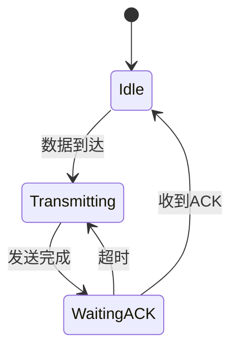

# PRISM 通信协议验证

## 介绍

通信协议是分布式系统和网络中的核心组件，确保数据在不可靠的通信通道上正确传输。PRISM作为**概率符号模型检测器**，能够验证通信协议的以下特性：  
- **功能性**（如消息是否最终到达）  
- **概率性**（如传输成功率）  
- **时序性**（如超时重传机制）  

本节将通过案例展示如何用PRISM建模和验证典型协议（如交替位协议）。

---

## 基础概念

### 1. 协议建模要素
通信协议在PRISM中通常建模为**离散时间马尔可夫链（DTMC）**或**马尔可夫决策过程（MDP）**，关键组件包括：
```prism
// 状态变量示例
module Sender
    s : [0..3]; // 发送方状态（0=空闲, 1=发送中, 2=等待ACK）
    [send] s=0 -> 0.9:(s'=1) + 0.1:(s'=0); // 90%概率成功发起发送
endmodule
```

### 2. 待验证属性
PRISM支持以下属性语法：
- **概率可达性**：`P>=0.99 [F delivered=true]`  
- **期望值**：`R{"energy"}<=10 [F complete]`  

---

## 案例研究：交替位协议

### 协议描述
交替位协议通过1比特序列号解决信道丢包和重复问题。PRISM模型需包含：
- 发送方和接收方模块  
- 可能丢失的信道  
- 超时重传机制  

### 建模示例
```prism
// 信道模型（50%丢包率）
module Channel
    msg_present : bool; // 当前是否有消息在传输
    [send] true -> 0.5:(msg_present'=true) + 0.5:(msg_present'=false);
    [receive] msg_present -> (msg_present'=false);
endmodule

// 接收方模型
module Receiver
    bit_expected : [0..1]; // 期望的序列号
    [receive] msg_present & msg_bit=bit_expected -> 
        (bit_expected'=1-bit_expected);
endmodule
```

### 验证属性
```prism
// 消息最终以高概率送达
P>=0.999 [F s=0 & r=0 & bit_sent=bit_expected]

// 平均重传次数上限
R{"retransmissions"}<=2 [F delivered]
```

---

## 实际应用场景

### 无线传感器网络协议
验证**ZigBee**路由协议的能耗和可靠性：  


对应的PRISM属性验证：
```prism
// 节点存活概率（能耗约束）
P>=0.95 [F energy<=0 U lifetime=1000]
```

---

## 总结

通过PRISM可系统化验证通信协议的：
1. **正确性**（如无死锁）  
2. **鲁棒性**（在丢包/延迟下的表现）  
3. **资源效率**（能耗、带宽利用率）  

:::tip 练习尝试
1. 修改上述交替位协议的丢包率，观察最低多少概率仍能满足`P>=0.99`的送达要求  
2. 添加一个恶意干扰节点模型，验证协议的抗攻击能力  
:::

## 延伸阅读
- PRISM手册中的[通信协议案例库](https://www.prismmodelchecker.org/casestudies/)  
- 《Principles of Model Checking》第10章