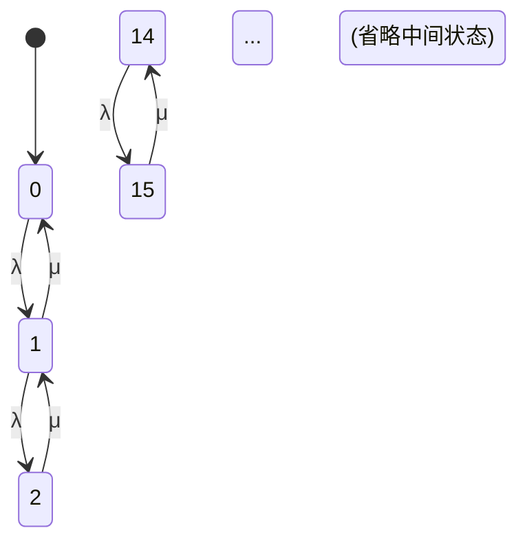

# PRISM 排队系统分析

## 引言
排队系统（Queueing Systems）是研究服务资源分配的核心模型，广泛应用于计算机网络、交通调度和生产线优化等领域。PRISM作为概率符号模型检测器，能够对排队系统进行**概率性性能评估**（如等待时间分布）和**稳态分析**（如队列平均长度）。本章将通过一个M/M/1队列案例，演示如何用PRISM建模并验证排队系统的关键属性。

---

## 基础概念
### 排队系统组成
典型的排队系统包含以下要素：
- **到达过程**（Arrival Process）：顾客到达的间隔时间分布（如泊松过程）
- **服务机制**（Service Mechanism）：服务时间的分布（如指数分布）
- **队列容量**（Queue Capacity）：系统允许的最大排队数量
- **调度策略**（Scheduling Policy）：如先进先出（FIFO）

### M/M/1队列特性
M/M/1是最基础的排队模型：
- 第一个M：到达间隔服从指数分布（Markov性）
- 第二个M：服务时间服从指数分布
- 1：单服务窗口

---

## PRISM 建模实现
### 模型参数定义
在PRISM中，我们首先定义模型参数：
```prism
// 参数定义
const double lambda = 0.5; // 到达率（顾客/分钟）
const double mu = 1.0;    // 服务率（顾客/分钟）
const int N = 10;         // 系统最大容量
```

### 模型构建
使用连续时间马尔可夫链（CTMC）建模：
```prism
module M/M/1_Queue
    q : [0..N] init 0; // 队列长度（含正在服务的顾客）

    // 顾客到达（队列未满时）
    [arrival] (q < N) -> lambda : (q' = q + 1);

    // 服务完成（队列非空时）
    [service] (q > 0) -> mu : (q' = q - 1);
endmodule
```

### 属性验证示例
1. **稳态概率**：计算系统中有k个顾客的长期概率
```prism
// 稳态下队列长度为k的概率
S=? [ q = k ]
```

2. **平均队列长度**：
```prism
// 稳态平均队列长度
R{"queue_length"}=? [ S ]
```

3. **等待时间超过阈值的概率**：
```prism
// 顾客等待时间超过T的概率
P=? [ F<=T q > 1 ]
```

---

## 案例研究：医院分诊系统
### 场景描述
某急诊科使用单队列分诊系统：
- 平均每小时到达6名患者（λ=0.1/分钟）
- 每个患者平均处理时间8分钟（μ=0.125/分钟）
- 最大容纳15名患者

### PRISM 实现关键代码
```prism
const double lambda = 0.1;
const double mu = 0.125;
const int N = 15;

module Triage_System
    patients : [0..N] init 0;

    [arrival] (patients < N) -> lambda : (patients' = patients + 1);
    [triage] (patients > 0) -> mu : (patients' = patients - 1);
endmodule
```

### 分析结果示例
通过PRISM验证以下属性：
1. 系统满负荷概率：
   ```prism
   S=? [ patients = 15 ]  // 结果 ≈ 0.013
   ```
2. 平均等待患者数：
   ```prism
   R{"waiting"}=? [ S ]   // 结果 ≈ 3.2
   ```



---

## 总结与扩展
### 关键结论
- PRISM可精确分析排队系统的**瞬态**和**稳态**行为
- 通过调整λ/μ比率可研究系统在不同负载（ρ=λ/μ）下的表现
- 模型可扩展为多服务器（M/M/c）或有限容量队列

### 进阶练习
1. 修改模型为M/M/2队列（双服务窗口）
2. 添加优先级调度策略（紧急患者优先）
3. 分析系统在瞬时过载（λ临时增大）时的表现

:::tip 学习建议
尝试使用PRISM的**模拟模式**观察队列动态变化，再与解析结果对比验证。
:::

### 扩展阅读
- PRISM官方文档：Queueing Systems案例库
- 《Fundamentals of Queueing Theory》第5章
- 论文"Model Checking Performance Models with PRISM"