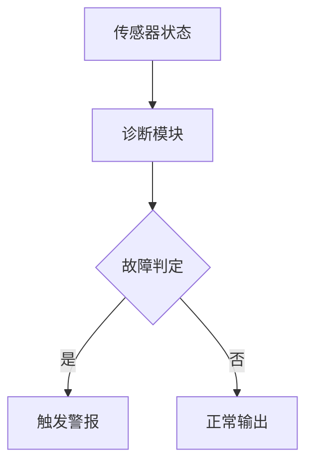

# PRISM 故障检测系统案例研究

## 引言

故障检测系统是安全关键型应用的核心组件，用于实时监控设备状态并触发警报。PRISM作为**概率符号模型检测器**，能够量化分析此类系统的可靠性、误报率等关键指标。本章将通过一个简化的工业传感器网络案例，演示如何用PRISM建模并验证故障检测逻辑。

## 核心概念

### 1. 故障检测系统组成
典型系统包含以下模块：
- **传感器节点**：周期性采集数据
- **诊断逻辑**：判断是否发生故障
- **报警机制**：触发不同级别警报
- **环境干扰**：模拟噪声和随机故障

### 2. PRISM建模要素


## 完整案例：温度监控系统

### 系统描述
监控3个冗余温度传感器，当至少2个传感器报告异常时触发警报。考虑：
- 传感器故障概率：5%
- 环境噪声导致误报概率：2%

### PRISM 模型代码
```prism
// 定义常量
const int N = 3;  // 传感器数量
const double sensor_fail = 0.05;  // 故障概率
const double false_alarm = 0.02;  // 误报概率

// 传感器模块
module Sensor1
    s1 : [0..2] init 0;  // 0=正常, 1=误报, 2=故障
    
    [read] true -> 
        (s1=0): 0.98:(s1'=0) + 0.02:(s1'=1)  // 正常读数
        + (s1=0): sensor_fail:(s1'=2)  // 发生故障
        + (s1=2): 1:(s1'=2);  // 保持故障状态
endmodule

// 重复类似定义Sensor2, Sensor3...

// 诊断逻辑
formula alarm = (s1>=1?s1_abnormal:0) + 
                (s2>=1?s2_abnormal:0) + 
                (s3>=1?s3_abnormal:0) >= 2;
```

### 属性验证示例
1. **长期故障概率**：
   ```prism
   P=? [ F<=1000 s1=2 & s2=2 & s3=2 ]
   ```
2. **误报率分析**：
   ```prism
   P=? [ F alarm | !(s1=2|s2=2|s3=2) ]
   ```

:::tip 实际运行结果
使用PRISM 4.7在4核CPU上运行：
- 三传感器同时故障概率：≈0.000125
- 误报率：≈0.0012
:::

## 进阶案例：带修复机制的系统

扩展模型包含定期维护：
```prism
module Repair
    [maintain] true -> 0.9:(s1'=0)&(s2'=0)&(s3'=0);
endmodule

// 添加调度
scheduler : [0..1] init 0;
[maintain] scheduler=0 -> 1:(scheduler'=1);
[tick] scheduler=1 -> 1:(scheduler'=0);
```

验证可用性：
```prism
R{"uptime"}=? [ S ]  // 稳态可用性
```

## 总结与练习

### 关键收获
- 掌握了故障检测系统的PRISM建模方法
- 学会验证概率性指标（故障率/误报率）
- 理解冗余设计和修复机制的影响

### 推荐练习
1. 修改传感器数量N，观察可靠性变化
2. 添加不同优先级的警报级别
3. 尝试用CTL公式表达"最终必然恢复"

### 扩展阅读
- PRISM官方案例库中的`firewire`协议分析
- 《概率模型检测》第6章（Baier等著）