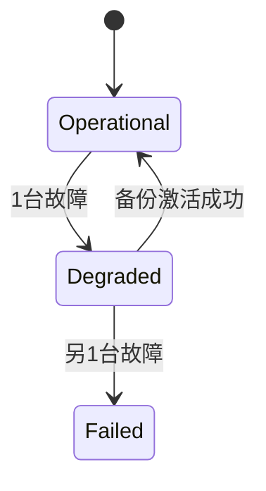

# PRISM 可靠性分析

## 引言
可靠性分析是评估系统在特定条件下持续正常运行能力的关键技术。PRISM作为**概率符号模型检测器**，能够通过数学建模验证系统的可靠性属性，例如故障概率、平均无故障时间(MTTF)等。本章将介绍如何用PRISM建模可靠性问题，并通过案例展示实际应用。

## 基本概念
可靠性分析通常涉及以下要素：
- **组件故障率**：用概率表示组件在单位时间内失效的可能性
- **系统拓扑**：组件之间的连接方式（串联、并联等）
- **度量指标**：如`P=? [ F<=T "failed" ]`（T时间内系统失效的概率）

:::note 概率时序逻辑
PRISM使用PCTL（概率计算树逻辑）表达可靠性属性，例如：
`P>=0.99 [ G<=1000 !fail ]` 表示"1000小时内保持正常的概率不低于99%"
:::

## 建模方法
### 1. 定义故障模型
```prism
// 单个组件的基本故障模型
module Component
    state : [0..1] init 0; // 0=正常, 1=故障
    [act] state=0 -> 0.01 : (state'=1); // 每次动作有1%故障概率
endmodule
```

### 2. 系统组合
```prism
// 串联系统（任一组件故障则系统故障）
system System = Component1 || Component2 || Monitor
```

### 3. 定义可靠性属性
```prism
// 计算1000小时内系统故障的概率
P=? [ F<=1000 Monitor.failure_detected ]
```

## 案例研究：冗余服务器系统
### 系统描述
- 2台主服务器 + 1台备份服务器
- 单台服务器年故障概率：5%
- 切换成功率：90%

### PRISM 模型
```prism
// 服务器模块
module Server
    status : [0..2] init 0; // 0=运行, 1=故障, 2=备用
    [heartbeat] status=0 -> 0.05 : (status'=1);
endmodule

// 备份切换控制器
module Controller
    active_servers : [0..2] init 2;
    [fail] (active_servers>0) -> (active_servers'=active_servers-1);
    [activate] (status=2) -> 0.9 : (status'=0);
endmodule
```

### 可靠性查询
```prism
// 一年内系统完全失效的概率
P=? [ F<=8760 active_servers=0 ]
```



## 进阶分析技巧
1. **参数化分析**：研究故障率变化对系统的影响
   ```prism
   const double p_fail; // 声明为可变量
   //...
   [heartbeat] status=0 -> p_fail : (status'=1);
   ```

2. **奖励机制**：计算平均无故障时间(MTTF)
   ```prism
   rewards "uptime"
     status=0 : 1;
   endrewards
   // 查询期望运行时间
   R{"uptime"}=? [ F status=1 ]
   ```

## 实际应用场景
- **云计算系统**：评估虚拟机迁移策略的可靠性
- **物联网网络**：分析传感器节点冗余设计的有效性
- **工业控制系统**：验证安全关键系统的故障恢复机制

## 总结与练习
### 关键要点
- PRISM可通过DTMC/CTMC模型量化系统可靠性
- 组合模块能反映复杂系统拓扑结构
- 奖励机制可用于计算时间相关指标

### 巩固练习
1. 修改案例中的备份服务器数量，观察可靠性变化
2. 为模型添加定期维护功能（故障组件可修复）
3. 比较串联系统与并联系统的可靠性差异

### 扩展资源
- PRISM手册可靠性章节
- 《系统可靠性工程》第4章
- IEEE Transactions on Reliability期刊案例