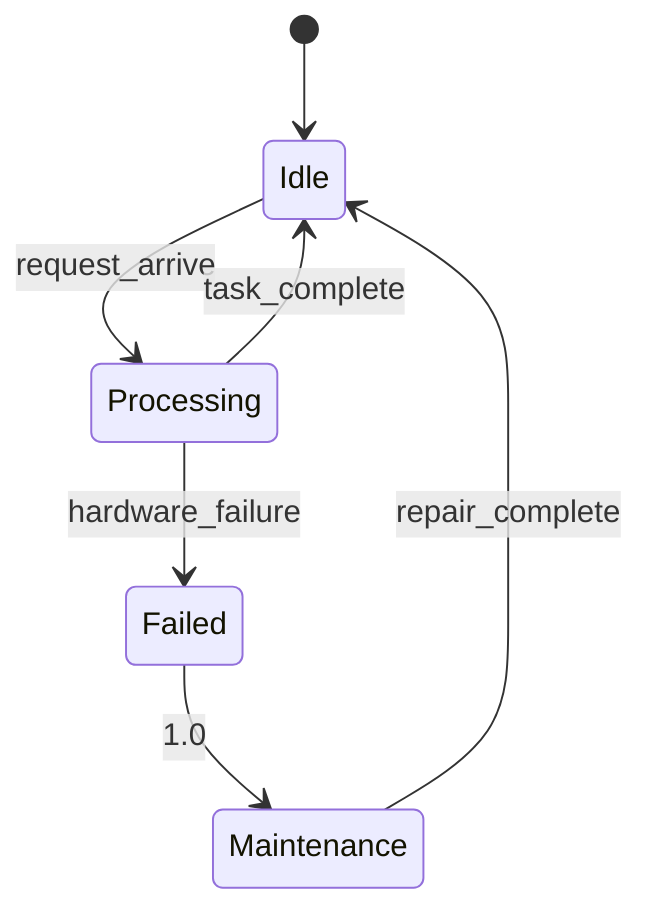

# PRISM 性能评估

## 简介

性能评估是PRISM模型检查器的核心应用场景之一。它允许我们量化分析概率模型（如马尔可夫链）的行为特性，例如计算系统在特定时间内完成任务的概率，或评估资源利用率等关键指标。本节将介绍PRISM中性能评估的基本方法、工具命令和实际案例。

## 性能评估基础

在PRISM中，性能评估通常通过以下步骤实现：

1. **模型构建**：用PRISM语言描述系统
2. **属性定义**：使用PCTL/CSL逻辑指定待评估指标
3. **求解计算**：执行模型检查获取数值结果

:::tip 关键概念
性能属性通常表示为`P=? [ F<=T "success" ]`（在时间T内达到"success"状态的概率）或`R{"time"}=? [ F "done" ]`（到达"done"状态的平均时间）
:::

## 基准测试方法

PRISM提供多种性能评估模式：

```prism
// 示例：简单队列模型
ctmc

const int N = 10; // 队列容量
module Queue
    q : [0..N] init 0; // 当前队列长度
    
    [enqueue] (q<N) -> 0.5 : (q'=q+1);
    [dequeue] (q>0) -> 1.0 : (q'=q-1);
endmodule
```

对应的性能查询可以是：

```prism
// 队列满的概率
P=? [ F q=N ]

// 平均队列长度
R{"qlen"}=? [ S ]
```

## 关键性能指标

PRISM可评估的典型指标包括：

| 指标类型          | PRISM查询示例                  | 解释                          |
|-------------------|-------------------------------|-----------------------------|
| 瞬时概率          | `P=? [ F<=10 "failed" ]`      | 10步内发生故障的概率          |
| 稳态概率          | `S=? [ q>5 ]`                 | 长期运行中队列长度>5的概率     |
| 累积奖励          | `R{"energy"}=? [ C<=100 ]`    | 100时间单位内累计能耗          |
| 瞬时奖励          | `R{"users"}=? [ I=50 ]`       | 第50个时间点的平均用户数       |

## 实际案例：云计算系统

考虑一个云服务器集群模型：



对应的PRISM属性和结果：

```prism
// 系统可用性（稳态时不在维护状态）
S=? [ !("Maintenance") ]

// 计算结果可能显示：
// 0.982 (即98.2%时间可用)

// 每小时平均处理任务数
R{"throughput"}=? [ S ]

// 典型输出：
// 12.6 tasks/hour
```

## 性能优化技巧

1. **状态空间缩减**：
   ```prism
   // 使用公式替代常量
   formula servers_active = min(servers, jobs);
   ```
   
2. **对称性利用**：
   ```prism
   // 使用模版复制相同组件
   module Server1 = Server [ id=1 ] endmodule
   module Server2 = Server [ id=2 ] endmodule
   ```

3. **近似方法选择**：
   ```prism
   // 在命令行指定求解方法
   prism model.pm props.pctl -sim -simsamples 100000
   ```

:::caution 常见问题
- 状态爆炸问题：当模型状态超过内存容量时，考虑使用：
  - 抽象精化
  - 对称性缩减
  - 分布式计算模式
:::

## 总结

PRISM的性能评估功能为量化分析随机系统提供了强大工具。通过本指南，您已经学习到：

- 基本性能查询语法
- 关键指标的计算方法
- 实际系统的建模技巧
- 性能优化的实用策略

## 扩展练习

1. 修改队列模型，评估不同到达/服务速率下的平均等待时间
2. 为云服务器模型添加冷却状态，分析其对可用性的影响
3. 使用`-exportresults`参数将结果输出到CSV文件

## 延伸阅读

- PRISM官方手册：性能属性章节
- 《概率模型检验基础》第6章
- 国际性能评估会议(SPE)历年论文集
``` 

注意：实际使用时请移除最外层的