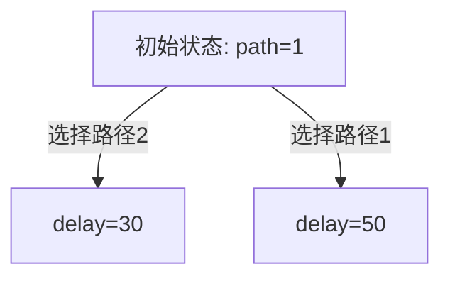

# PRISM 决策制定分析

## 简介

PRISM（Probabilistic Symbolic Model Checker）是一个用于建模和分析概率系统的工具，支持马尔可夫决策过程（MDPs）、连续时间马尔可夫链（CTMCs）等模型。决策制定分析是PRISM的核心功能之一，它帮助用户在不确定环境中评估不同策略的优劣，从而选择最优行动方案。

本节将介绍PRISM中决策制定分析的基本原理，并通过实际案例展示如何建模和求解决策问题。

---

## 决策制定基础

在PRISM中，**马尔可夫决策过程（MDP）**是决策制定分析的典型模型。MDP包含：
- **状态（States）**：系统可能处于的所有情况。
- **动作（Actions）**：在每个状态下可选的决策。
- **转移概率（Transitions）**：执行动作后状态变化的概率。
- **奖励（Rewards）**：衡量决策优劣的数值指标。

:::note
MDP的关键特性是“无记忆性”：下一状态仅依赖当前状态和动作，与历史无关。
:::

---

## PRISM 建模示例

以下是一个简单的MDP模型，描述机器人是否充电的决策问题：

```prism
// 定义状态变量（电池电量）
module Robot
  battery : [0..3] init 3;  // 电量范围0-3，初始为3

  // 动作1：执行任务（可能耗电）
  [task] battery > 0 -> 0.8: (battery'=battery-1) + 0.2: (battery'=battery);
  
  // 动作2：充电（需电量<3）
  [charge] battery < 3 -> 0.9: (battery'=battery+1) + 0.1: (battery'=battery);
endmodule

// 定义奖励（任务完成奖励10，充电成本2）
rewards "task_reward"
  [task] true : 10;
endrewards

rewards "charge_cost"
  [charge] true : -2;
endrewards
```

### 输出分析
使用PRISM命令行计算最大长期奖励：
```bash
prism robot.prism --props "Rmax=?[F battery=0]"
```
结果可能显示最优策略的期望奖励值（例如 `23.5`）。

---

## 实际案例：网络路由优化

### 问题描述
在一个网络中，数据包需要选择路径传输，每条路径有不同延迟和丢包率。目标是找到最小化平均延迟的策略。

### PRISM 模型片段
```prism
module Node
  path : [1..3] init 1;  // 可选路径1-3
  delay : [0..100];       // 延迟时间

  // 路径1：低丢包率但高延迟
  [send] path=1 -> 0.9: (delay'=50) + 0.1: (delay'=100);
  
  // 路径2：中等特性
  [send] path=2 -> 0.7: (delay'=30) + 0.3: (delay'=80);
endmodule

rewards "delay"
  [send] true : delay;
endrewards
```

### 策略验证
通过PRISM的`adversary`功能导出最优策略：


---

## 总结

1. PRISM的决策制定分析通过MDP模型评估不同策略的长期收益。
2. 关键步骤包括：定义状态/动作、设置转移概率、指定奖励函数。
3. 实际应用场景广泛，如机器人控制、网络优化等。

### 练习
1. 修改机器人案例，增加“低电量自动充电”的规则。
2. 在网络案例中新增一条高丢包率但零延迟的路径，比较策略变化。

### 扩展阅读
- PRISM官方文档：MDP建模章节
- 《Principles of Model Checking》第10章
