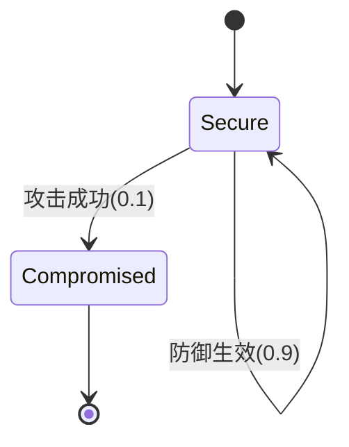

# PRISM 博弈论应用

## 引言

博弈论是研究决策者（玩家）在策略性互动中行为的数学工具。PRISM作为概率符号模型检测器，能够对博弈论模型进行形式化验证，例如计算纳什均衡或验证策略的稳定性。本章将通过案例展示如何用PRISM建模和分析博弈论问题。

## 基础概念

### 博弈论模型
在PRISM中，博弈通常建模为**随机博弈（Stochastic Games）**，包含：
- 玩家（Players）及其可选策略
- 状态转移的概率分布
- 玩家的收益函数（Reward Structures）

### PRISM 支持的特性
```prism
// 示例：定义玩家策略
player "Player1"
  [action1] x=0 -> (x'=1);
endplayer
```

## 案例1：囚徒困境

### 模型构建
囚徒困境是经典的非零和博弈，PRISM模型如下：
```prism
// 定义两个玩家的策略空间
module Player1
  strategy: [0..1]; // 0=合作, 1=背叛
  // 状态转移规则
  [act] strategy=0 -> (reward'=3);
  [act] strategy=1 -> (reward'=5);
endmodule

module Player2
  // 对称结构...
endmodule

// 收益矩阵通过奖励结构定义
rewards "payoff"
  true : strategy1=0 & strategy2=0 -> 3; // 双方合作
  true : strategy1=1 & strategy2=0 -> 5; // 玩家1背叛
  // ...其他组合
endrewards
```

### 纳什均衡分析
使用PRISM属性验证纳什均衡：
```prism
// 检查是否存在单方改变策略能获得更高收益
<<Player1>> Pmax=? [ F reward1 > 3 ]
```

## 案例2：安全协议中的博弈

### 模型场景
考虑攻击者与防御者的安全博弈：


### PRISM 实现
```prism
module Attacker
  action: [0..1]; // 攻击或不攻击
  [attack] action=1 -> 0.1: (state'=compromised) + 0.9: (state'=secure);
endmodule

module Defender
  [defend] state=secure -> (state'=secure);
endmodule
```

### 最优策略验证
```prism
<<Attacker>> R{"cost"}min=? [ F state=compromised ]
```

## 实际应用场景

1. **网络安全**：分析入侵检测系统中的攻防策略
2. **经济学**：验证市场均衡的存在性
3. **生物竞争**：模拟物种间的进化稳定策略

## 总结

通过PRISM可以：
- 形式化描述博弈规则
- 自动计算均衡策略
- 量化分析策略效果

## 延伸练习

1. 修改囚徒困境的收益矩阵，观察均衡变化
2. 为安全博弈添加防御成本约束
3. 尝试建模三玩家博弈场景

## 扩展资源

- PRISM官方文档：博弈论建模章节
- 《Algorithmic Game Theory》教材
- 纳什均衡的PRISM案例库
``` 

注意：所有代码块均使用 ```prism 或 