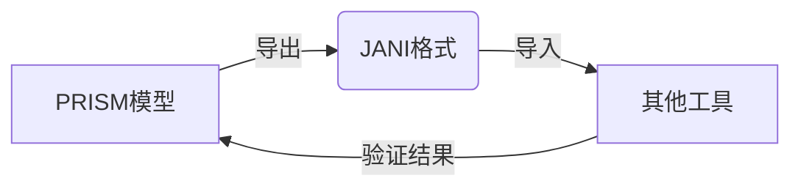

## 引言

JANI（JSON-annotated Network Interchange）是一种基于JSON的模型交换格式，用于在不同概率模型检查工具之间共享模型。PRISM作为主流的概率模型检查器，支持与JANI格式的双向转换。本章将详细介绍PRISM如何与JANI交互，包括语法差异、转换方法和实际应用场景。

## JANI格式基础

JANI使用JSON结构描述模型，核心元素包括：
- **变量声明**：定义模型中的离散/连续变量
- **自动机网络**：通过位置(Location)和边(Edge)描述状态转移
- **属性规范**：定义需要验证的模型属性

示例JANI模型片段：
```json
{
  "jani-version": 1,
  "name": "simple_model",
  "variables": [{
    "name": "x",
    "type": "int",
    "initial-value": 0
  }],
  "automata": [{
    "name": "aut",
    "locations": ["loc0"],
    "edges": [{
      "location": "loc0",
      "guard": {"op": "=", "left": "x", "right": 0},
      "assignments": [{"ref": "x", "value": 1}]
    }]
  }]
}
```

## PRISM 与JANI转换

### 导出JANI格式
使用PRISM命令行工具将`.prism`模型转换为JANI：
```bash
prism model.prism -jani model.jani
```

:::note 转换限制
PRISM不支持导出包含以下特性的模型到JANI：
- 部分PTA（Probabilistic Timed Automata）特性
- 特定类型的复杂奖励结构
:::

### 导入JANI格式
将JANI模型转换为PRISM格式：
```bash
prism model.jani -importjani -prism model_converted.prism
```

转换示例：


## 实际案例：资源共享系统

### 原始PRISM模型
```
ctmc

module Resource
  x : [0..1] init 0;
  
  [] x=0 -> 0.5:(x'=1);
  [] x=1 -> 1:(x'=0);
endmodule
```

### 转换后的JANI片段
```json
{
  "variables": [{
    "name": "x",
    "type": {"kind": "bounded", "base": "int", "lower": 0, "upper": 1},
    "initial-value": 0
  }],
  "automata": [{
    "edges": [{
      "guard": {"op": "=", "left": "x", "right": 0},
      "destinations": [{
        "probability": {"exp": 0.5},
        "assignments": [{"ref": "x", "value": 1}]
      }]
    }]
  }]
}
```

## 常见问题解决

### 类型不匹配错误
当JANI中使用实数类型而PRISM期望整数时，添加类型转换：
```prism
// PRISM中修正
formula converted_value = floor(jani_var);
```

### 标签映射
将JANI属性转换为PRISM的PCTL：
```json
// JANI属性
"properties": [{
  "name": "P_max",
  "expression": {"op": "Pmax", "exp": {"op": "F", "exp": "error"}}
}]
```

对应PRISM属性：
```prism
Pmax=? [ F "error" ]
```

## 总结与练习

### 关键点总结
1. JANI提供工具间标准化的模型交换格式
2. PRISM支持双向转换但存在部分语法限制
3. 转换时需要特别注意变量类型和属性语法差异

### 巩固练习
1. 将以下PRISM模型转换为JANI格式：
   ```
   dtmc
   module die
     s : [0..2] init 0;
     [] s=0 -> 0.5:(s'=1) + 0.5:(s'=2);
   endmodule
   ```
2. 尝试在JANI模型中添加奖励结构并导入PRISM

### 扩展资源
- [JANI格式规范文档](https://jani-spec.org)
- PRISM官方手册中的JANI支持章节
- MODEST Toolset的JANI模型库