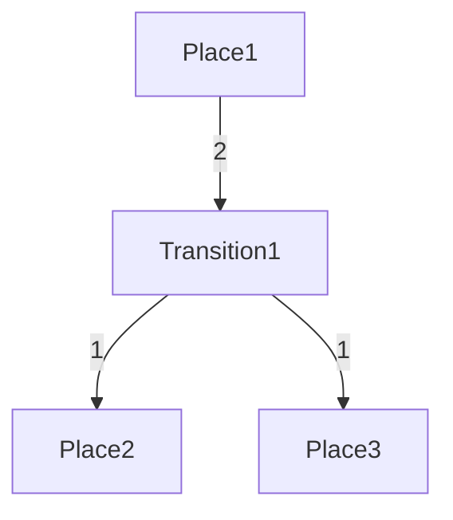
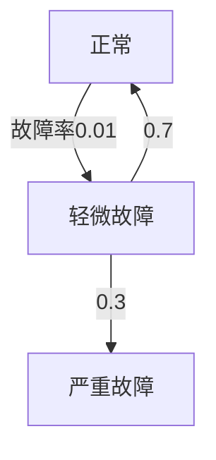

# PRISM 模型转换工具

## 介绍

PRISM（Probabilistic Symbolic Model Checker）是一个广泛使用的概率模型检测工具，支持对概率系统（如马尔可夫链）进行形式化验证。在实际应用中，我们可能需要将其他建模语言（如UML、Petri网等）描述的模型转换为PRISM的模型语言（`.prism`文件）。PRISM模型转换工具正是为此设计的桥梁工具。

本节将介绍PRISM模型转换工具的基本原理、使用方法和实际案例，帮助初学者快速掌握这一关键技能。

## 为什么需要模型转换？

1. **格式兼容性**：不同工具使用不同的模型描述语言
2. **效率提升**：避免手动转换的繁琐和错误
3. **扩展应用**：利用现有模型库进行分析

## 基本转换流程


## 支持的输入格式

PRISM支持多种输入格式的转换：

1. **UML状态图**（通过插件转换）
2. **Petri网**（使用专用转换器）
3. **自定义文本格式**（通过脚本转换）
4. **其他概率模型描述语言**

## 转换工具安装

PRISM模型转换工具通常作为PRISM的附加组件提供。安装方法：

1. 从PRISM官网下载转换工具包
2. 解压到PRISM安装目录的`tools`文件夹
3. 确保系统PATH包含PRISM二进制路径

## 基础转换示例

### 案例1：简单状态机转换

**输入模型**（JSON格式）：
```json
{
  "states": ["s0", "s1"],
  "transitions": [
    {"from": "s0", "to": "s1", "probability": 0.7},
    {"from": "s0", "to": "s0", "probability": 0.3}
  ]
}
```

**转换命令**：
```bash
python convert.py --input model.json --format json --output model.prism
```

**输出PRISM模型**：
```prism
dtmc

module M
  s : [0..1] init 0;
  
  [] s=0 -> 0.7:(s'=1) + 0.3:(s'=0);
  [] s=1 -> 1:(s'=1);
endmodule
```

### 案例2：Petri网转换



转换后的PRISM模型会包含相应的状态和变迁概率。

## 高级转换技巧

### 自定义转换规则

当标准转换不满足需求时，可以定义转换规则文件：

```xml
<!-- rules.xml -->
<rules>
  <state name="waiting" prism="idle"/>
  <transition prob="0.5" action="timeout"/>
</rules>
```

应用自定义规则：
```bash
convert --input model.xml --rules rules.xml --output custom.prism
```

### 批量转换

对于多个模型文件，可以使用批处理脚本：

```bash
for file in *.json; do
  convert -i "$file" -o "${file%.json}.prism"
done
```

## 实际应用案例

### 云计算资源调度模型

某云计算平台使用UML描述其资源调度算法，需要分析其服务可靠性：

1. 原始模型：UML状态图（`cloud.uml`）
2. 转换命令：`uml2prism cloud.uml -o cloud.prism`
3. 分析命令：`prism cloud.prism --prop "P>=0.95 [F success]"`

### 物联网设备故障模型

某IoT设备厂商使用Petri网建模设备故障传播：



转换后可在PRISM中计算MTTF（平均无故障时间）。

## 常见问题解决

:::caution 转换错误处理
如果遇到转换错误，检查：
1. 源模型是否符合规范
2. 转换工具版本是否匹配
3. 是否有特殊字符未转义
:::

:::tip 性能优化
对于大型模型：
1. 分模块转换
2. 使用`--simplify`选项自动简化
3. 转换前手动简化源模型
:::

## 总结

PRISM模型转换工具是连接各种建模语言与PRISM分析引擎的重要桥梁。通过本节学习，你应该能够：

✓ 理解模型转换的基本原理<br />
✓ 使用工具完成常见格式转换<br />
✓ 处理转换过程中的常见问题<br />
✓ 将转换技术应用于实际场景

## 扩展练习

1. 尝试将你熟悉的某种系统描述（如流程图）转换为PRISM模型
2. 比较自动转换和手动编写的PRISM模型差异
3. 为某种特定领域（如网络安全）创建自定义转换规则

## 延伸阅读

- PRISM官方文档：模型转换章节
- 《形式化方法中的模型转换技术》
- 《概率模型检测实践指南》