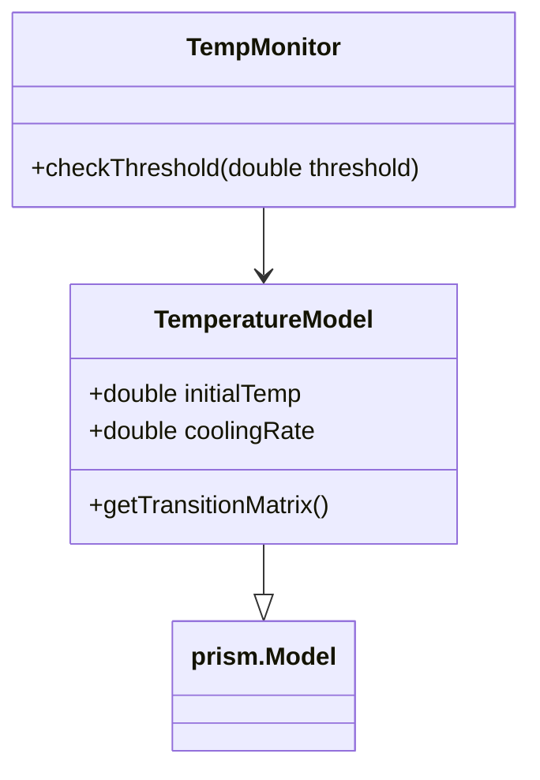

# PRISM 扩展模块开发

## 简介

PRISM（Probabilistic Symbolic Model Checker）是一个用于概率模型检测的开源工具。通过扩展模块开发，用户可以为PRISM添加新的功能特性（如自定义模型类型、奖励结构或分析算法）。本章将指导初学者通过Java API实现基础扩展。

:::note 为什么需要扩展？
- 支持PRISM未内置的特定领域模型
- 集成自定义概率分析算法
- 添加专用奖励计算逻辑
:::

## 开发环境准备

1. **获取PRISM源码**：
   ```bash
   git clone https://github.com/prismmodelchecker/prism.git
   ```

2. **依赖工具**：
   - Java JDK 11+
   - Apache Ant（PRISM使用Ant构建）

## 核心扩展类型

### 1. 模型类型扩展
通过继承`prism.ModelType`实现新模型类型：

```java
// 示例：自定义排队网络模型
public class QueueModelType extends ModelType {
    @Override
    public boolean isModelType(String s) {
        return s.equals("queue");
    }
    
    @Override
    public ModelGenerator getModelGenerator() {
        return new QueueModelGenerator();
    }
}
```

### 2. 命令扩展
添加新的PRISM命令行指令：

```java
// 注册自定义命令
public class MyCommand extends prism.Command {
    public MyCommand() {
        super("mycmd", "Performs custom analysis");
    }

    @Override
    public void execute(prism.Prism prism) {
        // 实现命令逻辑
    }
}
```

## 实际案例：温度监控扩展

开发一个监测温度概率的模块：



实现步骤：

1. **定义模型**：
   ```java
   public class TemperatureModel extends ExplicitModel {
       private double[][] transMatrix;
       
       public TemperatureModel(double initTemp, double coolingRate) {
           // 初始化转移矩阵
       }
   }
   ```

2. **添加分析功能**：
   ```java
   public class TempAnalysis extends prism.Analysis {
       public Result checkOverheat(TemperatureModel model) {
           // 实现温度超限概率计算
       }
   }
   ```

## 集成与测试

1. **注册扩展**：
   在`prism/Prism.java`中添加：
   ```java
   public void loadExtensions() {
       addModelType(new QueueModelType());
       addCommand(new MyCommand());
   }
   ```

2. **构建测试**：
   ```bash
   ant clean && ant
   ```

3. **使用示例**：
   ```text
   prism model.pm --mycmd -temp 37.5
   ```

## 调试技巧

:::caution 常见问题
- **类加载失败**：确保扩展类在`prism`包路径下
- **NPE错误**：检查模型初始化顺序
- **性能问题**：使用`prism.Timer`进行耗时分析
:::

使用PRISM内置日志：
```java
prism.getMainLog().println("Debug info");
```

## 总结

通过扩展开发，你可以：
- 为PRISM添加领域专用功能
- 集成现有分析工具链
- 优化特定场景下的性能

## 扩展练习

1. 实现一个简单的马尔可夫链模型扩展
2. 添加计算平均到达时间的命令
3. 创建可视化温度概率的模块

## 附加资源

- [PRISM开发者手册](https://prismmodelchecker.org/manual/)
- [Java API文档](https://www.prismmodelchecker.org/javadoc/)
- [扩展示例仓库](https://github.com/prismmodelchecker/prism-examples)