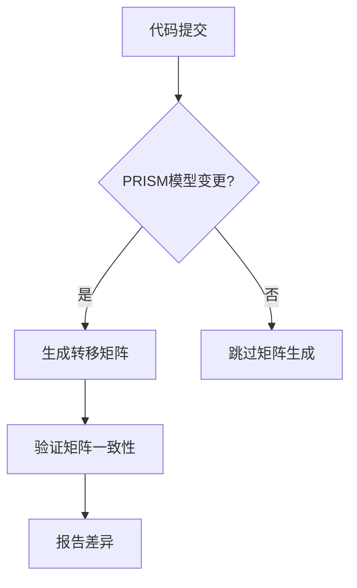

# PRISM 持续集成策略

## 介绍

持续集成（Continuous Integration, CI）是一种软件开发实践，通过频繁地将代码变更集成到共享仓库中，并自动运行构建和测试来快速发现问题。对于PRISM这样的概率符号模型检查器，CI能帮助验证模型正确性、确保性能稳定性，并加速迭代开发。

:::tip 为什么PRISM需要CI？
- 自动化验证复杂概率模型
- 快速捕捉模型定义错误
- 确保跨平台兼容性
- 简化团队协作开发
:::

## 基础配置

### 1. 选择CI平台
常见选择：
- GitHub Actions（与GitHub深度集成）
- GitLab CI/CD
- Jenkins（适合本地部署）

### 2. PRISM项目结构示例
典型的PRISM项目目录应包含：
```
/prism-project
├── models/          # PRISM 模型文件(.prism)
├── properties/      # 属性文件(.props)
├── scripts/         # 辅助脚本
├── tests/           # 测试用例
└── .github/workflows # GitHub Actions配置
```

## GitHub Actions实战

### 基本工作流配置
创建 `.github/workflows/prism-ci.yml`：

```yaml
name: PRISM CI

on: [push, pull_request]

jobs:
  verify-models:
    runs-on: ubuntu-latest
    steps:
    - uses: actions/checkout@v3
    - name: Set up Java
      uses: actions/setup-java@v3
      with:
        java-version: '11'
    - name: Install PRISM
      run: |
        wget http://www.prismmodelchecker.org/dl/prism-4.7-linux64.tar.gz
        tar -xzf prism-4.7-linux64.tar.gz
        echo "$(pwd)/prism-4.7-linux64/bin" >> $GITHUB_PATH
    - name: Verify models
      run: |
        prism models/demo.prism properties/demo.props -javamaxmem 2g
```

### 进阶验证示例
添加模型验证步骤：

```yaml
- name: Run quantitative verification
  run: |
    prism models/coin.prism properties/coin.props \
      -const N=10,K=5 \
      -simpath 1000 \
      -exportresults results.txt
```

## 实际案例研究

### 案例：网络协议验证
假设我们验证一个重传协议模型：

1. 模型文件 `retransmit.prism`：
```prism
dtmc

module Sender
    s : [0..3] init 0;
    [send] s=0 -> 0.9:(s'=1) + 0.1:(s'=0);
    [fail] s=1 -> 0.5:(s'=0) + 0.5:(s'=2);
    [done] s=2 -> (s'=3);
endmodule
```

2. CI测试脚本：
```bash
#!/bin/bash
# 验证成功传输概率应>85%
result=$(prism retransmit.prism success.props -javamaxmem 2g | grep "Result:")
threshold=0.85
if (( $(echo "$result < $threshold" | bc -l) )); then
    echo "验证失败: 成功概率$result低于阈值$threshold"
    exit 1
fi
```

## 高级技巧

### 矩阵生成验证


### 并行测试策略
```yaml
jobs:
  verify-small:
    runs-on: ubuntu-latest
    steps: [...]
  
  verify-large:
    needs: verify-small
    runs-on: ubuntu-largerunner
    timeout-minutes: 30
    steps: [...]
```

## 常见问题解决

:::caution 内存问题
PRISM可能消耗大量内存，建议：
- 添加 `-javamaxmem` 参数
- 分阶段验证大型模型
:::

:::warning 平台差异
在CI配置中明确指定：
```yaml
strategy:
  matrix:
    os: [ubuntu-latest, macos-latest]
```
:::

## 总结与延伸

### 关键收获
- CI能显著提高PRISM模型可靠性
- 自动化验证应包含功能性和定量检查
- 内存管理和平台兼容性是重要考量

### 推荐练习
1. 为现有PRISM项目添加基础CI流水线
2. 创建验证脚本检查概率边界条件
3. 实现矩阵生成差异检测

### 扩展资源
- PRISM官方文档中的[测试指南](http://www.prismmodelchecker.org/manual/)
- GitHub Actions[官方文档](https://docs.github.com/en/actions)
- 《形式化方法中的持续集成》学术论文