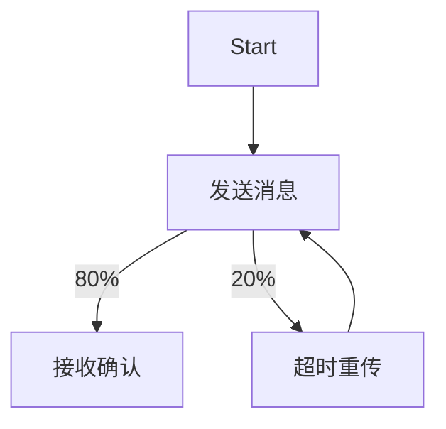

# PRISM 与UPPAAL连接

## 介绍

PRISM（Probabilistic Symbolic Model Checker）和UPPAAL是两种广泛应用于形式化验证的工具。PRISM专注于**概率模型检测**，而UPPAAL擅长**实时系统验证**。通过将两者连接，可以结合它们的优势，例如分析带概率行为的实时系统。本节将介绍如何实现这种集成，并提供实际案例。

:::note
**关键概念**  
- **PRISM**：用于分析随机模型（如马尔可夫链）的工具。  
- **UPPAAL**：用于建模和验证实时系统的工具，支持时间自动机（Timed Automata）。  
:::

---

## 连接原理

PRISM与UPPAAL的集成通常通过**模型转换**实现：  
1. 将UPPAAL的模型（`.xml`格式）转换为PRISM可读的模型（`.prism`格式）。  
2. 在PRISM中分析转换后的模型，提取概率或随机行为的结果。  
3. 将结果反馈到UPPAAL中优化原始模型。


---

## 实现步骤

### 步骤1：模型转换
使用工具（如`uppaal2prism`）将UPPAAL的XML模型转换为PRISM格式。  
**输入示例**（UPPAAL模型片段）：
```xml
<template>
    <name>Process</name>
    <declaration>clock x;</declaration>
    <location id="idle" x="0" y="0">
        <name>Idle</name>
    </location>
</template>
```

**转换命令**：
```bash
uppaal2prism model.xml output.prism
```

**输出示例**（PRISM模型片段）：
```prism
module Process
    x : clock;
    state : [0..1] init 0; // 0=Idle
endmodule
```

:::caution
转换工具可能需要手动调整，因为UPPAAL的时间自动机和PRISM的模型语义不完全一致。
:::

---

### 步骤2：PRISM分析
在PRISM中定义概率属性（如`P=? [ F "success" ]`），分析转换后的模型。  
**示例查询**：
```prism
// 计算在10秒内到达"success"状态的概率
Pmax=? [ F<=10 "success" ]
```

**输出**：
```plaintext
Result: 0.85 (85%概率)
```

---

### 步骤3：结果反馈
将PRISM的分析结果（如概率阈值）作为约束条件，重新优化UPPAAL模型。  
例如，在UPPAAL中排除概率低于80%的执行路径。

---

## 实际案例

### 案例：通信协议的超时重传
1. **UPPAAL模型**：描述消息发送和超时机制的时间自动机。  
2. **PRISM扩展**：为超时事件添加概率（如80%概率成功接收）。  
3. **联合分析**：计算在5次重传内成功交付消息的总概率。



---

## 总结

通过PRISM与UPPAAL的连接，可以：  
- 分析实时系统中的概率行为。  
- 验证带随机事件的时限约束。  
- 优化模型设计（如调整超时参数）。

---

## 附加资源
1. **工具下载**：  
   - [PRISM官网](https://www.prismmodelchecker.org/)  
   - [UPPAAL官网](https://uppaal.org/)  
2. **练习**：  
   - 尝试将UPPAAL的[火车闸机模型](https://uppaal.org/tutorials/)转换为PRISM格式，并分析故障概率。  
3. **进阶阅读**：  
   - 《Principles of Model Checking》第10章（混合系统验证）。