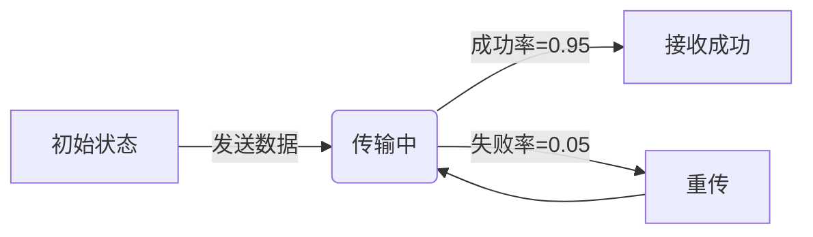

# PRISM 与Python接口

## 简介

PRISM是一个广泛使用的**概率模型检测工具**，用于分析随机系统的行为。通过其Python接口，开发者可以直接在Python脚本中调用PRISM的功能，实现从模型构建到结果分析的全流程自动化。本教程将介绍如何安装、配置并使用这一接口。

:::tip 为什么需要Python接口？
- **自动化流程**：避免手动操作PRISM GUI或命令行
- **集成能力**：与Python生态中的数据分析/机器学习工具结合
- **批量处理**：方便执行参数扫描或大规模实验
:::

## 环境配置

### 1. 安装PRISM
首先确保已安装PRISM（[官网下载](http://www.prismmodelchecker.org/))，并配置环境变量：

```bash
# 验证安装（Linux/macOS）
prism --version
```

### 2. 安装Python接口库
通过pip安装官方`prism-api`：

```bash
pip install prism-api
```

## 基础用法

### 加载PRISM模型
```python
from prism_api import Prism

# 初始化PRISM引擎
prism = Prism()

# 加载模型文件（.pm或.prism）
model = prism.load_model("example.pm")
```

### 模型验证示例
验证一个DTMC模型的属性：

```python
# 定义PRISM属性（PCTL公式）
property = "P=? [ F<=10 finished ]"

# 执行验证
result = prism.model_check(model, property)
print(f"验证结果: {result}")
```

输出示例：
```
验证结果: 0.8732
```

## 进阶功能

### 参数化分析
通过Python循环实现参数扫描：

```python
import numpy as np

failure_rates = np.linspace(0.1, 0.9, 5)
results = []

for rate in failure_rates:
    prism.set_constant("FAIL_RATE", str(rate))
    results.append(prism.model_check(model, property))
```

### 实时结果可视化
使用Matplotlib绘制分析结果：

```python
import matplotlib.pyplot as plt

plt.plot(failure_rates, results, 'o-')
plt.xlabel("Failure Rate")
plt.ylabel("Probability")
plt.show()
```

## 实际案例：网络可靠性分析

假设我们需要分析一个网络协议的可靠性：



对应的Python分析代码：

```python
# 定义网络模型
model = """
dtmc

const double p_success = 0.95;

module Network
    state : [0..2] init 0;  // 0=初始, 1=传输中, 2=成功
    [send] state=0 -> p_success:(state'=1) + (1-p_success):(state'=0);
    [transmit] state=1 -> p_success:(state'=2) + (1-p_success):(state'=1);
endmodule
"""

# 临时保存模型
with open("network.pm", "w") as f:
    f.write(model)

# 分析成功传输概率
prism.load_model("network.pm")
result = prism.model_check("P=? [ F state=2 ]")
print(f"传输成功概率: {result:.4f}")
```

## 常见问题解决

:::caution 错误排查
1. **PRISM路径错误**：确保`prism`命令可在终端直接运行
2. **Java版本问题**：PRISM需要Java 8+
3. **语法错误**：PRISM模型中的常量需通过`set_constant()`设置
:::

## 总结与扩展

### 关键知识点
- 通过`prism-api`实现Python与PRISM的无缝集成
- 支持模型加载、参数设置、属性验证等核心功能
- 可结合Python科学生态进行高级分析

### 延伸练习
1. 修改网络案例中的`p_success`，观察概率变化
2. 尝试添加多个模块的交互模型
3. 将结果导出为CSV文件

### 推荐资源
- [PRISM官方文档](http://prismmodelchecker.org/manual/)
- `prism-api`的GitHub仓库示例
- 《概率模型检测》第三章（可提供电子版链接）