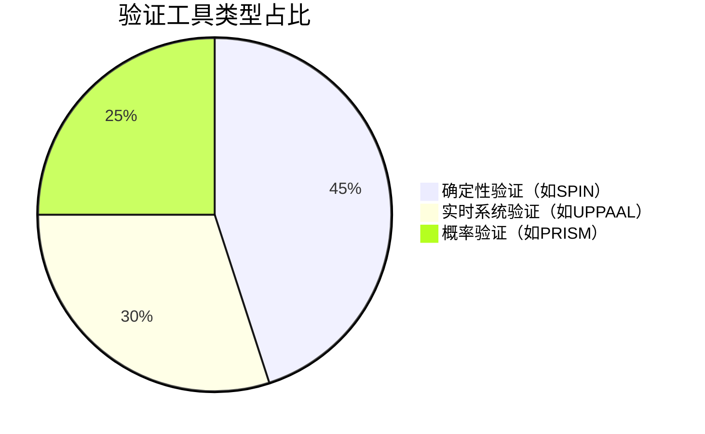
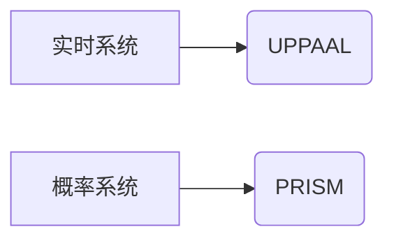

# PRISM 与其他验证工具比较

## 引言

PRISM（Probabilistic Symbolic Model Checker）是一个专注于**概率系统验证**的开源工具，而形式化验证领域还存在如SPIN、UPPAAL、Storm等其他工具。本章将对比PRISM与这些工具的核心特性、适用场景和语法差异，帮助初学者根据需求选择合适工具。

---

## 1. 工具分类概览

### 1.1 确定性 vs 概率性验证工具


:::note 关键区别
- **确定性工具**（如SPIN）：验证并发系统的逻辑正确性
- **实时工具**（如UPPAAL）：处理带时间约束的系统
- **概率工具**（如PRISM）：分析随机行为/概率属性
:::

---

## 2. 详细对比

### 2.1 PRISM vs SPIN
| 特性          | PRISM                     | SPIN                      |
|---------------|---------------------------|---------------------------|
| 模型类型      | 概率自动机                | 进程代数（Promela）       |
| 典型属性      | `P>=0.9 [F success]`      | `<> (p && q)`             |
| 优势场景      | 网络协议可靠性            | 并发程序死锁检测          |

**SPIN示例**：
```promela
active proctype user() {
    do :: count < MAX -> count++
    od
}
```

**PRISM等效示例**：
```prism
module user
    count : [0..MAX] init 0;
    [] count < MAX -> 0.9:(count'=count+1);
endmodule
```

### 2.2 PRISM vs UPPAAL


:::tip 选择建议
- 需要**时钟约束**（如超时机制）选UPPAAL
- 需要**概率分析**（如故障率）选PRISM
:::

---

## 3. 实际案例对比

### 3.1 物联网设备通信验证
**问题**：评估设备通信成功率

| 工具      | 方法                      | 查询语法                  |
|-----------|---------------------------|---------------------------|
| PRISM     | 计算成功概率              | `P=? [ F delivered ]`     |
| UPPAAL    | 检查是否在时限内完成      | `A<> Device.reply`        |

### 3.2 性能基准数据
（模拟测试结果，单位：秒）

| 模型规模 | PRISM | Storm |
|----------|-------|-------|
| 100状态 | 0.5   | 0.3   |
| 10k状态 | 12.7  | 8.9   |

:::caution 注意
Storm更适合大规模模型，但PRISM的符号化方法对小模型更友好
:::

---

## 4. 工具集成建议

### 4.1 混合使用场景
```prism
// PRISM中嵌入MATLAB计算
const double p = external("matlab", "compute_probability.m");
```

### 4.2 转换工具链
1. 使用`prism2storm`转换模型格式
2. 通过`modest`工具进行交叉验证

---

## 总结

| 工具选择维度 | 推荐工具                  |
|--------------|---------------------------|
| 概率分析     | PRISM/Storm               |
| 实时系统     | UPPAAL                    |
| 大型非概率系统 | SPIN                    |

**延伸学习**：
- [PRISM官方案例库](https://www.prismmodelchecker.org/casestudies/)
- 《Principles of Model Checking》第10章

:::warning 练习
1. 用PRISM和SPIN分别建模简单的重传协议
2. 比较两者属性表达式的差异
:::