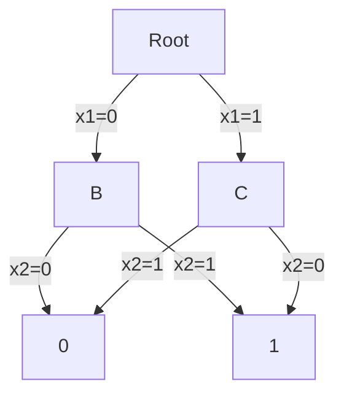
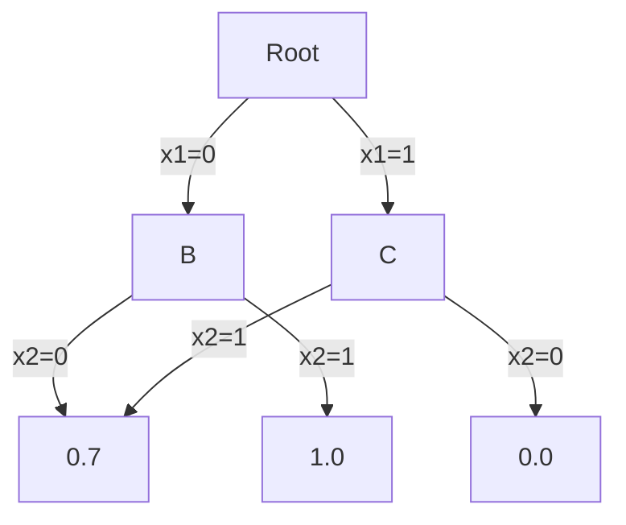

# PRISM 符号数据结构

## 引言

PRISM（Probabilistic Symbolic Model Checker）作为概率模型检测领域的标杆工具，其核心优势之一在于采用了**符号数据结构**来高效表示和操作大型状态空间。符号方法通过压缩存储和智能计算，使得验证具有数百万甚至数十亿状态的系统成为可能。

符号数据结构与传统显式表示法的关键区别在于：
- 显式方法逐个列举所有状态
- 符号方法将状态集合表示为逻辑公式，通过操作公式间接处理状态

## 基本概念

### 1. 二元决策图(BDD)

PRISM使用**二元决策图**(Binary Decision Diagrams)作为基础符号数据结构：



BDD特点：
- 压缩表示布尔函数
- 通过共享子结构节省空间
- 支持高效的逻辑运算（AND/OR/NOT）

:::tip 为什么使用BDD？
对于n个布尔变量组成的系统：
- 显式表示需要O(2ⁿ)空间
- BDD通常只需要O(n)或O(n²)空间
:::

### 2. 多终端BDD (MTBDD)

PRISM扩展使用MTBDD表示概率和奖励：



MTBDD特点：
- 终端节点可以是任意数值（不仅是0/1）
- 能表示概率转移矩阵
- 支持矩阵运算

## PRISM 中的实现

### 变量排序策略

变量顺序显著影响BDD效率。PRISM采用启发式排序：

```
全局变量 → 模块局部变量 → 时钟变量
```

示例PRISM模型变量声明：
```prism
// 全局变量优先
global x : [0..1] init 0;

module M1
    y : [0..2] init 0;
    // 转移关系...
endmodule
```

### 符号模型构建

PRISM构建过程分为三个阶段：
1. 解析模型文件生成语法树
2. 创建每个模块的局部MTBDD
3. 通过并行组合构建完整模型

:::note 并行组合示例
两个模块M1和M2的组合：
- M1有状态变量`{x,y}`
- M2有状态变量`{y,z}`
- 组合后系统变量为`{x,y,z}`
:::

## 实际案例研究

### 案例：网络协议验证

考虑一个简单的重传协议模型：
- 发送方可能丢失数据包（概率0.1）
- 最多3次重试
- 使用BDD表示状态空间

PRISM代码片段：
```prism
module Sender
    attempts : [0..3] init 0;
    [send] attempts < 3 → 0.9 : (attempts'=0) + 0.1 : (attempts'=attempts+1);
endmodule
```

符号表示的优势：
- 压缩存储所有可能状态（4种attempts值）
- 高效计算可达概率

## 性能优化技巧

1. **变量分组**：将相关变量在排序中靠近
   ```prism
   // 好习惯：相关变量连续声明
   packet_sent : bool init false;
   packet_ack : bool init false;
   ```

2. **模型分解**：利用PRISM的`parallel composition`特性

3. **奖励结构简化**：避免复杂的奖励表达式

:::caution 常见错误
- 变量顺序不合理导致BDD爆炸
- 在大型模型中使用复杂实时属性
:::

## 总结与练习

### 关键要点
✓ 符号数据结构使PRISM能处理大规模状态空间<br />
✓ BDD/MTBDD是PRISM的核心表示方法<br />
✓ 变量排序对性能有决定性影响<br />
✓ 模块化建模有助于符号处理

### 进阶练习
1. 在PRISM GUI中导出模型的BDD表示
2. 比较不同变量排序对模型构建时间的影响
3. 尝试用`--explicit`参数对比符号/显式方法的性能差异

### 扩展阅读
- PRISM手册第5章：符号引擎技术细节
- 《Principles of Model Checking》第6章：符号模型检测
- Bryant原始论文：BDD数据结构