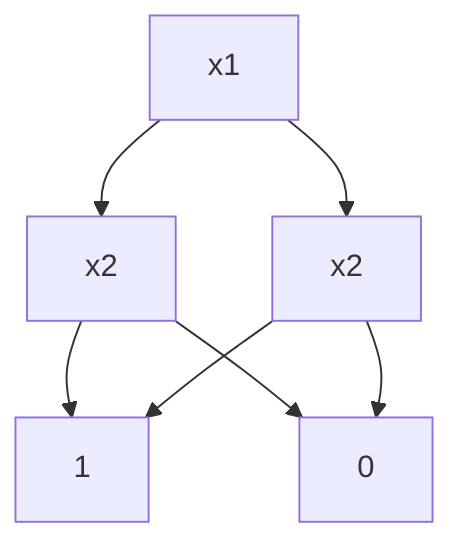
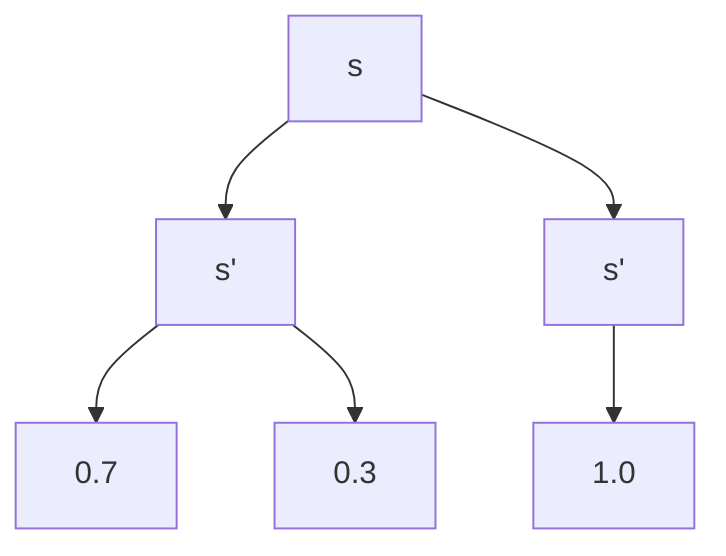

# PRISM 决策图技术

## 引言

决策图（Multi-Terminal Binary Decision Diagrams, MTBDD）是PRISM模型检测器的核心数据结构之一，用于高效表示和操作概率模型的状态空间与转移矩阵。对于初学者而言，理解这一技术将帮助您掌握PRISM处理大规模系统的底层原理。

:::note 为什么需要决策图？
传统显式状态表示法（如矩阵）在模型状态爆炸时会遇到内存限制。MTBDD通过共享相同子结构来压缩表示规模，使PRISM能处理超过10^20个状态的系统。
:::

## 基础概念

### 1. 二元决策图(BDD)
BDD是表示布尔函数的树状数据结构，通过以下方式优化：
- 合并相同子树
- 消除冗余节点



### 2. 多终端BDD(MTBDD)
MTBDD扩展BDD，允许叶子节点存储任意值（如概率），而不仅是0/1：

```
f(x1,x2) = {
    0.7: x1 ∧ x2
    0.2: ¬x1
    0.1: 其他情况
}
```

## PRISM 中的实现

### 关键操作示例
PRISM使用CUDD库实现MTBDD操作。以下是一个概率转移系统的编码示例：

```prism
// 模型定义示例
dtmc
module M
    s : [0..2] init 0;
    [] s=0 -> 0.7:(s'=1) + 0.3:(s'=2);
    [] s=1 -> 1:(s'=0);
    [] s=2 -> 1:(s'=1);
endmodule
```

对应的MTBDD结构可能表示为：


## 实际应用案例

### 网络协议分析
分析Zigbee协议的碰撞概率时，MTBDD可压缩表示：
- 20个节点 → 2^20种状态
- 实际MTBDD节点可能仅数千个

:::tip 性能对比
在无线传感器网络模型中：
- 显式存储：需要16GB内存
- MTBDD存储：仅需120MB
:::

## 进阶技术

### 变量排序优化
节点顺序显著影响MTBDD大小。PRISM提供自动排序策略：

```prism
// 手动指定变量顺序
prism -varorder "x,y,z" model.pm
```

### 矩阵向量乘法
概率计算核心操作通过MTBDD实现：
```python
# 伪代码示例
def multiply(MTBDD, vector):
    if is_terminal(MTBDD):
        return MTBDD.value * vector
    else:
        return combine(
            multiply(MTBDD.then, vector),
            multiply(MTBDD.else, vector)
        )
```

## 总结与练习

### 关键要点
- MTBDD通过共享结构节省内存
- 变量顺序显著影响性能
- PRISM自动应用多种优化策略

### 推荐练习
1. 在PRISM中比较不同模型的内存使用：`prism -verbose model.pm`
2. 尝试修改变量顺序观察执行时间变化
3. 用`exporttrans`命令查看MTBDD转换成的实际矩阵

### 扩展阅读
- PRISM手册第5章：符号表示技术
- 《Principles of Model Checking》第6章
- CUDD库官方文档（决策图底层实现）