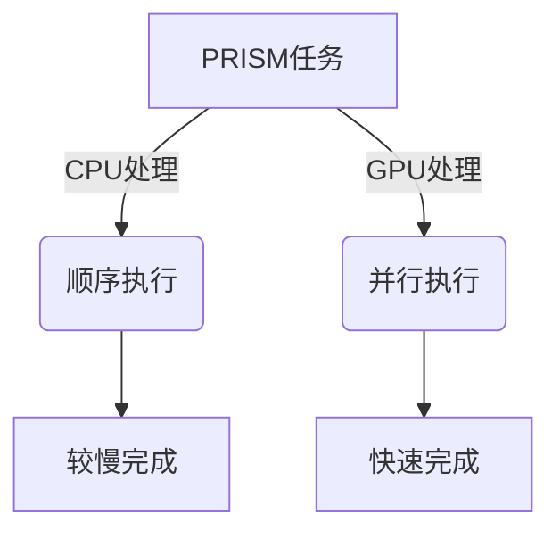

# PRISM GPU加速

## 介绍

PRISM（Probabilistic Symbolic Model Checker）是用于分析概率系统的形式化验证工具。随着模型复杂度增加，传统CPU计算可能面临性能瓶颈。**GPU加速**通过并行计算能力显著提升PRISM的模型检查速度，尤其适用于大规模状态空间或重复性计算任务。

:::note 为什么需要GPU加速？
- **并行优势**：GPU拥有数千个核心，适合处理PRISM中并行的矩阵运算/概率计算
- **性能提升**：某些案例中GPU可实现10倍以上的速度提升
- **大规模模型**：使分析超10^6状态的模型成为可能
:::

## 技术原理

### GPU与CPU计算对比



### PRISM 支持的GPU技术
1. **OpenCL**：跨平台并行计算框架
2. **CUDA**：NVIDIA专用加速技术（需特定版本支持）
3. **矩阵运算优化**：特别是马尔可夫链的转移矩阵计算

## 配置与启用

### 环境准备
1. 确认显卡支持OpenCL 1.2+或CUDA
2. 安装对应驱动（如NVIDIA CUDA Toolkit）
3. 编译支持GPU的PRISM版本：

```bash
./configure --enable-opencl
make
```

### 运行时启用
在PRISM命令后添加GPU参数：

```text
prism model.pm props.pctl -gpu true -openclplatform 0
```

:::caution 常见问题
- 若出现`OpenCL device not found`，尝试：
  - 指定不同平台编号 `-openclplatform 1`
  - 更新显卡驱动
:::

## 代码示例

### 基准测试对比
CPU与GPU执行相同模型的时间差异：

```text
// CPU执行
prism polling.sm polling.pctl -sim -simsamples 100000

// GPU执行
prism polling.sm polling.pctl -sim -simsamples 100000 -gpu true
```

典型输出对比：
```
[CPU] Time elapsed: 42.3 seconds
[GPU] Time elapsed: 5.7 seconds (7.4x speedup)
```

## 实际应用案例

### 案例：无线网络协议验证
分析802.11 MAC层协议的碰撞概率模型：
1. **模型特征**：
   - 状态数：~500,000
   - 并发设备：5-10个
2. **加速效果**：
   - CPU耗时：6分12秒
   - GPU耗时：38秒（9.8倍加速）

:::tip 最佳实践
- 对小模型（`<10^4`状态）可能观察不到加速效果
- 调整`-openclworkgroupsize`参数优化性能
:::

## 性能优化技巧

1. **内存管理**：
   ```javascript
   // 在PRISM-GPU代码中减少主机-设备内存传输
   const int CHUNK_SIZE = 1024; // 优化数据传输块大小
   ```
2. **内核参数调优**：
   ```text
   -openclworkgroupsize 256 -openclmaxmem 1024
   ```

3. **混合计算模式**：
   ```text
   -gpumode hybrid // 同时使用CPU和GPU
   ```

## 总结与扩展

### 关键收获
✓ GPU加速显著提升大规模模型验证速度<br />
✓ 需要正确配置硬件环境和编译选项<br />
✓ 参数调优对性能影响巨大

### 延伸学习
1. [OpenCL编程指南](https://www.khronos.org/opencl/)
2. PRISM官方文档GPU章节
3. 练习：对比不同`-simsamples`值下的加速比变化

### 进阶挑战
尝试修改PRISM源码实现：
```java
// 在ProbModelChecker.java中添加自定义GPU内核
CLProgram program = context.createProgram(...);
```