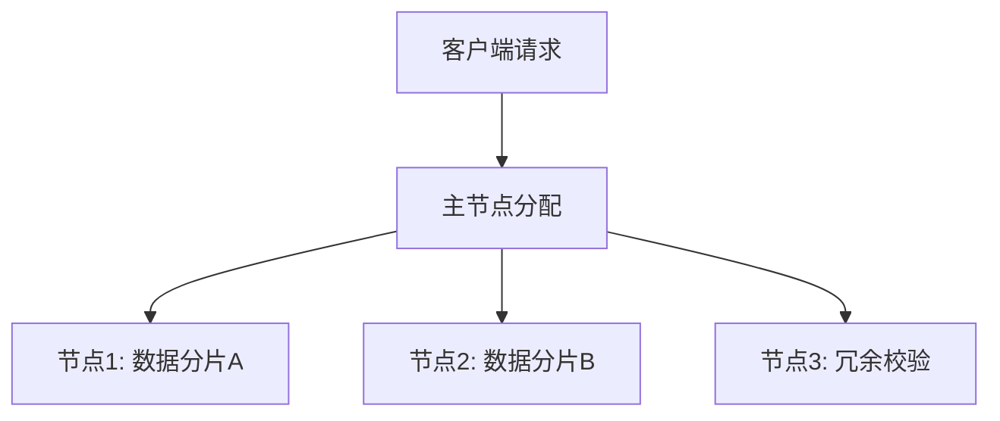

# PRISM 分布式计算

## 引言

PRISM是一个广泛使用的概率模型检查工具，用于分析随机系统的行为。当处理**大规模模型**时，单机计算可能面临内存不足或计算时间过长的问题。**分布式计算**通过将任务分配到多台机器上并行处理，显著提升了PRISM的处理能力。本章将介绍PRISM分布式计算的原理、配置方法和实际应用。

## 分布式计算基础

PRISM的分布式计算功能基于**MPI（Message Passing Interface）**实现，主要解决以下问题：
- **状态空间爆炸**：将状态空间分割到不同计算节点
- **并行模型检查**：同时计算多个属性或路径
- **分布式存储**：缓解单机内存限制

:::note 关键概念
分布式PRISM由以下组件构成：
- **主节点（Master）**：协调任务分配和结果收集
- **工作节点（Workers）**：执行实际计算任务
- **共享文件系统**：存储模型和临时数据
:::

## 环境配置

### 1. 安装MPI
PRISM分布式需要OpenMPI或MPICH支持。Ubuntu下安装示例：
```bash
sudo apt-get install openmpi-bin libopenmpi-dev
```

### 2. 编译PRISM
使用`--with-mpi`选项重新编译PRISM：
```bash
./configure --with-mpi
make
```

### 3. 启动集群
假设有4个节点（node1-node4），创建主机文件`hostfile`：
```
node1 slots=2
node2 slots=2
node3 slots=1
node4 slots=1
```

## 运行分布式PRISM

基本命令格式：
```bash
mpirun -np <总进程数> -hostfile <主机文件> prism <模型文件> <属性文件>
```

示例：使用6个进程分析无线协议模型：
```bash
mpirun -np 6 -hostfile hostfile prism wireless.pm wireless.pctl
```

## 代码示例

### 分布式模型检查
以下属性文件(`task.pctl`)检查系统达到目标的概率：
```text
P=? [ F "success" ]
```

运行后会显示各节点计算状态：
```text
[节点1] 计算分区1: 12000/50000状态
[节点2] 计算分区2: 15000/50000状态
...
全局结果: 0.8732
```

## 实际案例：云服务可靠性

**场景**：评估云存储系统在节点故障时的数据可用性。



对应的PRISM模型检查命令：
```bash
mpirun -np 8 prism cloud_storage.pm "R{"availability"}=? [ C<=24h ]"
```

该命令分布式计算24小时内系统可用性的期望值。

## 性能优化技巧

1. **负载均衡**：
   ```text
   // 在属性文件中添加
   const int CHUNK_SIZE = 5000; // 调整任务分块大小
   ```

2. **通信优化**：
   :::tip
   减少节点间通信频率：
   - 增大`--exportinterval`参数值
   - 使用`--shared`选项启用内存共享模式
   :::

3. **资源分配**：
   ```mermaid
   pie
       title 计算资源分配
       "状态生成" : 45
       "概率计算" : 35
       "结果聚合" : 20
   ```

## 常见问题解决

:::caution 问题排查
- **节点不同步**：检查所有机器的时间服务(NTP)
- **内存不足**：减少每个节点的`-Xmx`值
- **网络延迟**：使用`--mca btl_tcp_if_include eth0`指定网卡
:::

## 总结与进阶

PRISM分布式计算能显著提升大规模模型的分析效率。关键要点：
- 合理分配计算资源
- 优化通信开销
- 监控节点负载

**延伸学习**：
1. [OpenMPI官方文档](https://www.open-mpi.org/)
2. PRISM手册中"Parallel Model Checking"章节
3. 尝试修改`hostfile`测试不同节点配置的性能差异

**练习**：
1. 在3台虚拟机上部署PRISM集群
2. 比较分布式与单机模式下`herman7.pm`模型的验证时间
3. 设计一个负载不均衡的场景并尝试优化