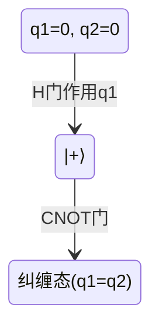

## 引言

PRISM的量子算法接口允许用户将量子计算模型与传统概率模型检查相结合。这一功能使得开发者能够验证量子程序的正确性和性能特性（如退相干错误概率），填补了经典验证工具在量子领域的空白。本节将介绍接口的基本原理、语法结构及实际应用。

## 核心概念

### 1. 量子系统建模基础
PRISM通过以下方式表示量子系统：
- **量子比特**：用离散变量模拟（如 `qbit: [0..1]`）
- **量子门**：转化为概率矩阵（如Hadamard门对应随机翻转）
- **测量**：使用`observable`关键字定义可观测量的概率分布

```prism
// 示例：单个量子比特的Hadamard门操作
module Qubit
    q : [0..1] init 0; // |0⟩状态

    [h_gate] q=0 -> 0.5:(q'=0) + 0.5:(q'=1); // 叠加态
    [h_gate] q=1 -> 0.5:(q'=0) + 0.5:(q'=1);
endmodule
```

### 2. 接口关键语法
| 语法元素          | 作用                          | 示例                      |
|-------------------|-----------------------------|--------------------------|
| `quantum` 块      | 声明量子特性                  | `quantum { q1, q2 }`     |
| `@measure`        | 测量操作标记                  | `[measure] q=1 -> ...`   |
| `#prob_amplitude` | 指定概率幅                    | `#prob_amplitude 1/sqrt(2)` |

## 实战案例：量子纠缠验证

验证Bell态制备的正确性：

```prism
// 双量子比特纠缠系统
quantum { q1, q2 }

module Alice
    q1 : [0..1] init 0;
    [H] q1=0 -> 0.5:(q1'=0) + 0.5:(q1'=1);
    [CNOT] q1=0 & q2=0 -> (q1'=0) & (q2'=0);
    [CNOT] q1=1 & q2=0 -> (q1'=1) & (q2'=1);
endmodule

// 验证相关性
formula correlated = (q1=q2);
P=? [ F correlated ] // 应返回概率1.0
```



## 错误分析示例

检测退相干错误的影响：

```prism
// 添加振幅阻尼噪声
module Noise
    [decay] q1=1 -> 0.9:(q1'=0) + 0.1:(q1'=1); // T1过程
    [dephasing] q1=0 -> 0.95:(q1'=0); // T2过程
endmodule

// 计算保真度下降
R{"fidelity"}=? [ I=100 ] // 经过100步后的期望保真度
```

:::tip 实验建议
尝试修改噪声参数，观察对以下性质的影响：
1. 纠缠维持概率
2. 量子态传输成功率
3. 门操作的错误累积
:::

## 总结与进阶

### 关键收获
- PRISM可将量子算法转化为可验证的离散时间马尔可夫链(DTMC)
- 支持量子特有属性（叠加、纠缠）的概率分析
- 能建模噪声和错误传播

### 延伸学习
1. 在PRISM官网查看量子案例库
2. 尝试将Shor算法分解为PRISM模块
3. 研究量子行走(Quantum Walk)的模型检查方法

:::warning 注意
当前实现有以下限制：
- 仅支持有限维量子系统
- 非Clifford门需要近似处理
- 测量坍缩需手动建模
:::