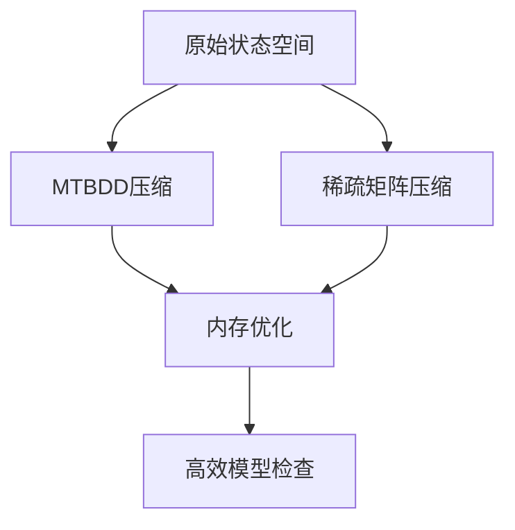
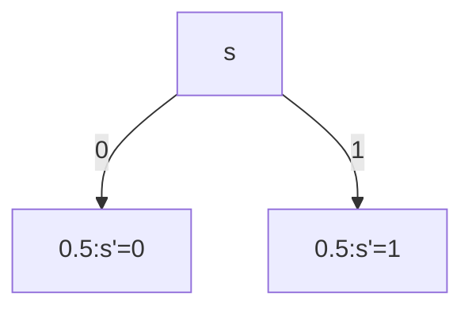

# PRISM 状态压缩技术

## 介绍

状态压缩技术是PRISM模型检查器中用于优化存储和计算效率的核心方法之一。当模型的状态空间过大时（即出现"状态爆炸"问题），直接存储所有状态会消耗大量内存。状态压缩通过智能编码和数据结构减少内存占用，使得大规模模型的分析成为可能。

:::note 为什么需要状态压缩？
- 典型模型可能包含10^6以上的状态
- 每个状态需要存储变量值、概率等信息
- 原始存储方式会快速耗尽系统资源
:::

## 基本原理

PRISM主要采用两种状态压缩技术：

1. **基于MTBDD的压缩**：将状态转移矩阵表示为多重终端二叉决策图
2. **稀疏矩阵压缩**：仅存储非零的转移概率



## MTBDD压缩详解

MTBDD（Multi-Terminal Binary Decision Diagram）是PRISM的默认压缩方式，特别适合具有规则结构的模型。

### 工作原理

1. 将状态变量编码为二进制决策树
2. 共享相同的子树结构
3. 终端节点存储转移概率

**示例模型**：
```
// 简单硬币投掷模型
dtmc

module coin
    s : [0..1] init 0;
    [] s=0 -> 0.5 : (s'=0) + 0.5 : (s'=1);
    [] s=1 -> 0.5 : (s'=0) + 0.5 : (s'=1);
endmodule
```

对应的MTBDD结构（简化表示）：


## 稀疏矩阵存储

当模型具有局部性（即每个状态的转移较少）时，稀疏矩阵更有效。

### 实现方式

```prism
// 在PRISM中使用稀疏矩阵（通过命令行）
prism model.pm -sparse
```

典型存储格式：
```
row_ptr = [0, 2, 4]  // 每行的非零元素起始索引
col_ind = [0, 1, 0, 1]  // 列索引
values = [0.5, 0.5, 0.5, 0.5]  // 转移概率
```

## 实际案例：网络协议分析

分析一个简单的重传协议，其中：
- 状态 = (发送次数, 确认状态)
- 原始状态空间：100×2 = 200状态
- 压缩后仅需存储约50个非零转移

**性能对比**：
| 方法        | 内存使用 | 计算时间 |
|-------------|---------|---------|
| 未压缩      | 320KB   | 1.2s    |
| MTBDD       | 45KB    | 0.8s    |
| 稀疏矩阵    | 28KB    | 0.6s    |

:::tip 选择压缩方法的建议
- 规则结构模型 → MTBDD
- 局部性强的模型 → 稀疏矩阵
- 不确定时先用默认设置测试
:::

## 总结

PRISM的状态压缩技术通过：
1. 减少内存占用
2. 保持计算准确性
3. 适应不同模型特性

## 延伸学习

**推荐练习**：
1. 在PRISM GUI中比较不同压缩方法的内存使用
2. 为3状态队列模型手动构建MTBDD
3. 使用`-exporttrans`查看稀疏矩阵格式

**进一步阅读**：
- PRISM手册"Efficient Model Representation"章节
- 《Principles of Model Checking》第7章
- MTBDD原始论文（Bryant, 1986）