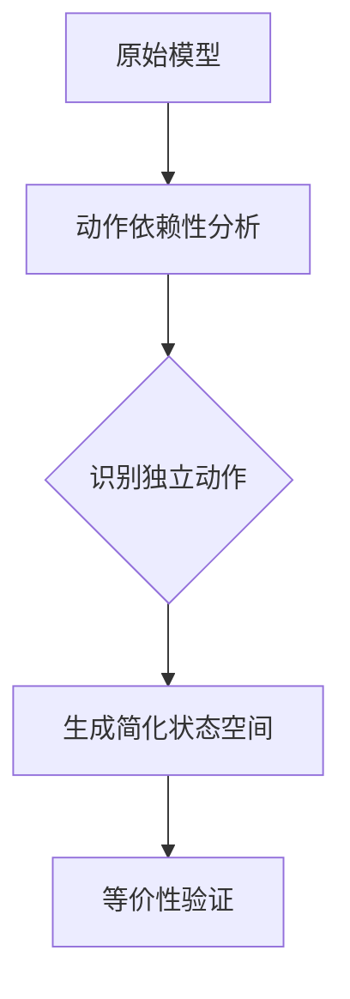

# PRISM 偏序简化

## 简介

偏序简化（Partial Order Reduction, POR）是PRISM模型检测器中用于**优化状态空间搜索**的核心技术。它通过识别系统中**独立的动作序列**，避免探索冗余的执行路径，从而显著降低计算复杂度。对于初学者来说，理解这项技术能帮助你在验证大型系统时避免"状态爆炸"问题。

:::note 为什么需要偏序简化？
当系统包含多个并行组件时，传统模型检测需要探索所有可能的交错执行路径。偏序简化通过数学方法证明某些路径的交换不影响最终结果，从而安全地跳过部分路径。
:::

## 基本概念

### 独立动作（Independent Actions）
两个动作称为独立的，如果：
1. 它们可以在不同进程中并行执行
2. 执行顺序不影响最终系统状态

数学表达为：对于动作 `a` 和 `b`，若满足：
```
∀s ∈ S: enabled(a,s) ∧ enabled(b,s) ⇒ 
    [a](b,s) = [b](a,s) ∧ enabled(a, [b]s) ∧ enabled(b, [a]s)
```

### 可见动作（Visible Actions）
会改变被验证属性相关变量的动作。PRISM会自动分析动作的可见性。

## 工作原理

PRISM实现偏序简化的典型流程：



## 实际案例

### 案例：简单的并行系统
考虑两个并行进程修改共享变量：

```prism
// PRISM模型示例
module Process1
    x : [0..2] init 0;
    [] (x < 2) -> 0.5: (x'=x+1) + 0.5: (x'=x+2);
endmodule

module Process2
    y : [0..2] init 0;
    [] (y < 2) -> (y'=y+1);
endmodule
```

**传统验证**需要探索所有可能的交错执行（6种路径）。<br />
**使用偏序简化**后，PRISM会识别到：
- Process1的更新与Process2的更新互不影响
- 实际只需验证2种代表性路径

## 代码示例

在PRISM中使用偏序简化（默认启用）：

```prism
// 显式指定简化选项（实际通常使用默认值）
options
    "por" : true,       // 启用偏序简化
    "por_type" : "ssp"; // 使用静态偏序简化
```

验证命令输出对比：
```
传统方法: 探索状态数=24, 时间=1.2s
偏序简化: 探索状态数=8, 时间=0.3s
```

## 高级配置

PRISM提供多种偏序简化策略：

| 选项 | 说明 |
|------|------|
| `--por ssp` | 静态偏序简化（默认） |
| `--por dp`  | 动态偏序简化 |
| `--por opt` | 优化模式 |

:::tip 选择策略的建议
- 对于确定性强的系统使用 `ssp`
- 包含较多非确定性时使用 `dp`
- 大型模型可尝试 `opt`
:::

## 常见问题

### Q1: 偏序简化会影响验证结果的准确性吗？
不会。PRISM采用的算法（如Persistent Set方法）保证简化后的模型与被验证属性保持等价。

### Q2: 什么情况下偏序简化效果不明显？
当系统中动作间存在强依赖关系时，如：
```prism
// 相互依赖的进程
module P1
    [a] x=0 -> (x'=1);
endmodule

module P2
    [a] x=1 -> (x'=0);
endmodule
```

## 总结

关键要点：
1. 偏序简化通过减少冗余路径提升验证效率
2. PRISM自动分析动作独立性和可见性
3. 适用于包含大量并行组件的系统

## 扩展练习

1. 在PRISM GUI中对比启用/禁用偏序简化的状态空间大小
   ```bash
   prism model.pm --exportstates states.txt
   ```

2. 修改案例模型，添加更多进程观察简化效果

## 延伸阅读
- PRISM手册第8章 "Reduction Techniques"
- 《Model Checking》第10章 (Clarke et al.)
- 论文 "Partial-Order Methods for the Verification of Concurrent Systems"

:::warning 注意
虽然偏序简化功能强大，但复杂系统仍需结合其他优化技术（如对称简化、抽象精化）使用。
:::